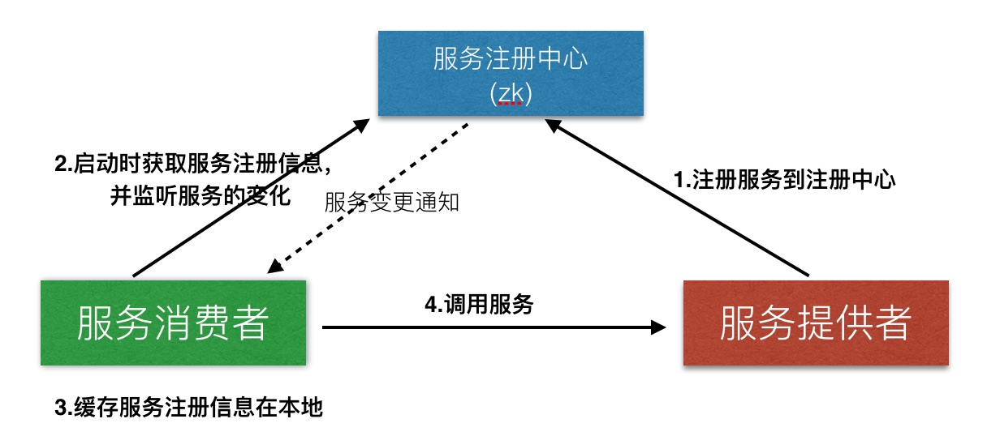

# 基于Docker、Registrator、Zookeeper实现服务自动注册
 
> 摘要：本文属于原创，未经允许不得转载！
> 
> 本文所有服务均采用docker容器化方式部署 
 
 
## 当前环境
1. 系统：Mac OS
2. docker 1.12.1
3. docker-compose 1.8.0

## 技术说明

**Docker：**是一个开源工具，能将一个WEB应用封装在一个轻量级，便携且独立的容器里，然后可以运行在几乎任何服务环境下。 Docker的一般使用在以下几点： 自动化打包和部署应用。

**Registrator：**一个由Go语言编写的，针对docker使用的，通过检查容器在线或者停止运行状态自动注册和去注册服务的工具。

**Zookeeper：**分布式服务框架是 Apache Hadoop 的一个子项目，它主要是用来解决分布式应用中经常遇到的一些数据管理问题，如：统一命名服务、状态同步服务、集群管理、分布式应用配置项的管理等等。

## 场景
在微服务架构中，传统的大型单一服务根据业务场景被拆分成了众多细小的服务模块，每个模块都能独立的对外提供服务。并且根据业务需求，各模块还可以动态的进行的扩容或缩减，充分的利用了服务器资源。

但此架构引入了很多新的问题，其中一个是服务的动态扩容，势必造成服务暴露的地址（IP、Port）将是动态生成的，这对服务的调用者造成了困扰。调用者如何去知晓所调服务的地址？服务地址变化后，又是如何通知到调用者的？

## 注册中心
为解决上述问题，业界给出的一种方案是使用注册中心，通过服务的发布-订阅模式，完成服务的注册与发现功能。

举例来讲，大家过去是否有翻查电话簿打电话的经历。有一天，你想给小明打个电话，可是不知道他的电话号码是多少。于是去翻查电话簿上对方的电话信息，这里电话簿就是所谓的注册中心，而翻查电话簿的动作就是属于服务的发现过程，那么小明给出电话号码，由自己（他人）记录在电话簿上的动作就属于服务的注册过程。

理解了其内在的本质，再看下面的流程图就很清楚了。

1. 服务注册：服务提供者将自身的服务信息注册进注册中心；
2. 服务订阅：服务消费者从注册中心获取服务信息，并对其进行监听；
3. 缓存服务信息：将获取到的服务信息缓存到本地，减少与注册中心的网络通信；
4. 服务调用：查找本地缓存，找到对应的服务地址，发送服务请求；
5. 变更通知：当服务节点有变动时（服务新增、删除等），注册中心将通知监听节点变化的消费者，使其更新服务信息。

## 服务注册
回到小明的例子，小明有两种方式将自己的电话写入电话簿，一种是自己亲自去写，一种是找他人代为登记。即所谓的服务自注册与第三方注册。

* 自注册：服务内部启动客户端，连接注册中心，写入服务信息。
	* 问题：
		* 	服务代码对注册中心进行了硬编码，若更换注册中心，服务代码将必须进行调整；
		*  每个服务都保持了一个与注册中心的连接，如果服务增多，注册中心的连接数将 成为一个瓶颈；
*  第三方注册：采用协同进程的方式，监听服务进程的变化，将服务信息注册进注册中心。
	*  好处：做到了服务与注册中心的解耦，对服务而言，完成了服务的自动化注册；
	*  问题：协同进程本身也要考虑高可用，否则将成为单点故障的风险点；

*由于篇幅有限，服务消费者相关内容将在下篇详细展开*

## 技术选型

**服务注册中心：**作为整个架构中的核心，需要做到的是可分布式、持久化存储的中心服务器，同时负责将服务注册信息的更新通知实时的Push给服务消费者，这里选用的是ZK（zookeeper）。

**服务提供者：**启动服务，这里包含各种语言实现的服务（如JAVA、PHP等），通过Registrator完成服务的自动注册。

### 实例
* 服务注册中心：ZK
* 服务提供者：springboot（JAVA）
* 服务注册进程：registrator
* 注册中心节点路径图

* ZK搭建
* 构建springboot
* 启动registrator

* 验证场景：
* 1. 注册服务
* 2. 扩展服务
* 3. 注销服务

### 扩展
可用性
扩展性
安全性

### 高可用
1. ZK注册中心，采用(2n+1)节点部署方式，通过master选举方式，容许n个节点不可用，服务仍旧可用；
2. 服务注册：服务多机器部署，单机器采用多个协同进程进去服务注册，防止单进程不可用。多机器部署，容许单机器不可用；
3. 服务发现：获取注册中心服务节点信息，缓存节点信息，减少网络请求，同时减少对注册中心的依赖，提高服务的可用性；

### 优化点
* zk访问控制
* registrator失效自动切换地址

## 总结

