# 基于Docker、Registrator、Zookeeper实现的服务自动注册
 
> 摘要：本文属于原创，未经允许不得转载！
> 
> 本文所有服务均采用docker容器化方式部署 
 
 
## 当前环境
1. 系统：Mac OS
2. docker 1.12.1
3. docker-compose 1.8.0

## 场景
在微服务架构中，传统的大型单一应用会根据业务场景被拆分成众多功能单一且独立自治的微型服务。每个服务模块不仅能独立的对外暴露服务，而且根据业务需求，可以动态的进行扩容或缩减，充分利用了服务器资源。

但此架构引入了很多新的问题。其中一个是，随着服务的增多，以及服务的动态扩容，服务地址（IP、Port）硬编码的方式已经显得不太合适。我们需要寻求一种机制，让每个服务能动态的创建地址，同时调用方要能获取到这些信息、且感知地址的动态变化。

## 注册中心
为解决上述问题，业界给出的一种方案是使用注册中心，通过服务的发布-订阅模式，来解决上述场景，即所谓的 “服务的注册&发现”。

举例来讲，大家过去是否有翻查电话簿打电话的经历。有一天，你想给小明打个电话，可是不知道他的电话号码是多少。于是去翻查电话簿上对方的电话信息，这里电话簿就是所谓的注册中心，而翻查电话簿的动作就是属于服务的发现过程，那么小明给出自己的电话号码，由自己（或他人）记录在电话簿上的动作就属于服务的注册过程。

理解了小明的例子，再来看服务注册发现的流程，是不是一样呢？


1. 服务注册：服务提供者将自身的服务信息注册进注册中心；
2. 服务订阅：服务消费者从注册中心获取服务信息，并对其进行监听；
3. 缓存服务信息：将获取到的服务信息缓存到本地，减少与注册中心的网络通信；
4. 服务调用：查找本地缓存，找到对应的服务地址，发送服务请求；
5. 变更通知：当服务节点有变动时（服务新增、删除等），注册中心将通知监听节点变化的消费者，使其更新服务信息。

## 服务注册
回到小明的例子，小明有两种方式将自己的电话写入电话簿，一种是自己亲自登记，一种是找他人代为登记。即所谓的服务 “自注册” 与 “第三方注册”。

* **自注册：** 服务内部启动客户端，连接注册中心，写入服务信息。
	* 问题：
		* 	服务代码对注册中心进行了硬编码，若更换了注册中心，服务代码也必须跟着调整；
		*  注册中心必须与每个服务都保持通信，来做心跳检测。如果服务很多时，对注册中心也是一种额外的开销；

*  **第三方注册：** 采用协同进程的方式，监听服务进程的变化，将服务信息写入注册中心。
	*  好处：做到了服务与注册中心的解耦，对服务而言，完成了服务的自动化注册；
	*  问题：协同进程本身也要考虑高可用，否则将成为单点故障的风险点；

***考虑篇幅原因，服务消费者相关内容将在下篇进行讲述***

## 技术方案

**服务注册中心：** 作为整个架构中的核心，注册中心要做到的是支持分布式、支持持久化存储。可以把它想象成一个集中化管理的中心服务器。同时负责将服务注册信息的变动实时通知给服务消费者。

这里，技术上我们选用的 [ZK (ZooKeeper)](https://zookeeper.apache.org/)。大家可以把 ZK 想象成文件服务器，注册中心在 ZK 中的展现就是节点路径图，每个节点下存放者相应的服务信息，ZK路径图如下：

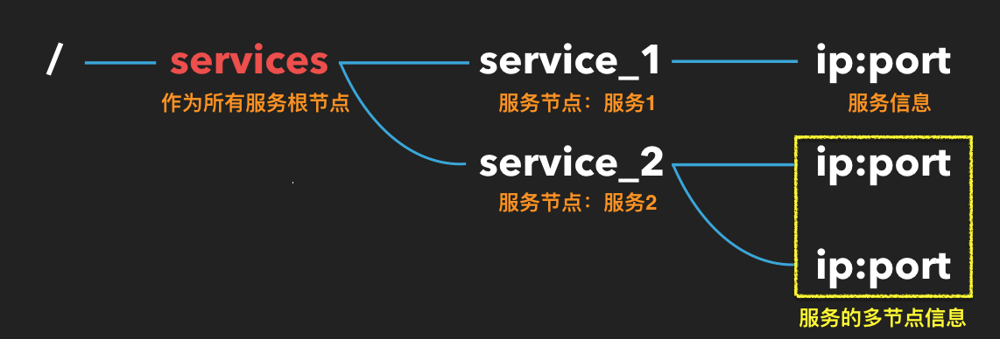

**服务提供者：** 服务以 docker 容器化方式部署（做到服务端口的动态创建），并以 [docker-compose](https://docs.docker.com/compose/) 的方式来管理，这里包含各种语言实现的服务（如JAVA、PHP等），通过 [Registrator](http://gliderlabs.com/registrator/latest/) 完成服务的自动注册。

## 技术说明

**Docker：** 是一个开源工具，能将一个WEB应用封装在一个轻量级，便携且独立的容器里，然后可以运行在几乎任何服务环境下。 Docker的一般使用在以下几点： 自动化打包和部署应用。

**Docker-compose：** 是一个用来定义、启动和管理服务的工具，通过compose配置文件，将一个或多个 Docker 容器组合成一个服务。并通过简单的命令对服务进行管理，如启动、销毁、水平扩展等等。

**Registrator：** 一个由Go语言编写的，针对docker使用的，通过检查容器在线或者停止运行状态自动注册和去注册服务的工具。

**ZK：** 作为一个分布式服务框架，是 Apache Hadoop 的一个子项目，它主要是用来解决分布式应用中经常遇到的一些数据管理问题，如：统一命名服务、状态同步服务、集群管理、分布式应用配置项的管理等等。

## 示例

**代码地址：** [https://github.com/jasonGeng88/service_registry_discovery](https://github.com/jasonGeng88/service_registry_discovery)

示例主要从4个方面演示：

1. 框架搭建
2. 服务准备
3. 场景演示

### 框架搭建：

#### ZK 部署
> 当前位置： 项目根目录

* zookeeper/docker-compose.yml （*为演示方便，这里在单台机器上运行*）：
	
```yaml
version: '2' //docker-compose版本
services:
    zoo1:
        image: zookeeper
        restart: always
        ports:
            - 2181:2181
        environment:
            ZOO_MY_ID: 1
            ZOO_SERVERS: server.1=zoo1:2888:3888 server.2=zoo2:2888:3888 server.3=zoo3:2888:3888

    zoo2:
        image: zookeeper
        restart: always
        ports:
            - 2182:2181
        environment:
            ZOO_MY_ID: 2
            ZOO_SERVERS: server.1=zoo1:2888:3888 server.2=zoo2:2888:3888 server.3=zoo3:2888:3888

    zoo3:
        image: zookeeper
        restart: always
        ports:
            - 2183:2181
        environment:
            ZOO_MY_ID: 3
            ZOO_SERVERS: server.1=zoo1:2888:3888 server.2=zoo2:2888:3888 server.3=zoo3:2888:3888
```


* 启动命令（*执行上述文件*）

```
cd zookeeper && docker-compose up -d
```
	
* 查看结果

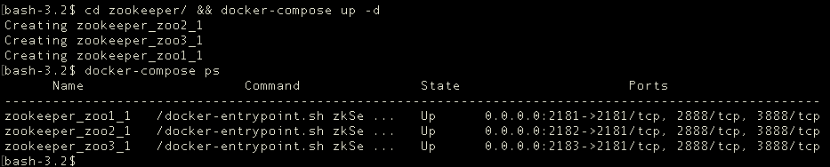

___

#### Registrator 部署
> 当前位置： 项目根目录

* registrator/docker-compose.yml

```yaml
version: '2'
services:
  registrator1:
    image: gliderlabs/registrator
    restart: always
    network_mode: "host"
    volumes:
      - /var/run/docker.sock:/tmp/docker.sock
    # -ip 设置服务写入注册中心的IP地址
    # zookeeper:// 设置连接的 ZK 协议、地址、注册的根节点
    command: "-ip 127.0.0.1 zookeeper://127.0.0.1:2181/services"

  registrator2:
    image: gliderlabs/registrator
    restart: always
    network_mode: "host"
    volumes:
      - /var/run/docker.sock:/tmp/docker.sock
    command: "-ip 127.0.0.1 zookeeper://127.0.0.1:2182/services"

  registrator3:
    image: gliderlabs/registrator
    restart: always
    network_mode: "host"
    volumes:
      - /var/run/docker.sock:/tmp/docker.sock
    command: "-ip 127.0.0.1 zookeeper://127.0.0.1:2183/services"
```
	
* 启动命令

```Shell
cd registrator/ && docker-compose up -d
```	
	
* 查看结果

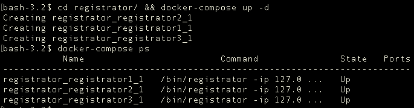
	
目前框架已搭建完毕，我们来连接一台ZK，来观察节点情况：

```Shell
# 进入 ZK 容器
docker exec -it zookeeper_zoo1_1 /bin/bash
# 连接 ZK
zkCli.sh -server 127.0.0.1:2181
```

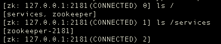

***

### 服务准备：

项目中为演示准备了2个服务，分别是用JAVA、PHP实现的。

#### java_service_1（由springboot实现）:

> 当前位置： services/java_service_1

* 启动文件

```Java
package com.example;

import org.springframework.boot.SpringApplication;
import org.springframework.boot.autoconfigure.SpringBootApplication;

@RestController
@SpringBootApplication
public class DemoApplication {

	@RequestMapping("/")
    String home() {
        return "This is Service 1.";
    }

	public static void main(String[] args) {
		SpringApplication.run(DemoApplication.class, args);
	}
}

```

* 生成 jar 文件

这里使用 [Spring Boot CLI](https://docs.spring.io/spring-boot/docs/current/reference/html/getting-started-installing-spring-boot.html) 进行打包

```Shell
spring jar ROOT.jar src/main/java/com/example/DemoApplication.java
```

* 构建镜像

```Shell
# java_service_1 为你要构建的镜像名，tag默认为latest
docker build -t java_service_1 .
```

***

#### php_service_2:

> 当前位置： services/php_service_2

* index.php

```Php
<?php

echo 'This is Service 2.';

```

* 构建镜像

```Shell
# php_service_2 为你要构建的镜像名，tag默认为latest
docker build -t php_service_2 .
```


***现两个服务镜像以构建完毕，展示如下：***

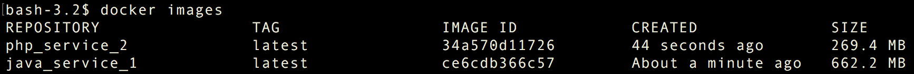

***

### 场景演示：

> 当前位置： services

* **场景 1：** 启动 service_1（JAVA）服务

```
docker-compose up -d service_1
```

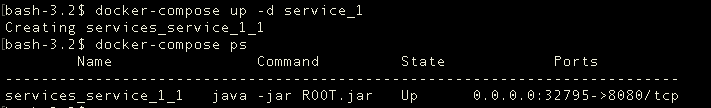

查看 ZK 节点情况

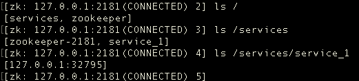

***

* **场景 2：** 启动service_2（PHP）服务

```
docker-compose up -d service_2
```

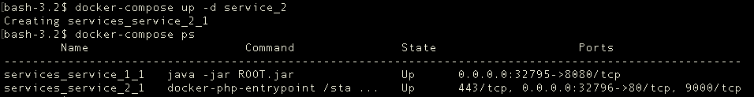

查看 ZK 节点情况

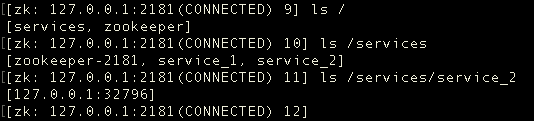

***

* **场景 3：** 扩展service_2（PHP）服务，个数为2

```
docker-compose up -d service_2
```

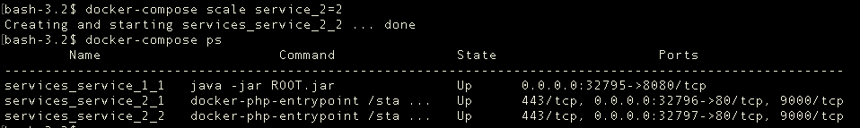

查看 ZK 节点情况

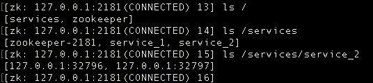


***

* **场景 4：** 注销service_1（JAVA）服务

```
docker-compose up -d service_2
```

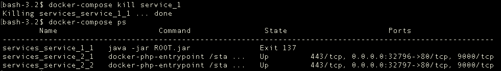

查看 ZK 节点情况

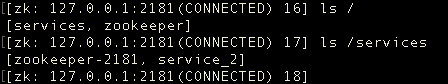


### 优化点
* 在生产环境中，zk安全连接、节点访问控制都是需要注意的。简单做法，可以把连接地址改成内网IP，添加防火墙策略来限制连接客户端。

* Registrator这里采用的是其多个进程分别连接不同的节点，来防止Registrator的单点故障。由于Registrator所用开销较小，在服务数量与ZK节点数量不大的情况下，不会产生问题。 较好的方式是：Registrator提供失效自动地址切换功能（*目前官方文档好像没有提供此方案，有了解的同学可以留言告诉我*）。

## 总结
本文从介绍何为 “服务注册&发现” 切入，以通俗易懂的语言介绍了其内在的本质，最后讲到了实现的所用的具体技术方案，以及以 Demo 的方式，演示了 Registrator 是如何做到服务的自动化注册的。

当然，这只是实现的一种形式。注册中心用 etcd、consul 也都是可行的，而且 Registrator 官方最好的支持是 consul。我们这里就不细究它们的差别了，找到适合自己、满足业务的就是最好的:blush:。

## 后续
1. 服务发现机制与实现


