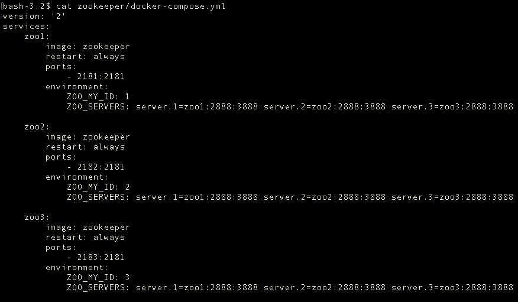
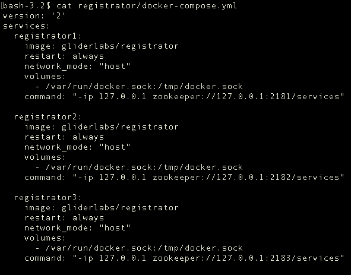

# 基于Docker、Registrator、Zookeeper实现服务自动注册
 
> 摘要：本文属于原创，未经允许不得转载！
> 
> 本文所有服务均采用docker容器化方式部署 
 
 
## 当前环境
1. 系统：Mac OS
2. docker 1.12.1
3. docker-compose 1.8.0


## 技术说明

**Docker：**是一个开源工具，能将一个WEB应用封装在一个轻量级，便携且独立的容器里，然后可以运行在几乎任何服务环境下。 Docker的一般使用在以下几点： 自动化打包和部署应用。

**Registrator：**一个由Go语言编写的，针对docker使用的，通过检查容器在线或者停止运行状态自动注册和去注册服务的工具。

**Zookeeper：**分布式服务框架是 Apache Hadoop 的一个子项目，它主要是用来解决分布式应用中经常遇到的一些数据管理问题，如：统一命名服务、状态同步服务、集群管理、分布式应用配置项的管理等等。

## 场景
在微服务架构中，传统的大型单一服务根据业务场景被拆分成了众多细小的服务模块，每个模块都能独立的对外提供服务。并且根据业务需求，各模块还可以动态的进行的扩容或缩减，充分的利用了服务器资源。

但此架构引入了很多新的问题，其中一个是服务的动态扩容，势必造成服务暴露的地址（IP、Port）将是动态生成的，这对服务的调用者造成了困扰。调用者如何去知晓所调服务的地址？服务地址变化后，又是如何通知到调用者的？

## 注册中心
为解决上述问题，业界给出的一种方案是使用注册中心，通过服务的发布-订阅模式，完成服务的注册与发现功能。

举例来讲，大家过去是否有翻查电话簿打电话的经历。有一天，你想给小明打个电话，可是不知道他的电话号码是多少。于是去翻查电话簿上对方的电话信息，这里电话簿就是所谓的注册中心，而翻查电话簿的动作就是属于服务的发现过程，那么小明给出电话号码，由自己（他人）记录在电话簿上的动作就属于服务的注册过程。

理解了其内在的本质，再看下面的流程图就很清楚了。


1. 服务注册：服务提供者将自身的服务信息注册进注册中心；
2. 服务订阅：服务消费者从注册中心获取服务信息，并对其进行监听；
3. 缓存服务信息：将获取到的服务信息缓存到本地，减少与注册中心的网络通信；
4. 服务调用：查找本地缓存，找到对应的服务地址，发送服务请求；
5. 变更通知：当服务节点有变动时（服务新增、删除等），注册中心将通知监听节点变化的消费者，使其更新服务信息。

## 服务注册
回到小明的例子，小明有两种方式将自己的电话写入电话簿，一种是自己亲自去写，一种是找他人代为登记。即所谓的服务自注册与第三方注册。

* 自注册：服务内部启动客户端，连接注册中心，写入服务信息。
	* 问题：
		* 	服务代码对注册中心进行了硬编码，若更换注册中心，服务代码将必须进行调整；
		*  每个服务都保持了一个与注册中心的连接，如果服务增多，注册中心的连接数将 成为一个瓶颈；
*  第三方注册：采用协同进程的方式，监听服务进程的变化，将服务信息注册进注册中心。
	*  好处：做到了服务与注册中心的解耦，对服务而言，完成了服务的自动化注册；
	*  问题：协同进程本身也要考虑高可用，否则将成为单点故障的风险点；

*由于篇幅有限，服务消费者相关内容将在下篇详细展开*

## 技术方案

**服务注册中心：**作为整个架构中的核心，需要做到的是可分布式、持久化存储的中心服务器，同时负责将服务注册信息的更新通知实时的Push给服务消费者，这里选用的是 ZK（zookeeper）。

大家可以把 ZK 想象成文件目录，注册中心在 ZK 中的展现就是节点路径图，不同的节点下存放者相应的服务信息，ZK路径图如下：


**服务提供者：**通过docker启动服务，这里包含各种语言实现的服务（如JAVA、PHP等），通过Registrator完成服务的自动注册。

## 示例

代码仓库地址：[https://github.com/jasonGeng88/service_registry_discovery](https://github.com/jasonGeng88/service_registry_discovery)

示例主要从4个方面演示：

1. 框架搭建
2. 服务准备
3. 场景演示
4. 可用性测试

### 框架搭建：

* ZK 部署
	* 配置文件（*为演示方便，这里在单台机器上运行*）：

	

	* 启动命令

	```
	cd zookeeper && docker-compose up -d
	```
	
	* 查看结果

	
	

* Registrator 部署
	* 配置文件

	 
	
	* 启动命令

	```
	cd registrator/ && docker-compose up -d
	```	
	
	* 查看结果

	
	
目前框架已搭建完毕，我们来连接一台ZK，来观察节点情况：

```
# 进入 ZK 容器
docker exec -it zookeeper_zoo1_1 /bin/bash
# 连接 ZK
zkCli.sh -server 127.0.0.1:2181
```


### 服务准备：
项目中为演示准备了2个服务，分别是用JAVA、PHP实现的。

**java_service_1（由springboot实现）:**

*进入 services/java_service_1 执行以下操作*

* 启动文件

```
package com.example;

import org.springframework.boot.SpringApplication;
import org.springframework.boot.autoconfigure.SpringBootApplication;

@RestController
@SpringBootApplication
public class DemoApplication {

	@RequestMapping("/")
    String home() {
        return "This is Service 1.";
    }

	public static void main(String[] args) {
		SpringApplication.run(DemoApplication.class, args);
	}
}

```

* 打包jar文件

这里使用 [Spring Boot CLI](https://docs.spring.io/spring-boot/docs/current/reference/html/getting-started-installing-spring-boot.html) 进行打包

```
spring jar ROOT.jar src/main/java/com/example/DemoApplication.java
```

* 构建镜像

```
# java_service_1 为你要构建的镜像名，tag默认为latest
docker build -t java_service_1 .
```

**php_service_2:**

*进入 services/php_service_2 执行以下操作*

* index文件

```
<?php

echo 'This is Service 2.';

```

* 构建镜像

```
# php_service_2 为你要构建的镜像名，tag默认为latest
docker build -t php_service_2 .
```

### 场景演示：
* 场景 1：启动 service_1（JAVA）服务

```
docker-compose up -d service_1
```


查看 ZK 节点情况


* 场景 2：启动service_2（PHP）服务

```
docker-compose up -d service_2
```


查看 ZK 节点情况


* 场景 3：扩展service_2（PHP）服务，个数为2

```
docker-compose up -d service_2
```


查看 ZK 节点情况


* 场景 4：注销service_1（JAVA）服务

```
docker-compose up -d service_2
```


查看 ZK 节点情况


### 优化点
* 在生产环境中，zk安全连接、节点访问控制都是需要注意的。简单做法，可以把连接地址改成内网IP，添加防火墙策略来限制连接客户端。
* Registrator这里采用的是其多个进程分别连接不同的节点，来防止Registrator的单点故障。由于Registrator所用开销较小，在服务数量与ZK节点数量不大的情况下，不会产生问题。 较好的方式是：Registrator提供失效自动地址切换功能（*目前官方文档好像没有提供此方案*）。

## 总结


