# 看 Docker Swarm 如何做集群
 
> 摘要：本文属于原创，欢迎转载，转载请保留出处：[https://github.com/jasonGeng88/blog](https://github.com/jasonGeng88/blog)
> 
> 本文所有服务均采用docker容器化方式部署 
 
 
## 当前环境
1. Mac OS 10.11.x
2. Docker >= 1.12

## 目录

* 基本概念
* 安装
* 使用场景
* 分配策略
* 高可用
* 总结

## 基本概念

### 技术说明
* Docker Engine：作为 Docker 镜像构建与容器化启动的工作引擎；
* Docker Machine：安装与管理 Docker Engine 的工具；
* Docker Swarm：是 Docker 自1.12后自带的集群技术，将多个独立的 Docker Engine 利用 Swarm 技术进行集群化管理；

### 原理

简单来讲，Docker 集群的实现是通过 Docker Machine 在多主机或虚拟机上创建多个 Docker Engine，在利用 Docker Swarm 以某个 Engine 作为集群的初始管理节点，其他 Engine 以管理或工作节点的方式加入，形成完成的集群环境。

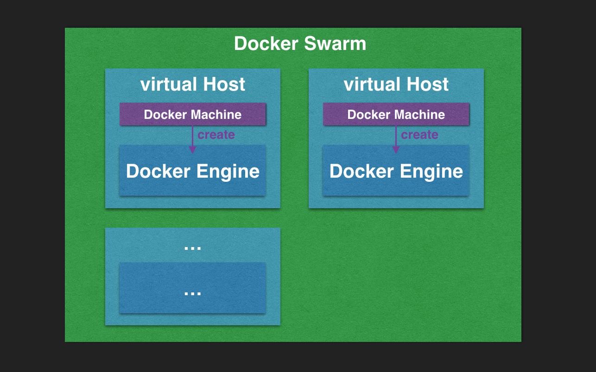

## 安装（本次演示在单台 Mac 上进行）

### 创建 Docker Engine

使用 docker-machine 命令创建 docker 工作引擎。

参数说明：

-d：设置 Docker Engine 驱动（Mac 下默认是 virtualbox）

--virtualbox-boot2docker-url：设置驱动地址（*如果默认驱动下载很慢，可以更改国内的下载路径*）

下面创建4个引擎，1个集群管理者和3个工作者：
??

``` 
docker-machine create -d virtualbox manager1
docker-machine create -d virtualbox worker1
docker-machine create -d virtualbox worker2
docker-machine create -d virtualbox worker3
```

查看运行结果（docker-machine ls）：

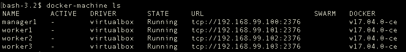


### 初始化集群
* 连接 manager1

```
eval $(docker-machine env manager1)
```

查看运行结果：

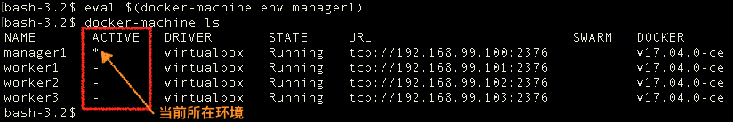

* 创建 swarm

```
docker swarm init --advertise-addr 192.168.99.100
```

参数说明：

--advertise-addr：设置管理节点的对外IP，供集群中的其他节点访问；

命令说明：

该命令会创建一个新的 swarm，以当前节点作为 swarm 的管理节点。同时生成2个 token （manager/worker）供其他节点加入使用（*查询token命令 docker swarm join-token*）。

查看集群节点状况（docker node ls）：

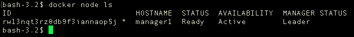

---

### 加入工作节点

```
# 连接 worker1
eval $(docker-machine env worker1)

# 加入 swarm
docker swarm join \
--token WORKER_TOKEN \
192.168.99.100:2377
```

*同上，将其余两个以 worker 身份加入*

查看集群节点状况（*仅可在管理节点下查看*）：

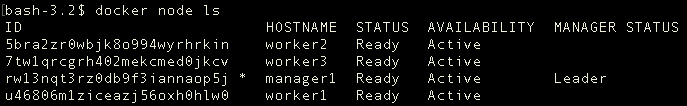

---

### 移除节点

如果想要移除集群下的某个节点，可在该节点环境下，执行该命令：

```
$ eval $(docker-machine env worker3)

# 当前环境在 worker3 上
docker swarm leave
```

查看集群节点状况

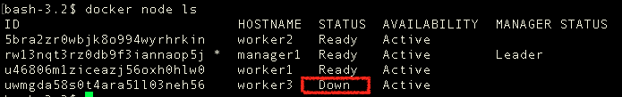

---

### 重新加入集群

```
# 加入 swarm
docker swarm join \
--token WORKER_TOKEN \
192.168.99.100:2377
```

查看集群节点状况


---

### 移除无效节点

```
docker node rm INVALID_ID
```

查看集群节点状况

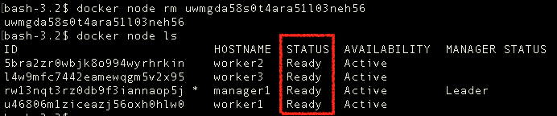

## 使用场景
关于 swarm 集群的搭建已经完成了，接下来就是启动服务。启动服务的模式分为：replicated 和 global。

replicated（默认方式）：先在一个 node 节点上创建一个服务，通过复制的方式进行扩展，这中间涉及扩展的策略。

global：在每个 node 节点上都会创建一个服务，像 Registrator（自动注册服务） 就很适合用这种方式执行。

### 以 gobal 方式创建 nginx 服务

```
docker service create --mode=global --name=web nginx
```

查看服务启动情况（每个节点都起了一个 web 服务）：

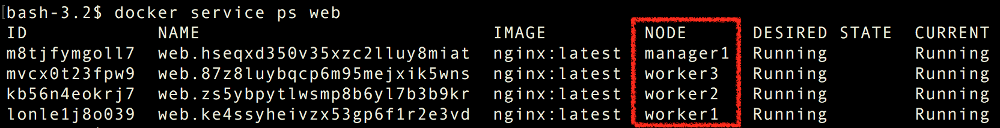

### 以 replicated 方式创建 nginx 服务

* 创建一个 nginx 服务

```
docker service create --name=web nginx
```

查看服务启动情况：

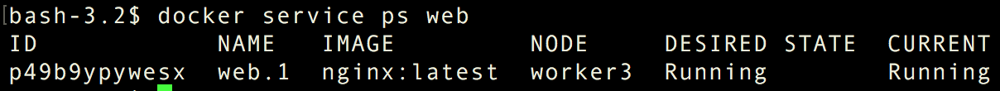

* 将服务依次扩展至5个

```
docker service scale nginx=2
```

查看服务启动情况

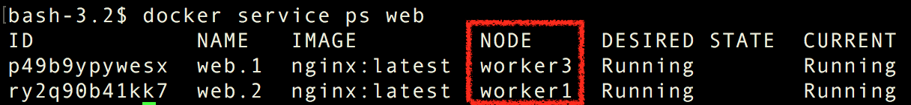

```
docker service scale nginx=3
```

查看服务启动情况

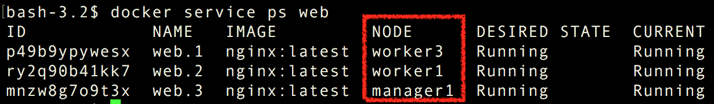

```
docker service scale nginx=4
```

查看服务启动情况

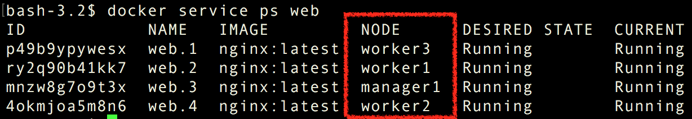

```
docker service scale nginx=5
```

查看服务启动情况

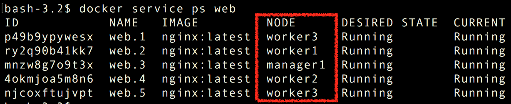

## 扩展分配策略

从服务的扩展可以看出，其中存在了一定的分配策略。这里采用的是默认的 Spread 策略。下面简单描述下最常用的2种 Spread 与 BinPack。[详细的介绍还请查看官方文档（如filters、affinity的使用）](https://docs.docker.com/swarm/scheduler/strategy/)。

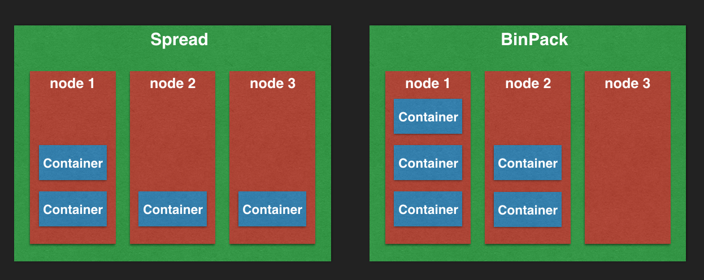

* Spread：依据节点个数进行平均分配。
	* 优势：在容器使用资源相对一致的情况下，整体资源使用在每个节点上做了平均的分配；
	* 不足：若每个容器所占资源相差很大，那么节点的资源使用率将存在明显差异，导致资源使用的浪费；
 	
* BinPack：尽可能的使用一个节点的资源，在节点资源不足的情况下，更换使用节点。
	* 优势：节点资源能得到充分使用；
	* 不足：单节点的负重较高，而且每个节点性能未必都一样，可能会分重CPU或重磁盘读写等。

真实场景还是得依据具体的业务来合理使用分配策略。特殊情况，还需要搭配使用 filters、affinity 来具体选择节点。[详细的介绍还请查看官方文档](https://docs.docker.com/swarm/scheduler/filter/)。

## 高可用

服务的启动都是通过 manager 节点将启动服务分发给 worker 节点，而且服务的管理也是由manager节点来控制的。

* manager 节点的可用性：我们可以设置多个 manager 节点。当 primary manager 挂掉后，secondary managers 中会选举一个作为 primary manager，以保证服务的高可用性。

* 服务高可用：服务如果启动失败，或中途异常中止，会进行自动重启。保障了扩展服务的可用性。

## 总结

本文主要讲述了如何使用 Docker Swarm 来做 docker 的集群管理。其中包括了集群部署、服务的启动、扩展，以及常用的分配策略。

swarm 在 docker 1.12开始被集成进了docker中。相比之前版本，以 docker run swarm create 启动的方式，现节点与节点之间是通过内置的 DNS 发现机制进行通信，使用更为便捷。

最后也提一下，使用 k8s 做容器集群管理的也在多数。这里不讨论两者的好坏，如果还没用 k8s 的可以考虑使用 swarm，毕竟目前是docker 内置的服务。

