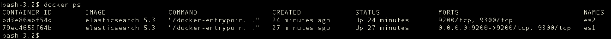
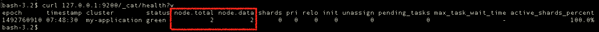
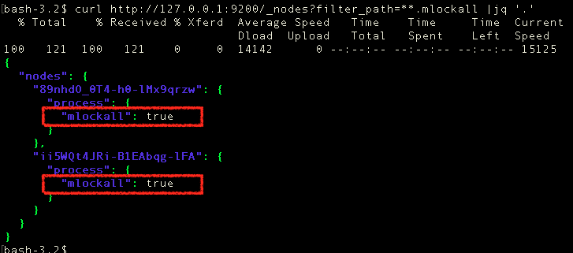

# Elasticsearch 集群配置与容器部署
> 摘要：本文属于原创，欢迎转载，转载请保留出处：[https://github.com/jasonGeng88/blog](https://github.com/jasonGeng88/blog)
> 
> 本文所有服务均采用docker容器化方式部署 
 
 
## 当前环境
1. Mac OS 10.11.x
2. Docker >= 1.12
3. elasticsearch 5.3

## 技术说明
Elasticsearch（ES） 是一个分布式可扩展的实时搜索和分析引擎。底层基于的是 Apache Lucene 的搜索引擎。

## 目录
* 配置文件讲解
* 容器化配置
* 总结

## 简介
写这篇文章的主要原因是之前部署 ES 集群的过程中遇到了一些问题，后来在看了官方文档后，发现和网上类似的文章还是所有差别。网上基本都是版本比较早的，而且没有用容器化来部署。尤其是在 版本5 之后引入了 Bootstrap Check 机制，下面来给大家讲讲我的理解。

## 配置文件
ES 有两个配置文件，分别是：

* **elasticsearch.yml**：ES 的具体配置。
* **log4j2.properties**：ES 日志文件。（*顺便提一下，ES 是由 JAVA 实现的，所以写 JAVA 的同学看到这文件应该很熟悉，这里就不展开了*）。

---
### **elasticsearch.yml 配置**

### 路径
* path.data: ES 数据的存储地址；
* path.logs: ES 日志地址；

### 网络

ES 在网络方面主要提供两种协议：

1. http： 用于 REST API 的使用；
2. tcp：用于节点间通信；

其对应的模块是 http 与 transport，详情可查看 [模块列表](https://www.elastic.co/guide/en/elasticsearch/reference/current/modules.html)。

* http.host：设置 HTTP 的服务地址；
* http.port：设置 HTTP 端口，默认端口 9200-9300；
* transport.host：设置 TCP 的服务地址；
* transport.tcp.port：设置 TCP 端口，默认端口 9300-9400；

ES 还提供了一个 network.host 设置，http 与 tcp 的 host 默认是绑定在它上面的，所以大多数情况下，上面参数可不进行配置。

* network.host：默认为本地回环地址。**<font color="red">当定义该属性时，程序环境默认切换至生产环境（即开启 Bootstrap Checks）</font>**。

### 集群
ES 中的集群是根据集群名称来关联的，它会将集群名称相同的节点自动关联成一个集群，并通过节点名称来做区分。

节点常用的分为 集群管理节点（master） 与 数据操作节点（data），默认情况下是两者都是。

* cluster.name：集群名称，默认名称 elasticsearch；
* node.name：节点名称，同一集群下，节点名称不能重复；

### 发现机制

上面讲了集群的组成，但是节点与节点之间是如何发现的呢？

这里采用的是 ES 自带的 Zen Discovery 发现机制，

* discovery.zen.ping.unicast.hosts：需要发现的节点地址，支持 IP 和 domain，在不指定端口的情况下，会默认扫描端口 9300 - 9305。

```
discovery.zen.ping.unicast.hosts:
   - 192.168.1.10:9300
   - 192.168.1.11 
   - seeds.mydomain.com 
```

* discovery.zen.minimum_master_nodes：master 节点最少可用数，当节点数小于该值，服务将不可用。这也是为了避免集群中出现多个中心，导致数据不一致；

```
# 计算公式：(master 节点数 / 2) + 1
# 例子：(3 / 2) + 1
discovery.zen.minimum_master_nodes: 2
```

### Bootstrap Checks（生产环境）

上面讲到了 Bootstrap Checks，这也是它区别之前老版本的一个地方，在以前的版本中，也有这些警告，但有时会被人忽视，造成了服务的不稳定性。在版本 5.0 之后，对这些在启动时做了强校验，来保证在生产环境下的稳定性。

这些校验主要涉及有内存、线程数、文件句柄等，

* JVM heap：

建议将最小堆与最大堆设置为一样，当设置bootstrap.memory_lock时，在程序启动就会对内存进行锁定。

```
ES_JAVA_OPTS=-Xms512m -Xmx512m
```

* 内存锁定，禁止内存与磁盘的置换

```
bootstrap.memory_lock: true
```

* 取消文件数限制

```
ulimit -n unlimited
```

* 取消线程数限制

```
ulimit -l unlimited
```

## 容器化配置

关于容器化还是通过 docker 技术来实现，这里为了简单起见，以 Docker Cli 的方式进行部署。

* es1.yml

```
cluster.name: my-application
node.name: node-1
# 可以选择宿主机地址，网络模式选择 --net=host
network.host: 172.17.0.2
bootstrap.memory_lock: true
discovery.zen.ping.unicast.hosts: ["172.17.0.3"]
discovery.zen.minimum_master_nodes: 2
```

* es2.yml

```
cluster.name: my-application
node.name: node-2
network.host: 172.17.0.3
bootstrap.memory_lock: true
discovery.zen.ping.unicast.hosts: ["172.17.0.2"]
discovery.zen.minimum_master_nodes: 2
```

* docker cli

```
# 启动 es1
docker run -d \
--name=es1 \
-p 9200:9200 \
-e "ES_JAVA_OPTS=-Xms512m -Xmx512m" \
--ulimit memlock=-1:-1 \
--ulimit nofile=65536:65536 \
-v ${YOUR_PATH}/es1.yml:/usr/share/elasticsearch/config/elasticsearch.yml \
-v ${YOUR_PATH}/data:/usr/share/elasticsearch/data \
-v ${YOUR_PATH}/logs:/usr/share/elasticsearch/logs \
elasticsearch:5.3

# 启动 es2
docker run -d \
--name=es2 \
-e "ES_JAVA_OPTS=-Xms512m -Xmx512m" \
--ulimit memlock=-1:-1 \
--ulimit nofile=65536:65536 \
-v ${YOUR_PATH}/es2.yml:/usr/share/elasticsearch/config/elasticsearch.yml \
-v ${YOUR_PATH}/data:/usr/share/elasticsearch/data \
-v ${YOUR_PATH}/logs:/usr/share/elasticsearch/logs \
elasticsearch:5.3

```

查看结果：

* 容器情况



* 集群情况（GET: /_cat/health?v）



* 内存锁定情况（GET: /_nodes?filter_path=**.mlockall）



*<font color="red">坑：在容器化中，由于没锁定内存。每次在节点加入时，容器总是意外崩溃，查看容器相关日志也没有任何说明。后来在系统日志中发现内存溢出的问题。所以再次强调，一定要设置 bootstrap.memory_lock: true，并且查看是否生效。</font>*


## 总结
本文从 ES 的配置文件开头，从 文件路径、网络情况、集群配置以及生产环境的校验等方面讲述了配置文件的主要内容，最后以 docker 容器化的方式进行了集群的部署。虽然文章写的比较简单，但涉及的面还是比较多的，包括节点间发现的网络单播传输、集群最小节点个数的算法、jvm的内存限制、内存与磁盘的置换限制等。有兴趣的同学，可以自行去研究下。


