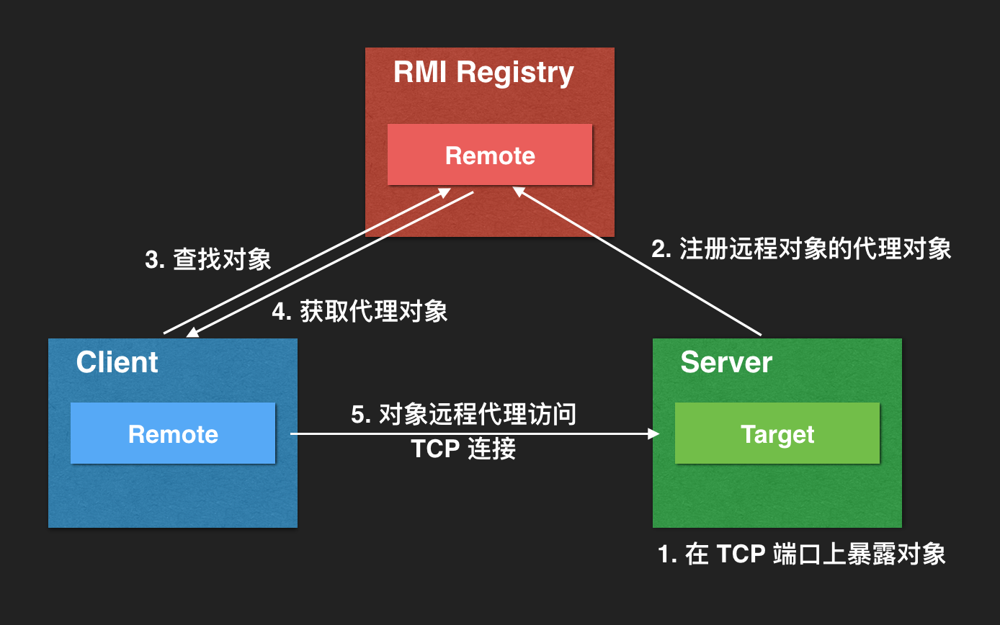
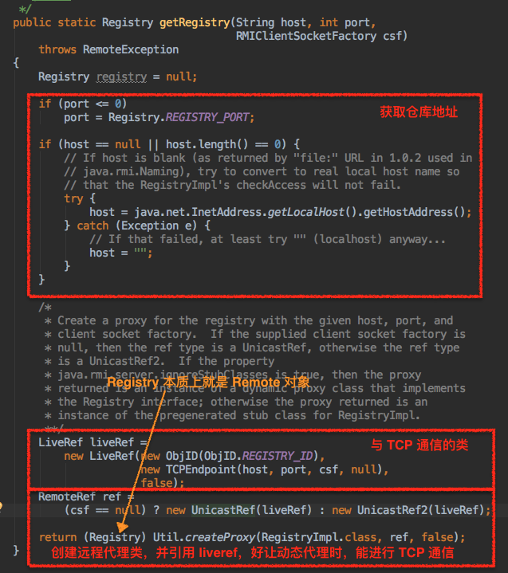
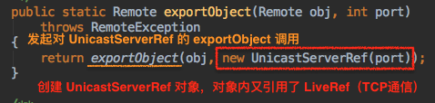
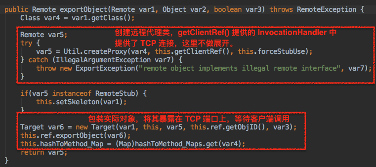
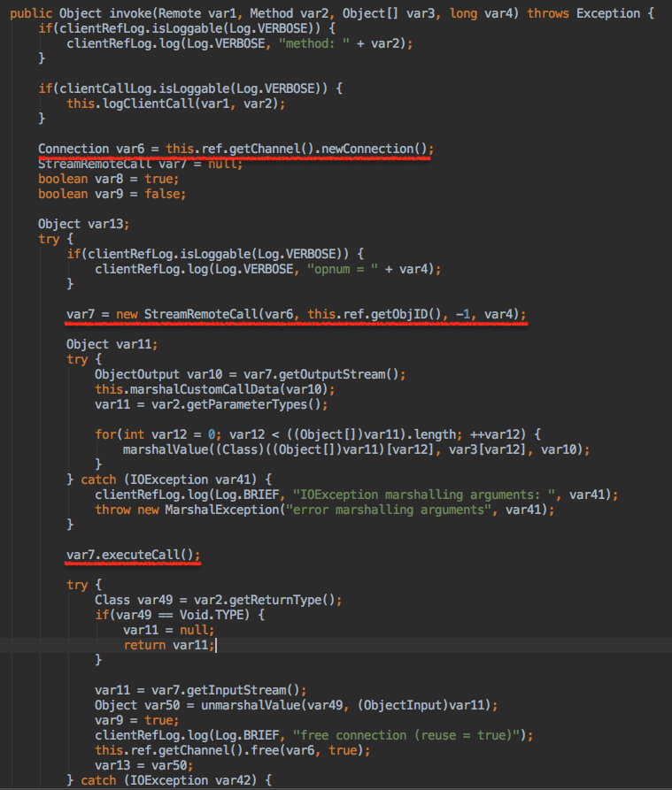

# JAVA中最简单的分布式调用 RMI
 
> 摘要：本文属于原创，欢迎转载，转载请保留出处：[https://github.com/jasonGeng88/blog](https://github.com/jasonGeng88/blog)
 
 
**代码地址：[https://github.com/jasonGeng88/rmi-sample-rpc](https://github.com/jasonGeng88/rmi-sample-rpc)**

## 前言
我们先来看一个例子：

系统中目前存在两个 JAVA 服务，分别是服务A、服务B。现在服务A 想要调用服务B中的某个服务，我们怎么实现呢？

有人觉得这不很简单，服务B暴露一个服务接口，服务A通过 RPC 的方式来访问这个接口，这里的 RPC 可以引用第三方实现，也可以通过简单的 REST 请求的方式实现。

是的，解决这场景的方法有很多，其实 JAVA 自身也提供了一种更简单的方式，即通过 RMI 实现跨 JVM 虚拟机的远程调用。虽然它和现在主流的 RPC 相比，可能显得比较无力。但是其设计思想，加上它的简单易用，我们不妨来看一下。

## RMI 简介

RMI（Remote Method Invocation）是一种用于实现远程过程调用的应用程序编程接口。它使客户机上运行的程序可以调用远程服务器上的对象。远程方法调用特性使Java编程人员能够在网络环境中分布操作。

### 特点
* 是 JAVA 自带的功能，无需集成任何的外部扩展；
* 数据传输是面向对象的；
* 动态下载对象资源；
* 仅限 JAVA 间通信；

### 通信协议
服务间的通信通过 TCP 传输。协议约定为 rmi://，仅限JAVA之间的远程通信；

### 成员

- RMI Registry：作为存储远程服务的代理对象的仓库
- Server：服务端，暴露远程对象，并将其代理对象注册进 RMI Registry
- Client：客户端，查找远程代理对象，远程调用服务对象

### 运行机制



从上图可以看出，虽然 RMI 目前看上去有点过时了，但其思想和现在的服务注册与发现还是很相似的。归纳起来，包含以下几点：

1. 启动注册中心
1. 服务端：暴露服务
2. 服务端：服务注册
3. 客户端：获取服务地址（代理对象）
4. 客户端：远程调用服务

### 使用方法

* 启动 RMI Registry

这里启动仓库有两种方式，一种是在程序中启动：

```
import java.rmi.registry.LocateRegistry;
Registry registry = LocateRegistry.createRegistry(REGISTRY_PORT);
```

另一种通过命令启动：

```
/usr/bin/rmiregistry REGISTRY_PORT
```

* 获取 RMI Registry
	* 通过环境变量 java.rmi.server.hostname 来设置仓库地址

```
import java.rmi.registry.LocateRegistry;
Registry registry = LocateRegistry.getRegistry(REGISTRY_PORT)
```

* 定义远程服务接口

	* 接口继承 Remote
	* 接口方法必须抛出 RemoteException

```
import java.rmi.Remote;
public interface RemoteService extends Remote {

    //define your function
    Object run() throws RemoteException;

}
```

* UnicastRemoteObject.exportObject(Remote obj, int port)

	* 创建 Remote 对象的代理类，并实现 Serializable 接口
	* 在 TCP 上暴露远程服务
	* port 为 0 表示使用匿名随机端口 （*使用1~1023的已知端口时，注意权限问题*）

```
import java.rmi.server.UnicastRemoteObject;
Remote remoteProxy = UnicastRemoteObject.exportObject(your_remote_service, 0);
```

* 注册远程对象到 RMI Registry（*在 Registry 中的都是对象的远程代理类，并非真正的对象*）

获取 Registry 的远程代理类，然后调用它的 rebind 将代理对象注册进仓库中 （*Naming.rebind(String name, Remote obj) 本质上也是解析 name 中的仓库地址，获取仓库的代理对象，进而进行远程注册*）

```
// 本地创建或远程获取 Registry
Registry registry = ...
registry.rebind(String name, Remote obj);
```

* 查找远程调用对象

```
Registry registry = LocateRegistry.getRegistry(REGISTRY_PORT);
Remote obj = registry.lookup(REMOTE_NAME);
```

## 示例

###准备工作：
定义远程对象接口

```
package com.test.remote;

import java.rmi.Remote;
import java.rmi.RemoteException;

public interface RemoteService extends Remote {

    Object run() throws RemoteException;

    Object run(Object obj) throws RemoteException;

}
```

###服务B：注册远程服务

* 实现远程服务对象

```
package com.test.serviceB.publishService;

import com.test.remote.RemoteService;
import java.rmi.RemoteException;

public class pService1 implements RemoteService {

    public Object run() {
        System.out.println("invoke pService1.");
        return "success";
    }

    public Object run(Object obj) throws RemoteException {
        System.out.println("invoke pService1, params is " + obj.toString());
        return "success";
    }

}
```

* 启动服务

	* 创建 RMI Registry（也可在通过命令 rmiregistry 在应用外创建）
	* 实例化远程服务
	* 导出远程对象，使其能接受远程调用
	* 将导出的远程对象绑定到仓库中
	* 等待服务调用

```
public class Boot {

    private static final String REMOTE_P1 = "serviceB:p1";
    private static final int REGISTRY_PORT = 9999;

    public static void main(String[] args) throws RemoteException {
    	  
    	 // 实例化远程对象，并创建远程代理类
        RemoteService p1 = new pService1();
        Remote stub1 = UnicastRemoteObject.exportObject(p1, 0);
        
        // 本地创建 Registry，并注册远程代理类
        Registry registry = LocateRegistry.createRegistry(REGISTRY_PORT);
        registry.rebind(REMOTE_P1, stub1);

        System.out.println("service b bound");

    }
}
```

###服务A：调用远程服务

* 启动服务
	* 连接仓库
	* 在 Registry 中查找所调用服务的远程代理类
	* 调用代理类方法

```
public class Boot {

    private static final String REMOTE_P1 = "serviceB:p1";
    private static final int REGISTRY_PORT = 9999;

    public static void main(String[] args) throws RemoteException {

        try {
        
            Registry registry = LocateRegistry.getRegistry(REGISTRY_PORT);
            // 从仓库中获取远程代理类
            RemoteService p1 = (RemoteService) registry.lookup(REMOTE_P1);
            // 远程动态代理
            String res1 = (String)p1.run();
            System.out.printf("The remote call for %s %s \n", REMOTE_P1, res1);

        } catch (NotBoundException e){
            e.printStackTrace();
        } catch (RemoteException e){
            e.printStackTrace();
        }

    }
}
```

### 演示结果

* 启动服务B

```
service b bound
```

* 启动服务A

```
The remote call for serviceB:p1 success 

Process finished with exit code 0
```

* 查看服务B 调用情况

```
service b bound
invoke pService1.
```


## 高级用法

上面示例没有涉及到远程调用的传参问题。如果需要传参，且传参的类型不是基本类型时，远程服务就需要动态的去下载资源。

这里通过设置环境变量来实现远程下载：

* java.rmi.server.codebase：远程资源下载路径（必须是绝对路径），可以是file://, ftp://, http:// 等形式的；
* java.rmi.server.useCodebaseOnly：默认为 true, 表示仅依赖当前的 codebase, 如果使用外部的 codebase（*服务B 需要使用 服务A 提供的下载地址时*），需将此参数设置为false；

对于跨主机的访问，RMI 加入了安全管理器（SecurityManager），那么也需要对应的安全策略文件

* java.security.policy：指定策略文件地址；

其他设置：

* java.rmi.server.hostname：设置仓库的主机地址；
* sun.rmi.transport.tcp.handshakeTimeout：设置连接仓库的超时时间；

## 核心代码

关于源码的阅读，网上曾经看到一句话讲的很好，“源码阅读的什么样程度算好，阅读到自己能放过自己了，那就够了。”

我一般喜欢带着问题来阅读，这里我从几个问题入手，简单分享下我的理解。

* 获取到的 Registry 对象到底是什么东西？

从这段代码来分析：

```
Registry registry = LocateRegistry.getRegistry(REGISTRY_PORT);
```



* 远程对象到底是什么，原始对象又在哪里呢？

从这段代码来分析：

```
Remote obj = UnicastRemoteObject.exportObject(Remote obj, int port);
```





* 知道了仓库中存放、获取的都是 远程对象的代理类，那么实际的远程通信是如何完成的？

知道 JDK 动态代理的同学，肯定有一个 invoke 方法，是方法调用的关键。这里的 invoke() 具体代码在 UnicastRef 中。




## 问题

从源码中可以看出，远程调用每次都会 新建一个 connection，感觉这里会成为一个性能的瓶颈。

## 总结

虽然 RMI 在目前看来有些过时了，但它的思想：远程仓库、服务注册、服务查找、代理调用等，和目前主流的 RPC 是不是很相似呢？一种技术的过时，往往是跟不上业务的快速发展，但它的产生至少是满足了当时的需求。

个人觉得，技术的实现会随着业务的发展不断的变化，但是核心思想一定是小步的进行，毕竟这些都是不断积累的经验总结出来的。希望本篇对大家能有所收获！


