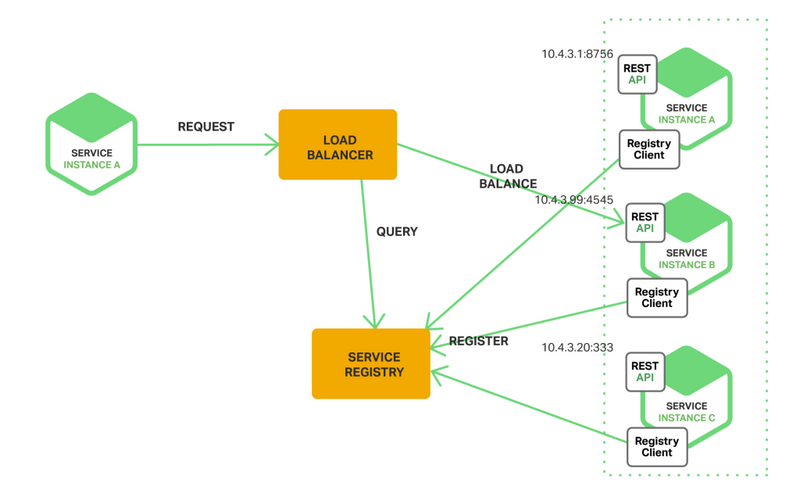

# 基于Docker、NodeJs实现高可用的服务发现
 
> 摘要：本文属于原创，欢迎转载，转载请保留出处：[https://github.com/jasonGeng88/blog](https://github.com/jasonGeng88/blog)
> 
> 本文所有服务均采用docker容器化方式部署 
 
 
## 当前环境
1. 系统：Mac OS
2. docker 1.12.1
3. docker-compose 1.8.0

## 前言

基于上一篇的 [“基于Docker、Registrator、Zookeeper实现的服务自动注册”](https://github.com/jasonGeng88/blog/blob/master/201703/service_registry.md)，完成了 “服务注册与发现” 的上半部分（即上图中的1）。本文就来讲讲图中的2、3、4、5 分别是如何实现的。

## 功能点
- 服务订阅
	- 动态获取服务列表
	- 获取服务节点信息（IP、Port）
- 本地缓存
	- 缓存服务路由表
- 服务调用
	- 服务请求的负载均衡策略
	- 反向代理
- 变更通知
	- 监听服务节点变化
	- 更新服务路由表

## 技术方案
### 服务发现方式
关于服务发现的方式，主要分为两种方式：客户端发现与服务端发现。它们的主要区别为：前者是由调用者本身去调用服务，后者是将调用者请求统一指向类似服务网关的服务，由服务网关代为调用。

这里采用服务端发现机制，即服务网关（*切记：服务网关的作用不仅仅是服务发现*）。

与客户端发现相比，可见的优势有：

1. 服务调用的统一管理；
2. 减少客户端与注册中心不必要的连接数；
3. 将后端服务与调用者相隔离，降低服务对外暴露的风险；

### 所选技术 
本文采用 NodeJs 作为服务网关的实现技术。当然，这不是唯一的技术手段，像nginx+lua，php等都能实现类似的功能。我这里采用 NodeJs 主要出于以下几个原因：

1. NodeJs 采用的是事件驱动、非阻塞 I/O 模型，具有天生的异步性。在处理服务网关这种以IO密集型为主的业务时，正是 NodeJs 所擅长的。
2. NodeJs 基于Chrome V8 引擎的 JavaScript 语言的运行环境，对于有一定 JavaScript 基础的同学，上手相对简单。

*所有技术都有其优劣所在，NodeJs 在这里的使用也存在一定的问题（本文最后会讲述它的高可用策略）：*

1. NodeJs 是基于单进程单线程的方式，这种方式存在一定的不可靠性。一旦进程崩溃，对应的服务将变得不可用；
2. 单进程单线程方式，也导致了只能利用单核CPU。为了充分利用计算机资源，还需进行服务的水平扩展；

## 演示代码

## 高可用

1. NodeJs 重启机制
2. 分布式部署

## 优化点
1. 调用链过深

## 总结

