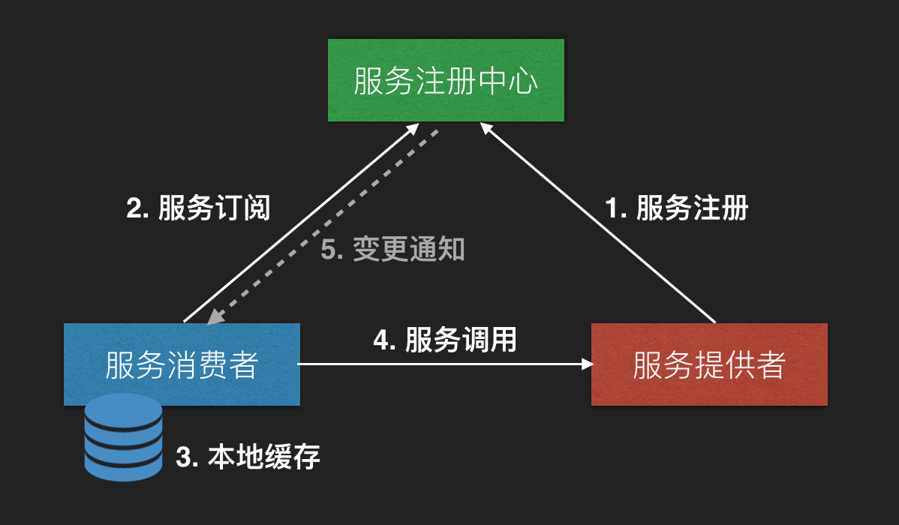
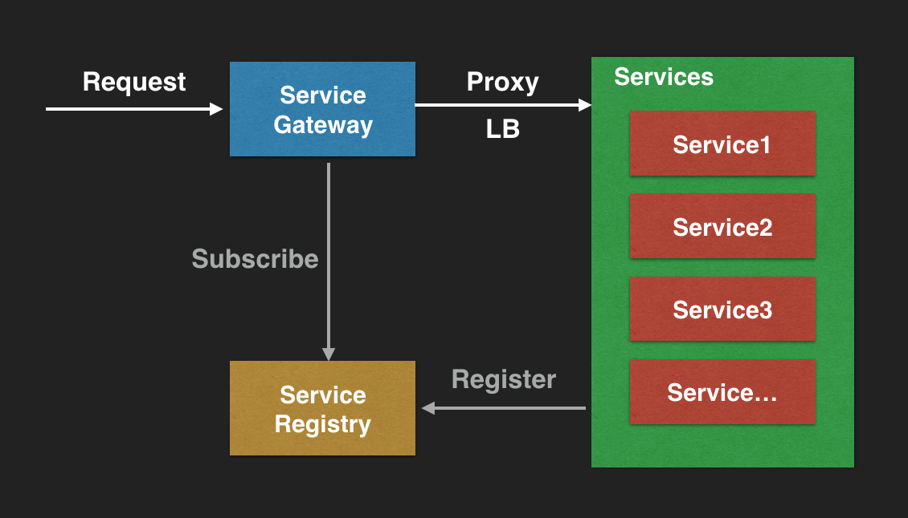
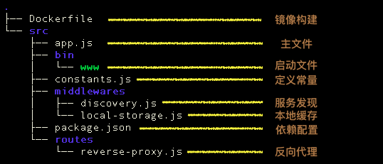
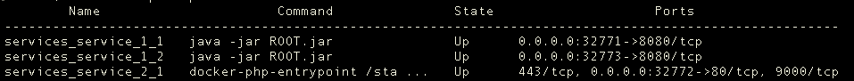
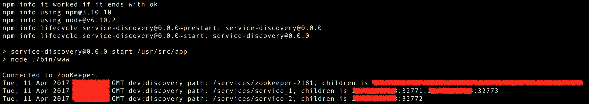
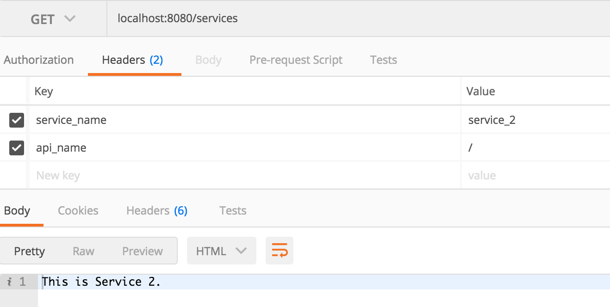
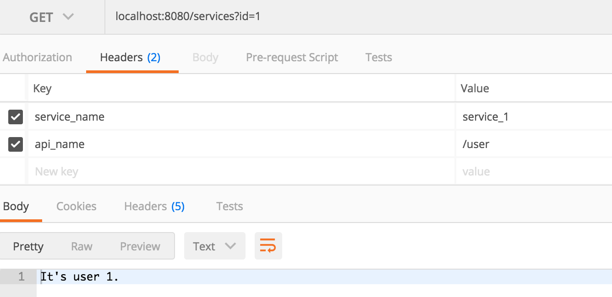
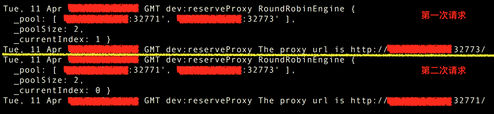
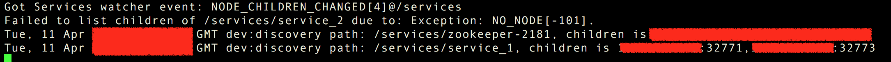

# 基于Docker、NodeJs实现高可用的服务发现
 
> 摘要：本文属于原创，欢迎转载，转载请保留出处：[https://github.com/jasonGeng88/blog](https://github.com/jasonGeng88/blog)
> 
> 本文所有服务均采用docker容器化方式部署 
 
 
## 当前环境
1. Mac OS 10.11.x
2. docker 1.12.1
3. docker-compose 1.8.0
4. node 6.10.2

## 前言


基于上一篇的 [“基于Docker、Registrator、Zookeeper实现的服务自动注册”](https://github.com/jasonGeng88/blog/blob/master/201703/service_registry.md)，完成了 “服务注册与发现” 的上半部分（即上图中的1）。本文就来讲讲图中的2、3、4、5 分别是如何实现的。

## 功能点
- 服务订阅
	- 动态获取服务列表
	- 获取服务节点信息（IP、Port）
- 本地缓存
	- 缓存服务路由表
- 服务调用
	- 服务请求的负载均衡策略
	- 反向代理
- 变更通知
	- 监听服务节点变化
	- 更新服务路由表

## 技术方案
### 服务发现方式
关于服务发现的方式，主要分为两种方式：客户端发现与服务端发现。它们的主要区别为：前者是由调用者本身去调用服务，后者是将调用者请求统一指向类似服务网关的服务，由服务网关代为调用。

这里采用服务端发现机制，即服务网关（*注意：服务网关的作用不仅仅是服务发现*）。



与客户端发现相比，可见的优势有：

1. 服务调用的统一管理；
2. 减少客户端与注册中心不必要的连接数；
3. 将后端服务与调用者相隔离，降低服务对外暴露的风险；

### 所选技术 
本文采用 NodeJs 作为服务网关的实现技术。当然，这不是唯一的技术手段，像nginx+lua，php等都能实现类似的功能。我这里采用 NodeJs 主要出于以下几个原因：

1. NodeJs 采用的是事件驱动、非阻塞 I/O 模型，具有天生的异步性。在处理服务网关这种以IO密集型为主的业务时，正是 NodeJs 所擅长的。
2. NodeJs 基于Chrome V8 引擎的 JavaScript 语言的运行环境，对于有一定 JavaScript 基础的同学，上手相对简单。


*<font color='grey'>所有技术都有其优劣所在，NodeJs 在这里的使用也存在一定的问题（<font color='red'>本文最后会讲述它的高可用策略</font>）：*</font>

1. NodeJs 是基于单进程单线程的方式，这种方式存在一定的不可靠性。一旦进程崩溃，对应的服务将变得不可用；
2. 单进程单线程方式，也导致了只能利用单核CPU。为了充分利用计算机资源，还需进行服务的水平扩展；

## 代码示例

代码地址： [https://github.com/jasonGeng88/service_registry_discovery](https://github.com/jasonGeng88/service_registry_discovery)

### 代码目录


*本文主要介绍服务发现相关实现，其他部分已在上篇中介绍过，感兴趣的同学可查看上篇。*

### 目录结构（discovery项目）


### 依赖配置（package.json）
```
{
    "name": "service-discovery",
    "version": "0.0.0",
    "private": true,
    "scripts": {
        "start": "node ./bin/www"
    },
    "dependencies": {
        "debug": "~2.6.3",
        "express": "~4.15.2",
        "http-proxy": "^1.16.2",
        "loadbalance": "^0.2.7",
        "node-zookeeper-client": "^0.2.2"
    }
}
```
* debug：用于开发调试；
* express：作为 NodeJs 的Web应用框架，这里主要用到了它的响应HTTP请求以及路由规则功能；
* http-proxy：用作反向代理；
* loadbalance：负载均衡策略，目前提供随机、轮询、权重；
* node-zookeeper-client：ZK 客户端，用作获取注册中心服务信息与节点监听；

### 常量设置（constants.js）

```
"use strict";

function define(name, value) {
    Object.defineProperty(exports, name, {
        value: value,
        enumerable: true
    });
}

define('ZK_HOSTS', '${PRIVATE_IP}:2181,${PRIVATE_IP}:2182,${PRIVATE_IP}:2183');
define('SERVICE_ROOT_PATH', '/services');
define('ROUTE_KEY', 'services');
define('SERVICE_NAME', 'service_name');
define('API_NAME', 'api_name');
```

### 功能点具体实现

下面会对上面提供的功能点依次进行实现（*展示代码中只保留核心代码，详细请见代码*）

* **服务订阅 - 动态获取服务列表**

文件路径|操作|方法|备注
---|---|---|---
src/middlewares/discovery.js|ADD|connect|连接ZK
同上|ADD|getServices|获取服务列表
 
``` 
var zookeeper = require('node-zookeeper-client');
var constants = require('../constants');
var debug = require('debug')('dev:discovery');

var zkClient = zookeeper.createClient(constants.ZK_HOSTS);

/**
 * 连接ZK
 */
function connect() {
    zkClient.connect();

    zkClient.once('connected', function() {
        console.log('Connected to ZooKeeper.');
        getServices(constants.SERVICE_ROOT_PATH);
    });
}

/**
 * 获取服务列表
 */
function getServices(path) {
    zkClient.getChildren(
        path,
        null,
        function(error, children, stat) {
            if (error) {
                console.log(
                    'Failed to list children of %s due to: %s.',
                    path,
                    error
                );
                return;
            }

            // 遍历服务列表，获取服务节点信息
            children.forEach(function(item) {
                getService(path + '/' + item);
            })

        }
    );
}
```

---

* **服务订阅 - 获取服务节点信息（IP、Port）**

文件路径|操作|方法|备注
---|---|---|---
src/middlewares/discovery.js|ADD|getService|获取服务节点信息

```
/**
 * 获取服务节点信息（IP,Port）
 */
function getService(path) {
    zkClient.getChildren(
        path,
        null,
        function(error, children, stat) {
            if (error) {
                console.log(
                    'Failed to list children of %s due to: %s.',
                    path,
                    error
                );
                return;
            }
            // 打印节点信息
            debug('path: ' + path + ', children is ' + children);
        }
    );
}
```

---

* **本地缓存 - 缓存服务路由表**

文件路径|操作|方法|备注
---|---|---|---
src/middlewares/discovery.js|MODIFY|getService|获取服务节点信息

```
// 初始化缓存
var cache = require('./local-storage');
cache.setItem(constants.ROUTE_KEY, {});
                
/**
 * 获取服务节点信息（IP,Port）
 */
function getService(path) {
        ...
        // 打印节点信息
        debug('path: ' + path + ', children is ' + children);

        if (children.length > 0) {
            //设置本地路由缓存
            cache.getItem(constants.ROUTE_KEY)[path] = children;
        }
        ...
}
```
---

* **服务调用 - 负载均衡策略**

文件路径|操作|方法|备注
---|---|---|---
src/middlewares/discovery.js|MODIFY|getService|获取服务节点信息

```
/**
 * 获取服务节点信息（IP,Port）
 */
function getService(path) {
        ...
        if (children.length > 0) {
            //设置负载策略（轮询）
            cache.getItem(constants.ROUTE_KEY)[path] = loadbalance.roundRobin(children);
        }
        ...
}
```

*请求的负载均衡，本质是对路由表中请求地址进行记录与分发。记录：上一次请求的地址；分发：按照策略选择接下来请求的地址。这里为了简便起见，将负载与缓存并在一起。*

---

* **服务调用 - 反向代理**

文件路径|操作|方法|备注
---|---|---|---
src/routes/reverse-proxy.js|ADD|reverseProxy|反向代理

```
var proxy = require('http-proxy').createProxyServer({});
var cache = require('../middlewares/local-storage');
var constants = require("../constants");
var debug = require('debug')('dev:reserveProxy');

/**
 * 根据headers的 service_name 与 api_name 进行代理请求
 */
function reverseProxy(req, res, next) {
    var serviceName = req.headers[constants.SERVICE_NAME];
    var apiName = req.headers[constants.API_NAME];
    var serviceNode = constants.SERVICE_ROOT_PATH + '/' + serviceName;

    debug(cache.getItem(constants.ROUTE_KEY)[serviceNode]);

    var host = cache.getItem(constants.ROUTE_KEY)[serviceNode].pick();
    var url = 'http://' + host + apiName;
    debug('The proxy url is ' + url);
    proxy.web(req, res, {
        target: url
    });
}
```

---

* **变更通知 - 监听服务节点 && 更新路由缓存**

文件路径|操作|方法|备注
---|---|---|---
src/middlewares/discovery.js|MODIFY|getServices|获取服务列表
同上|MODIFY|getService|获取服务节点信息
 
```
/**
 * 获取服务列表
 */
function getServices(path) {
    zkClient.getChildren(
        path,
        // 监听列表变化
        function(event) {
            console.log('Got Services watcher event: %s', event);
            getServices(constants.SERVICE_ROOT_PATH);
        },
        function(error, children, stat) {
            ...
        }
    );
}

/**
 * 获取服务节点信息（IP,Port）
 */
function getService(path) {
    zkClient.getChildren(
        path,
        // 监听服务节点变化
        function(event) {
            console.log('Got Serivce watcher event: %s', event);
            getService(path);
        },
        function(error, children, stat) {
        	  ...
        }
    );
}
```

---
### 主文件（src/app.js）

```
var express = require('express');
var reverseProxy = require('./routes/reverse-proxy');
var discovery = require('./middlewares/discovery');
var app = express();

// service discovery start
discovery();

// define the home page route
app.get('/', function(req, res) {
    res.send('This is a Service Gateway Demo')
});

// define proxy route
app.use('/services', reverseProxy);
```

### 启动脚本（src/bin/www）
脚本中含有单进程与多进程两种启动方式，由于 NodeJs 单进程的不可靠性，一般生产环境中采用多进程方式启动，保证它的稳定性。

```
#!/usr/bin/env node

var app = require('../app');
var http = require('http');

var port = 8080;

//单进程运行
//http.createServer(app).listen(port);

//多进程运行
var cluster = require('cluster');
var numCPUs = require('os').cpus().length;

if (cluster.isMaster) {
    console.log("master start...");

    // Fork workers.
    for (var i = 0; i < numCPUs; i++) {
        cluster.fork();
    }

    cluster.on('listening',function(worker,address){
        console.log('listening: worker ' + worker.process.pid +', Address: '+address.address+":"+address.port);
    });

    cluster.on('exit', function(worker, code, signal) {
        console.log('worker ' + worker.process.pid + ' died');
        cluster.fork();
    });
} else if (cluster.isWorker) {
    http.createServer(app).listen(port);
}
```

### 镜像构建
*为演示方便，采用单进程方式*

```
# Dockerfile
FROM node:6.10.2
MAINTAINER jasongeng88@gmail.com
ENV TZ="Asia/Shanghai" HOME="/usr/src/app"
WORKDIR ${HOME}
COPY src/ ${HOME}/
RUN npm install
EXPOSE 8080
ENTRYPOINT ["npm", "run", "start"]
```

```
# 构建命令
docker build -t node_discovery .
```


## 场景演示

### 改动

*坑：由于 docker --net=host 在 Mac 上存在问题，所以对 Registrator 做出调整。原先向注册中心注册的是 127.0.0.1 改为 内网IP，保证容器内可以访问。*

*Linux 环境下不需要此改动，服务网关网络模式应为host。*


### 准备工作
为了方便演示，对原先的服务模块进行调整，提供如下服务：

模块名 | API地址 | 请求方式| 请求参数示例 | 响应结果
---|---|---|---|---
service_1|/|GET||This is Service 1.
service_1|/user|GET|id=1|It's user 1.
service_2|/|GET||This is Service 2.

服务模块启动如下（service_1：2个，service_2：1个）



### 启动服务网关

```
cd discovery && docker-compose up -d
```

输出效果（docker logs -f discovery_discovery_1 看出日志输出）：



* **场景1：GET方式，请求服务2，API路径为 / ，无请求参数**



---

* **场景2：GET方式，请求服务1，API路径为 /user ，请求参数为id=1**



---

* **场景3：GET方式，多次请求服务1，API路径为 / ，查看负载均衡情况**


---

* **场景4：启停服务2实例，观察路由表变化**

```
// 停用 serivce_2
cd services && docker-compose stop service_2
```

查看网关监听变化：



---


## 高可用

1. NodeJs 自身通过 cluster 模块，进行多进程启动，防止单进程崩溃的不稳定性；
2. 通过 Docker 容器化启动，在启动时设置restart策略，一旦服务崩溃将立即重启；
2. 上述的使用场景都在单机上运行，在分布式情况下，可以将 NodeJs 容器多主机部署，采用 nginx + NodeJs 的架构进行水平扩展；


## 总结

本文以上篇 “服务自动化注册” 遗留的功能点开头，讲述了服务发现的2种实现方式，以及其优劣。并以 NodeJs 作为服务网关的实现手段，详细介绍了其中各功能点的实现细节。最后通过场景代入的方式，展示了其效果。

对于网关的高可用，也通过了2种方式进行了保证。自身高可用通过多进程、失败重启策略进行保证；分布式下则以 nginx + NodeJs 的架构进行了保证。

文中也提到，服务发现实则只是服务网关的一个部分，服务网关还包括服务鉴权、访问控制等。这里的代码仅是个Demo示例，目的是让大家更好的看清它的本质，希望对大家有所帮助~


