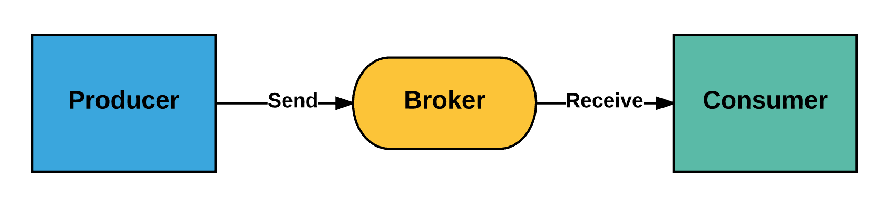

# 一个故事告诉你什么是消息队列
> 摘要：本文属于原创，欢迎转载，转载请保留出处：[https://github.com/jasonGeng88/blog](https://github.com/jasonGeng88/blog)

## 案例
有一天，产品跑来说：“我们要做一个用户注册功能，需要在用户注册成功后给用户发一封成功邮件。”

小明（攻城狮）：“好，需求很明确了。” 不就提供一个注册接口，保存用户信息，同时发起邮件调用，待邮件发送成功后，返回用户操作成功。没一会功夫，代码就写完了。验证功能没问题后，就发布上线了。

线上正常运行了一段时间，产品匆匆地跑来说：“你做的功能不行啊，运营反馈注册操作响应太慢，已经有好多用户流失了。”

小明听得一身冷汗，赶紧回去改。他发现，原先的以单线程同步阻塞的方式进行邮件发送，确实存在问题。这次，他利用了 JAVA 多线程的特性，另起线程进行邮件发送，主线程直接返回保存结果。测试通过后，赶紧发布上线。小明心想，这下总没问题了吧。

没过多久，产品又跑来了，他说：“现在，注册操作响应是快多了。但是又有新的问题了，有用户反应，邮件收不到。能否在发送邮件时，保存一下发送的结果，对于发送失败的，进行补发。” 

小明一听，哎，又得熬夜加班了。产品看他一脸苦逼的样子，忙说：“邮件服务这块，别的团队都已经做好了，你不用再自己搞了，直接用他们的服务。”

小明赶紧去和邮件团队沟通，谁知他们的服务根本就不对外开放。这下小明可开始犯愁了，明知道有这么一个服务，可是偏偏又调用不了。

邮件团队的人说，“看你愁的，我给你提供了一个类似邮局信箱的东西，你往这信箱里写上你要发送的消息，以及我们约定的地址。之后你就不用再操心了，我们自然能从约定的地址中取得消息，进行邮件的相应操作。”

后来，小明才知道，这就是外界广为流传的消息队列。你不用知道具体的服务在哪，如何调用。你要做的只是将该发送的消息，向你们约定好的地址进行发送，你的任务就完成了。对应的服务自然能监听到你发送的消息，进行后续的操作。这就是消息队列最大的特点，将同步操作转为**异步处理**，将多服务共同操作转为职责单一的单服务操作，做到了**服务间的解耦**。

哈哈，这下能高枕无忧了。太年轻，哪有万无一失的技术啊~

不久的一天，你会发现所有业务都替换了邮件发送的方式，统一使用了消息队列来进行发送。这下仅仅一个邮件服务模块，难以承受业务方源源不断的消息，大量的消息堆积在了队列中。这就需要更多的消费者（邮件服务）来共同处理队列中的消息，即所谓的**分布式消息处理**。

未完待续。。。

## 总结

### 定义
有了上面的基础，再看非常官方的解释应该也能理解了。

> 消息队列（英语：Message queue）是一种进程间通信或同一进程的不同线程间的通信方式，软件的贮列用来处理一系列的输入，通常是来自用户。消息队列提供了异步的通信协议，每一个贮列中的纪录包含详细说明的数据，包含发生的时间，输入设备的种类，以及特定的输入参数，也就是说：消息的发送者和接收者不需要同时与消息队列互交。消息会保存在队列中，直到接收者取回它。 ——维基百科

### 名词解释
解释还是太官方了，我们来看一个最简单的架构模型：

* Producer：消息生产者，负责产生和发送消息到 Broker；
* Broker：消息处理中心。负责消息存储、确认、重试等，一般其中会包含多个 queue；
* Consumer：消息消费者，负责从 Broker 中获取消息，并进行相应处理；

### 特性
#### 异步性
将耗时的同步操作，通过以发送消息的方式，进行了异步化处理。减少了同步等待的时间。

#### 松耦合
消息队列减少了服务之间的耦合性，不同的服务可以通过消息队列进行通信，而不用关心彼此的实现细节，只要定义好消息的格式就行。

#### 分布式
通过对消费者的横向扩展，降低了消息队列阻塞的风险，以及单个消费者产生单点故障的可能性（*当然消息队列本身也可以做成分布式集群*）。

#### 可靠性
消息队列一般会把接收到的消息存储到本地硬盘上（*当消息被处理完之后，存储信息根据不同的消息队列实现，有可能将其删除*），这样即使应用挂掉或者消息队列本身挂掉，消息也能够重新加载。
