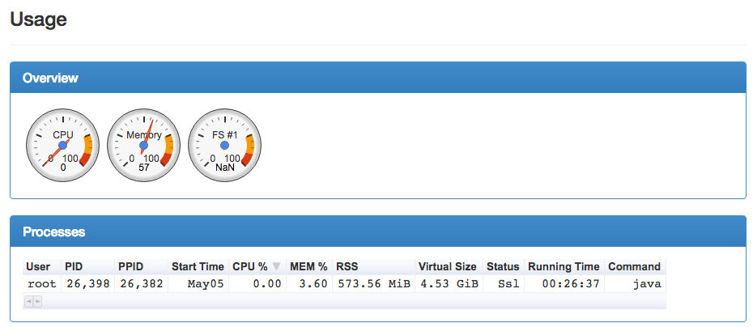
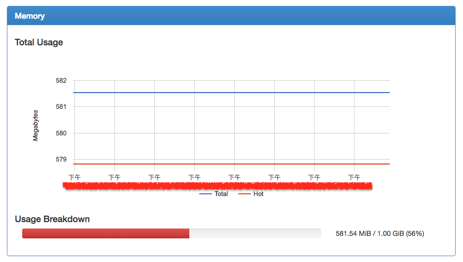
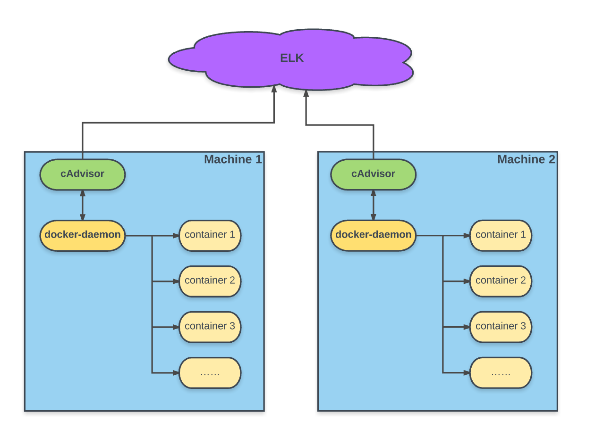
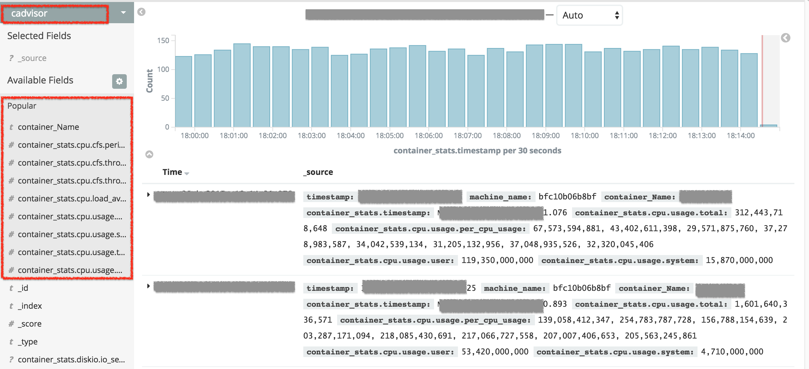
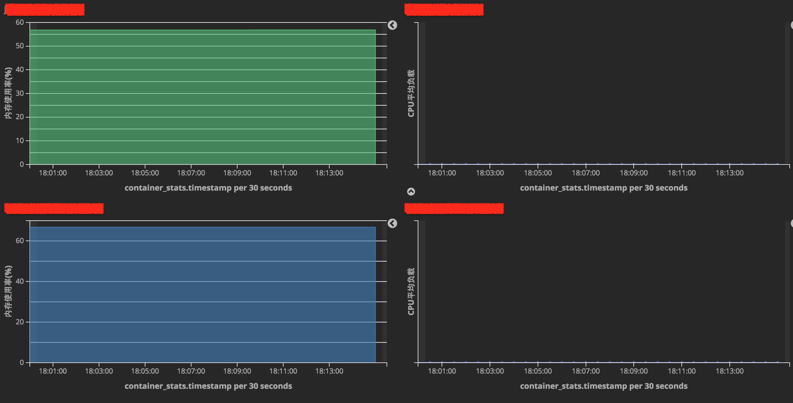

# 容器监控方案 cAdvisor + Elasticsearch
> 摘要：本文属于原创，欢迎转载，转载请保留出处：[https://github.com/jasonGeng88/blog](https://github.com/jasonGeng88/blog)
 
 
## 当前环境
1. docker 1.12.1
2. centos 7

## 前言
什么是微服务？微服务带来的好处？想必大家都了解了很多。但在真正实践中，还是有各种各样的挑战。今天就想和大家分享一下，在服务容器化场景中的服务监控问题。

传统的服务监控，一般都是针对宿主机的，有对 CPU、内存、进程数、IO 等监控。这些指标做得非常全面，也能很好的反应宿主机的健康状况。可到了服务容器化的场景中，似乎变得有些力不从心。一台宿主机上会起 n 个容器，每个容器都会独立分配资源，如 CPU、内存等。如果还是仅仅针对宿主机做监控，效果可能不太理想。

我们的容器化部署采用的是 docker 技术，所以下面会针对 docker 来进行一系列的服务监控，以及将监控的数据集成进我们已有的日志中心（ELK）。

*关于日志中心的搭建，有兴趣的可看我之前写过的一篇[“基于ELK+Filebeat搭建日志中心”](https://github.com/jasonGeng88/blog/blob/master/201703/elk.md)。*

## docker 容器监控
### cAdvisor 介绍
关于 docker 的监控，我们这里采用的是由 Google 开源的的监控工具 [cAdvisor](https://github.com/google/cadvisor)。采用它的主要原因有：

* 对 docker 容器提供了原生的支持；
* 开箱即用的特性，降低了部署的成本；
* 除了自身提供简单的可视化界面外，还提供了外部存储的扩展，如 ES(Elasticsearch)、kafka、InfluxDB等。

> Google的cAdvisor（Container Advisor）“为容器用户提供了了解运行时容器资源使用和性能特征的方法”。cAdvisor的容器抽象基于Google的lmctfy容器栈，因此原生支持Docker容器并能够“开箱即用”地支持其他的容器类型。cAdvisor部署为一个运行中的daemon，它会收集、聚集、处理并导出运行中容器的信息。这些信息能够包含容器级别的资源隔离参数、资源的历史使用状况、反映资源使用和网络统计数据完整历史状况的柱状图。

### cAdvisor 部署
由于 cAdvisor 本身也进行了容器化，所以部署极其简单。只需在运行有 docker-daemon 的宿主机上，运行如下命令：

```
docker run \
--volume=/:/rootfs:ro \
--volume=/var/run:/var/run:rw \
--volume=/sys:/sys:ro \
--volume=/var/lib/docker/:/var/lib/docker:ro \
--publish=8080:8080 \
--detach=true \
--name=cadvisor \
google/cadvisor:latest
```

### cAdvisor 演示




它提供了简单的可视化界面，为我们提供了容器的整体情况，以及每个容器的独立数据，数据包括有 CPU、内存、网络IO、磁盘IO等使用情况。

### cAdvisor 参数说明
上面的部署只是为了演示使用的，所以参数都使用的是缺省值。为了更好的运用 cAdvisor，有些参数我们还是需要了解的（*[详细信息参考官方文档](https://github.com/google/cadvisor/blob/master/docs/runtime_options.md)*）：

|参数|默认值|说明|
|---|---|---|
|-allow\_dynamic\_housekeeping|true|设置数据采集的频率间隔是动态的，这取决于容器的活跃程度。若设为false，采集的时间间隔将和预期的保持一致，但这会增加资源的使用率。|
|-global\_housekeeping\_interval|1m0s|设置cAdvisor全局的采集行为的时间间隔，主要通过内核事件来发现新容器的产生。|
|-housekeeping\_interval|1s|每个已发现的容器的数据采集频率。|
|-machine\_id\_file|/etc/machine-id,/var/lib/dbus/machine-id|标识宿主机ID的文件地址，可以设置多个文件，当第一个不存在时，会依次向后查找，文件地址用逗号分隔|
|-storage\_duration|2m0s|在内存中保存最近多久的历史数据|
|-storage\_driver|Empty（none）|设置采集的缓存数据将推送至的存储驱动，可选项有： <empty>, bigquery, ES, influxdb, kafka, redis, statsd, stdout。|

### cAdvisor 不足
从上述的参数列表中可以看出，cAdvisor 做到的是实时监控，数据存储在内存中，并且只会保存很短的一段时间。所以它是做不到监控数据的存储，换句话说，它是记录下近几天的监控数据。为此它提供了有关的存储驱动，帮助我们将实时数据传输到我们指定的数据存储器中。

其次，cAdvisor监听的是宿主机 docker 主进程的变化，这就意味着单单依靠它是做不到分布式的监控。所以，这更添加了我们将它与 ELK 做集成的理由。

## 与日志中心（ELK）集成

### 背景
为了降低维护成本，我们这里选择 ES 作为存储驱动，将 cAdvisor 与我们已有的 ELK 日志中心进行集成。这也降低了使用者的复杂度，通过同一个平台，解决了日志收集与服务监控的问题。

### 架构


从上图不难看出，cAdvisor 也是采用了协同进程的概念，通过监听 docker 主进程的事件，将采集到的数据远程传输的方式，push 到 ES 中。并且通过 Machine ID 来区分不同宿主机的容器信息，实现了数据的分布式监控。

### <font color="red">cAdvisor 支持 ES 5</font>
其实我们用它与 ES 集成的时候，还是略坑的。如果你用的 ES 是 5.0+，那就杯具了。因为 cAdvisor 官方目前仅对 ES 2 进行了支持。具体的情况可以查看官方 Github 下的讨论：[https://github.com/google/cadvisor/pull/1597](https://github.com/google/cadvisor/pull/1597)。

这当然也体现了开源的力量。从上述的讨论中可以看出，对 ES 5 的支持已经有人提供了，也经过了测试验证，只是因为官方为了考虑兼容 ES 2，所以暂时没有采纳合并请求。但这给了我们解决方案，虽然官方不提供，我们可以根据社区提供的 ES 5 的代码，进行手动的 build 生成 cadvisor 执行文件。在以官方镜像启动容器时，将我们生成的 cadvisor 执行文件以文件挂载方式替换原有的执行文件，这就做到了对 ES 5的支持（*相信官方会很快对 ES 5 进行支持，我们也不用采用这种迂回的方式了*）。

> 为了避免自己在手动编译过程会出现一些问题，我这里也提供了 build 好的 cadvisor 执行文件，下载地址：[https://github.com/jasonGeng88/cadvisor/releases/download/es5/cadvisor](https://github.com/jasonGeng88/cliadvisor/releases/download/es5/cadvisor)

### 部署
```
docker run \
--volume=/:/rootfs:ro \
--volume=/var/run:/var/run:rw \
--volume=/sys:/sys:ro \
--volume=/var/lib/docker/:/var/lib/docker:ro \
--volume=$YOUR_PATH/cadvisor:/usr/bin/cadvisor \
--publish=8080:8080 \
--detach=true \
--name=cadvisor \
google/cadvisor:latest \
-storage_driver=elasticsearch.v5 \
-storage_driver_es_index="cadvisor" \
-storage_driver_es_host="http://$ELASTICSEARCH_IP:9200"
```

### 展示（*Demo数据*）



## 总结 
本文介绍了微服务下的容器监控方案，从“开箱即用”的 cAdvisor 讲起，虽然它也能输出我们想要的监控数据。但是作为一个完整的应用，我们还要考虑它的可行性、易用性和可扩展性。同时要从实际出发，结合现有的框架体系，将 cAdvisor 融入进已有的 ELK 日志中心，并且对数据可以进行自定义的图表展示，使用上更灵活。


