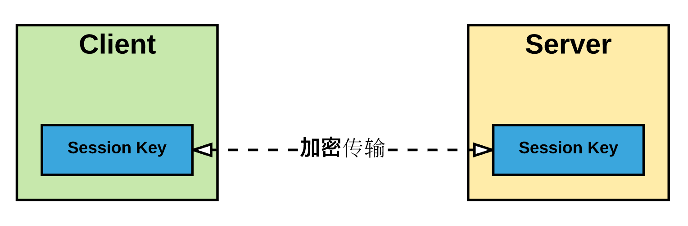
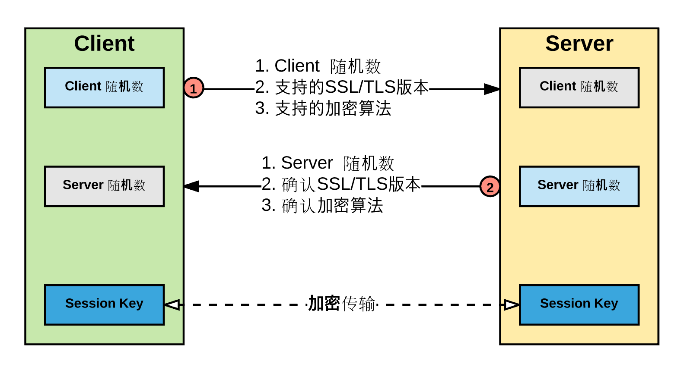
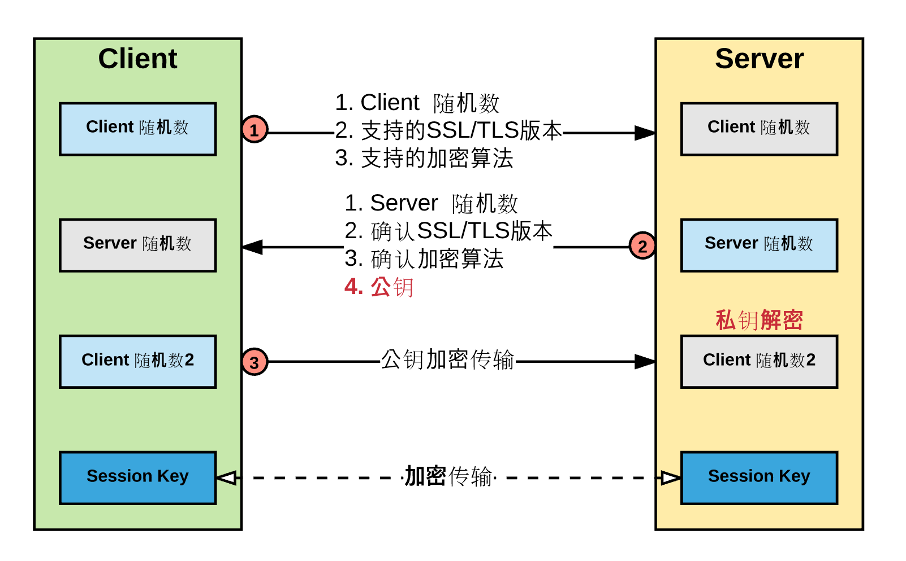
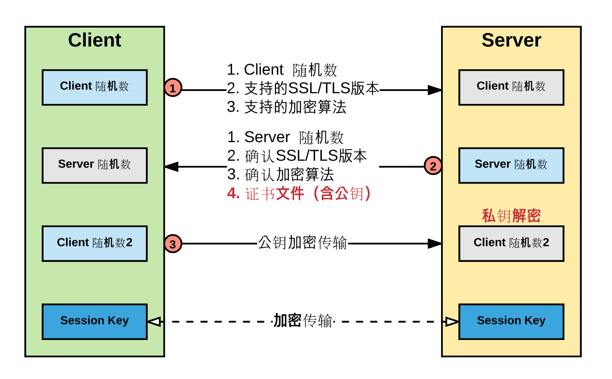

# 我们为什么要用 HTTPS
> 摘要：本文属于原创，欢迎转载，转载请保留出处：[https://github.com/jasonGeng88/blog](https://github.com/jasonGeng88/blog)

## 前言
讲 HTTPS 之前，我们先来回顾一下 HTTP 协议。HTTP 是一种超文本传输协议，它是无状态的、简单快速的、基于 TCP 的可靠传输协议。

既然 HTTP 协议这么好，那怎么有冒出来了一个 HTTPS 呢？主要是因为 HTTP 是明文传输的，这就造成了很大的安全隐患。在网络传输过程中，只要数据包被人劫持，那你就相当于赤身全裸的暴露在他人面前，毫无半点隐私可言。想象一下，如果你连了一个不可信的 WIFI，正好有使用了某个支付软件进行了支付操作，那么你的密码可能就到别人手里去了，后果可想而知。

网络环境的就是这样，给你带来便利的同时，也到处充满了挑战与风险。对于小白用户，你不能期望他有多高的网络安全意识，产品应该通过技术手段，让自己变得更安全，从源头来控制风险。这就诞生了 HTTPS 协议。

## HTTPS
简单理解，HTTP 不就是因为明文传输，所以造成了安全隐患。那让数据传输以加密的方式进行，不就消除了该隐患。

从网络的七层模型来看，原先的四层 TCP 到七层 HTTP 之间是明文传输，在这之间加一个负责数据加解密的传输层（SSL/TLS），保证在网络传输的过程中数据是加密的，而 HTTP 接收到的依然是明文数据，不会有任何影响。


*<font color="grey">SSL是Netscape开发的专门用户保护Web通讯的，目前版本为3.0。最新版本的TLS 1.0是IETF(工程任务组)制定的一种新的协议，它建立在SSL 3.0协议规范之上，是SSL 3.0的后续版本。两者差别极小，可以理解为SSL 3.1，它是写入了RFC的。</font>*

## 优势
*<font color="grey">本节参考[阮一峰的SSL/TLS协议运行机制的概述](http://www.ruanyifeng.com/blog/2014/02/ssl_tls.html)。</font>*

在看实现细节之前，我们先看一下 HTTP 具体的安全隐患，以及 HTTPS 的解决方案。

**HTTP 三大风险**：

1. 窃听风险（eavesdropping）：第三方可以获知通信内容。
2. 篡改风险（tampering）：第三方可以修改通信内容。
3. 冒充风险（pretending）：第三方可以冒充他人身份参与通信。

**HTTPS 解决方案**

1. 所有信息都是加密传播，第三方无法窃听。
2. 具有校验机制，一旦被篡改，通信双方会立刻发现。
3. 配备身份证书，防止身份被冒充。

## 实现
通过上面的介绍，对 HTTPS 有了大致的了解。可本质问题还没说，HTTPS 是如何做到数据的加密传输？这儿不打算搬出复杂的算法公式，还是以最通俗的话述来讲讲我的理解。

首先，先来了解下加密算法的方式，常用的有两种：对称加密与非对称加密。

* 对称加密：即通信双方通过相同的密钥进行信息的加解密。加解密速度快，但是安全性较差，如果其中一方泄露了密钥，那加密过程就会被人破解。

* 非对称加密：相比对称加密，它一般有公钥和私钥。公钥负责信息加密，私钥负责信息解密。两把密钥分别由发送双发各自保管，加解密过程需两把密钥共同完成。安全性更高，但同时计算量也比对称加密要大很多。

对于网络通信过程，在安全的前提下，还是需要保证响应速度。如何每次都进行非对称计算，通信过程势必会受影响。所以，人们希望的安全传输，最终肯定是以对称加密的方式进行。如图：



首先 Session Key 是如何得到的，并且在 Session Key 之前的传输都是明文的。Session Key 通过网络传输肯定不安全，所以它一定各自加密生成的。因此在这之前，双方还要互通，确认加密的算法，并且各自添加随机数，提高安全性。如图：



这样双方确认了使用的 SSL/TLS 版本，以及生成 Session Key 的加密算法。并且双方拥有了2个随机数（客户端、服务端各自生成一个）。可是如果按照目前的随机参数，加上加密算法生成 Session Key 呢，还是存在风险，加密算法是有限固定的，而且随机数都是明文传输的，有被截获的可能。

让加密算法变得不可预测，可能性不大。那么能否再传输一个加密的随机数，这个随机数就算被截获，也无法破译。这就用到了非对称加密算法，我们在步骤二中，把公钥传输给客户端。这样客户端的第三个随机数用公钥加密，只有拥有私钥的服务端才能破译第三个参数，这样生成的 Session 就是安全的了。如图：



不容易啊，看似完成了。现在生成的 Session Key 是不可预测的（就算被截获也无所谓），我们可以放心的进行私密通信了。真的是这样吗？我们似乎对服务端给的公钥十分信任，如果你目前通信的本身就不可信，或者被中间人劫持，由它发送伪造的公钥给你，那后果可想而知，这就是传说中的“中间人攻击”。

所以，我们得包装一下公钥，让它变得安全。这就引出了数字证书的概念，数字证书由受信任的证书机构颁发，证书包含证书文件与证书私钥文件。私钥文件由服务端自己保存，证书文件发送给请求的客户端，文件包含了域名信息、公钥以及相应的校验码。客户可以根据得到的证书文件，校验证书是否可信。如图：



这下算简单讲完了整个的通信过程，首先在 TCP 三次握手后，进行非对称算法的加密（校验证书），将得到的参数进行加密生成会话所需的 Session Key，在之后的数据传输中，通过 Session Key 进行对称密码传输，会话信息在私密的通道下完成。

*当然，实际的过程远比这来的复杂，这中间包括了复杂的算法以及细节内容，有兴趣的同学，可查阅相关的资料进行了解。*

## 证书
关于数字证书，下面简单介绍一下证书的一些类别：

### 按验证级别分类
* Domain Validation（DV）：最基本的验证方式，只保证访问的域名是安全的。但在证书中不会提及任何公司/组织信息，所以这算是最低级别的验证。

示例：[https://robowhois.com](https://robowhois.com)


* Organization Validation（OV）：这一级别的证书解决了上面域名与公司无法对应的问题，该证书中会描述公司/组织的相关信息。确保域名安全的同时，也保证了域名与公司的绑定关系。

示例：[https://www.baidu.com](https://www.baidu.com)


* Extended Validation（EV）：该级别的证书具有最高的安全性，也是最值得信任的。它除了给出更详细的公司/组织信息外，还在浏览器的地址栏上直接给出了公司名称。

示例：[https://www.github.com](https://www.github.com)


### 按覆盖级别分类
* 单域名 SSL 证书：这类证书只能针对一个域名使用，如，当证书与 yourdomain.com 配对了，那就不能在用在 sub.yourdomain.com 上了。
* 通配符域名 SSL 证书：这类证书可以覆盖某个域名下的所有子域名。如，当证书与 yourdomain.com 配对了，那默认 sub.yourdomain.com 以及其他子域名都加入了安全验证。
* 多多域名 SSL 证书：这类证书可以使用在多个不同的域名上。如，域名 a.com 与 b.com 上可以配对同一个证书。

## 从 HTTP 迁移的注意点
* 首先需要从相关的网站申请需要的证书；
* 在服务器上开放 HTTPS 所需的443端口，并设置相应的证书地址，下面贴一段在 nginx 上的配置：

```
server {
    listen 443;
    server_name localhost;
    ssl on;
    root html;
    index index.html index.htm;
    ssl_certificate   cert/证书文件.pem;
    ssl_certificate_key  cert/证书私钥.key;
    ssl_session_timeout 5m;
    ssl_ciphers ECDHE-RSA-AES128-GCM-SHA256:ECDHE:ECDH:AES:HIGH:!NULL:!aNULL:!MD5:!ADH:!RC4;
    ssl_protocols TLSv1 TLSv1.1 TLSv1.2;
    ssl_prefer_server_ciphers on;
    location / {
        root html;
        index index.html index.htm;
    }
}
```
* 对于原先的80端口，需做重定向的跳转。将原先访问 HTTP 协议的用户，自动跳转用 HTTPS 上来。
* 出于性能考虑，Session Key 的生成相对耗 CPU 的资源，所以尽量减少 Key 的生成次数。这里有两种方案：
	* 采用长连接方式；
	* 在回话创建时，对生成的 Session Key 进行缓存（仍以 nginx 为例）；
	
	```
	http {
	    #配置共享会话缓存大小
	    ssl_session_cache   shared:SSL:10m;
	    #配置会话超时时间
	    ssl_session_timeout 10m;
	    ...
	```
	
## 总结
本文不涉及任何高深的概念，都是以自己的一些理解来进行讲述，希望对大家有用！

最后，推荐一个比较好用的 HTTP 抓包工具（含 HTTPS）。

* [Charles 4.0 Mac破解版](http://www.sdifen.com/charles4.html)
* [使用 Charles 获取 https 的数据](http://blog.csdn.net/yangmeng13930719363/article/details/51645435)


