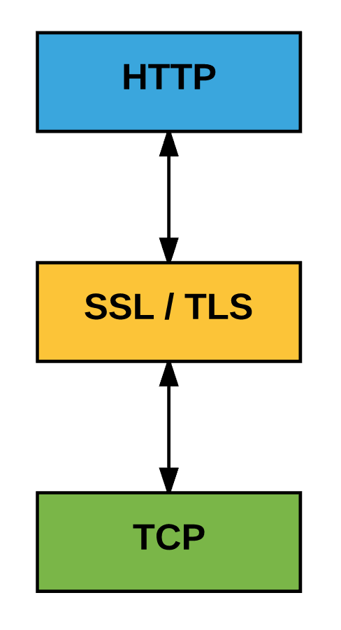
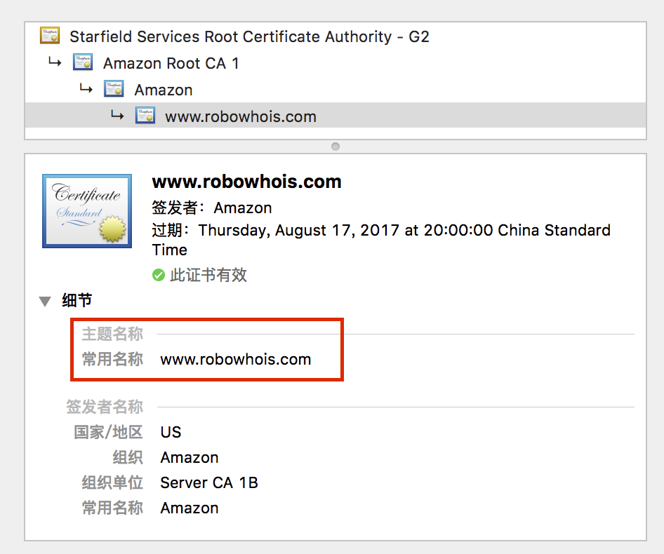
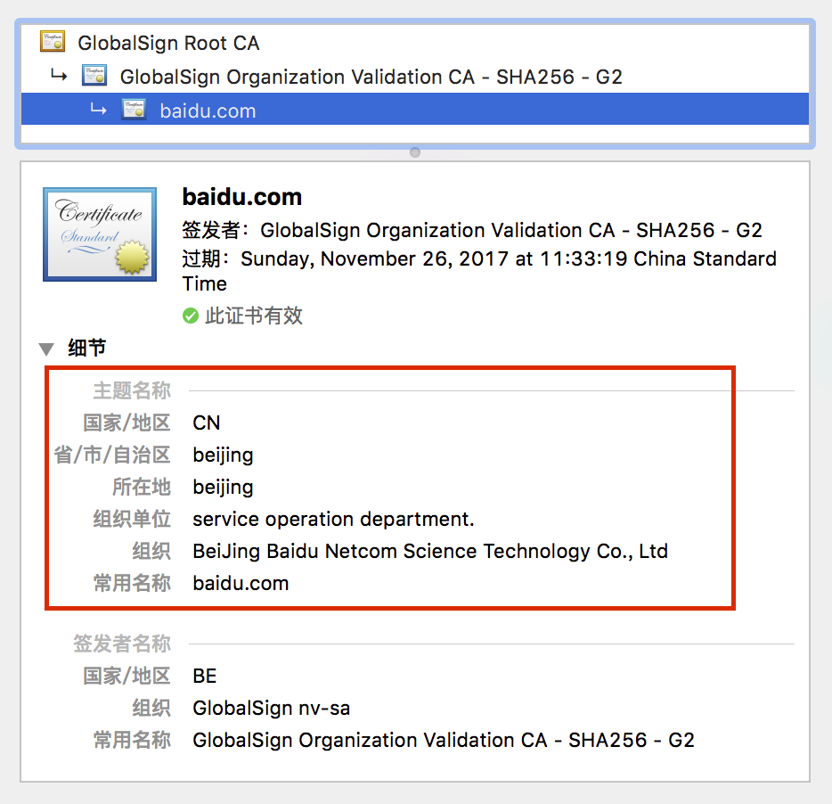
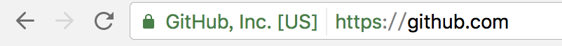
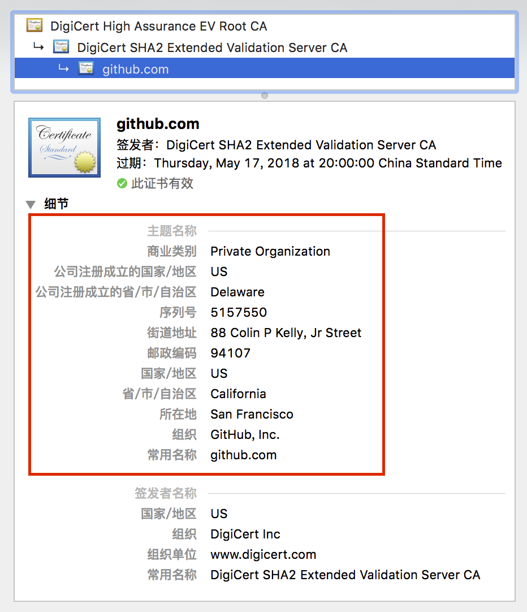

# 我们为什么要用 HTTPS
> 摘要：本文属于原创，欢迎转载，转载请保留出处：[https://github.com/jasonGeng88/blog](https://github.com/jasonGeng88/blog)

## 前言
讲 HTTPS 之前，我们先来回顾一下 HTTP 协议。HTTP 是一种超文本传输协议，它是无状态的、简单快速的、基于 TCP 的可靠传输协议。

既然 HTTP 协议这么好，那怎么有冒出来了一个 HTTPS 呢？主要是因为 HTTP 是明文传输的，这就造成了很大的安全隐患。在网络传输过程中，只要数据包被人劫持，那你就相当于赤身全裸的暴露在他人面前，毫无半点隐私可言。想象一下，如果你连了一个不可信的 WIFI，正好有使用了某个支付软件进行了支付操作，那么你的密码可能就到别人手里去了，后果可想而知。

网络环境的就是这样，给你带来便利的同时，也到处充满了挑战与风险。对于小白用户，你不能期望他有多高的网络安全意识，产品应该通过技术手段，让自己变得更安全，从源头来控制风险。这就诞生了 HTTPS 协议。

## HTTPS
简单理解，HTTP 不就是因为明文传输，所以造成了安全隐患。那让数据传输以加密的方式进行，不就消除了该隐患。

从网络的七层模型来看，原先的四层 TCP 到七层 HTTP 之间是明文传输，在这之间加一个传输加密层（SSL/TLS），保证 HTTP 接收到的是加密的数据。

*SSL是Netscape开发的专门用户保护Web通讯的，目前版本为3.0。最新版本的TLS 1.0是IETF(工程任务组)制定的一种新的协议，它建立在SSL 3.0协议规范之上，是SSL 3.0的后续版本。两者差别极小，可以理解为SSL 3.1，它是写入了RFC的。*

## 优势
*本节参考[阮一峰的SSL/TLS协议运行机制的概述](http://www.ruanyifeng.com/blog/2014/02/ssl_tls.html)。*

在看实现细节之前，我们先看一下 HTTP 具体的安全隐患，以及 HTTPS 的解决方案。

**HTTP 三大风险**：

1. 窃听风险（eavesdropping）：第三方可以获知通信内容。
2. 篡改风险（tampering）：第三方可以修改通信内容。
3. 冒充风险（pretending）：第三方可以冒充他人身份参与通信。

**HTTPS 解决方案**

1. 所有信息都是加密传播，第三方无法窃听。
2. 具有校验机制，一旦被篡改，通信双方会立刻发现。
3. 配备身份证书，防止身份被冒充。

## 实现

## 证书
### 按验证级别分类
* Domain Validation（DV）：最基本的验证方式，只保证访问的域名是安全的。但在证书中不会提及任何公司/组织信息，所以这算是最低级别的验证。

示例：[https://robowhois.com](https://robowhois.com)

* Organization Validation（OV）：这一级别的证书解决了上面域名与公司无法对应的问题，该证书中会描述公司/组织的相关信息。确保域名安全的同时，也保证了域名与公司的绑定关系。

示例：[https://www.baidu.com](https://www.baidu.com)

* Extended Validation（EV）：该级别的证书具有最高的安全性，也是最值得信任的。它除了给出更详细的公司/组织信息外，还在浏览器的地址栏上直接给出了公司名称。

示例：[https://www.github.com](https://www.github.com)

### 按覆盖级别分类
* 单域名 SSL 证书：这类证书只能针对一个域名使用，如，当证书与 yourdomain.com 配对了，那就不能在用在 sub.yourdomain.com 上了。
* 通配符域名 SSL 证书：这类证书可以覆盖某个域名下的所有子域名。如，当证书与 yourdomain.com 配对了，那默认 sub.yourdomain.com 以及其他子域名都加入了安全验证。
* 多多域名 SSL 证书：这类证书可以使用在多个不同的域名上。如，域名 a.com 与 b.com 上可以配对同一个证书。

## 迁移注意点

