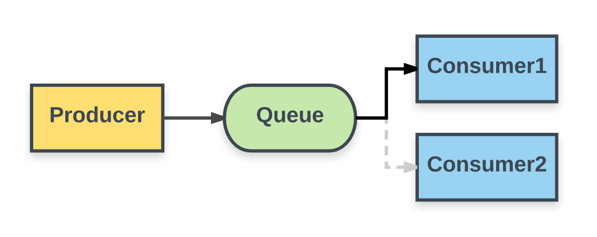
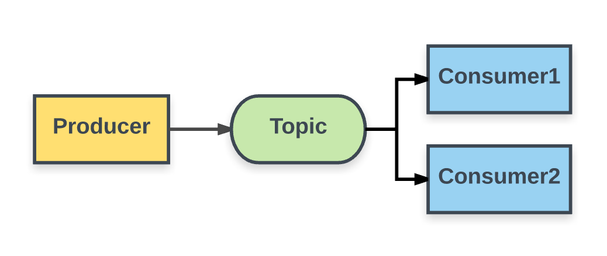

# SpringBoot 集成 JMS 下的各种使用场景
> 摘要：本文属于原创，欢迎转载，转载请保留出处：[https://github.com/jasonGeng88/blog](https://github.com/jasonGeng88/blog)
> 本文所有服务均采用docker容器化方式部署

## 当前环境
1. Mac OS 10.11.x
2. docker 1.12.1 
3. JDK 1.8
4. SpringBoot 1.5
 
 
## 前言
基于之前一篇[“一个故事告诉你什么是消息队列”](https://github.com/jasonGeng88/blog/blob/master/201705/MQ.md)，了解了消息队列的使用场景以及相关的特性。本文主要讲述消息服务在 JAVA 中的使用。

市面上的有关消息队列的技术选型非常多，如果我们的框架代码要支持不同的消息实现，在保证框架具有较高扩展性的前提下，我们势必要进行一定的封装。

如果你使用 JAVA 开发，那大可不必如此。因为在 JAVA 中，已经定义了一套标准的 JMS 规范。该规范定义了一套通用的接口和相关语义，提供了诸如持久、验证和事务的消息服务，其最主要的目的是允许Java应用程序访问现有的消息中间件。就和 JDBC 一样。

<!--下面会默认你对的 SpringBoot 与 JMS 有一定的了解，我会直接以使用场景来介绍 JMS 的使用，代码上会尽可能详细的注释，并且在每个场景后，都会给予一定的解释，既然我的一些理解，同时也希望？？

***SpringBoot：快速、敏捷地开发新一代基于Spring框架的应用程序***-->


## 基本概念
在介绍具体的使用之前，先简单介绍一下 JMS 的一些基本知识。这里我打算分为 3 部分来介绍，即 消息队列（MQ）的连接、消息发送与消息接收。

***这里我们的框架采用的是 SpringBoot、JMS、ActiveMQ***

*这里没有使用 SpringBoot 零配置来搭建项目，因为它不利于我们理解概念。实际项目中推荐使用*

### MQ 的连接
使用 MQ 的第一步一定是先连接 MQ。因为这里使用的是 JMS 规范，对于任何遵守 JMS 规范的 MQ 来说，都会实现相应的```ConnectionFactory```接口，因此我们只需要创建一个```ConnectionFactory```工厂类，由它来实现 MQ 的连接，以及封装一系列特性的 MQ 参数。

例子：这里我们以 ActiveMQ 为例，

maven 依赖：

```xml
<dependency>
	<groupId>org.springframework.boot</groupId>
	<artifactId>spring-boot-starter-activemq</artifactId>
	<version>1.5.3.RELEASE</version>
</dependency>
```

创建 ActiveMQ 连接工厂：

```java
@Bean
public ConnectionFactory connectionFactory(){

    ActiveMQConnectionFactory connectionFactory = new ActiveMQConnectionFactory();
    connectionFactory.setBrokerURL(ActiveMQ_URL);
    connectionFactory.setUserName(ActiveMQ_USER);
    connectionFactory.setPassword(ActiveMQ_PASSWORD);
    return connectionFactory;
    
}
```

### 消息发送
关于消息的发送，是通过 JMS 核心包中的```JmsTemplate```类来实现的，它简化了 JMS 的使用，因为在发送或同步接收消息时它帮我们处理了资源的创建和释放。从它的作用也不难推测出，它需要引用我们上面创建的连接工厂，具体代码如下：

```java
@Bean
public JmsTemplate jmsQueueTemplate(){

    return new JmsTemplate(connectionFactory());
    
}
```

```JmsTemplate```创建完成后，我们就可以调用它的方法来发送消息了。这里有两个概念需要注意：

1. 消息会发送到哪里？-> 即需要指定发送队列的目的地（Destination），是可以在 JNDI 中进行存储和提取的 JMS 管理对象。
2. 发送的消息体具体是什么？-> 实现了```javax.jms.Message```的对象，类似于 JAVA RMI 的 Remote 对象。

代码示例：

```java
@Autowired
private JmsTemplate jmsQueueTemplate;

/**
 * 发送原始消息 Message
 */
public void send(){

    jmsQueueTemplate.send("queue1", new MessageCreator() {
        @Override
        public Message createMessage(Session session) throws JMSException {
            return session.createTextMessage("我是原始消息");
        }
    });
    
}
```

优化：当然，我们不用每次都通过```MessageCreator ```匿名类的方式来创建```Message```对象，```JmsTemplate```类中提供了对象实体自动转换为```Message```对象的方法，```convertAndSend(String destinationName, final Object message)```。

优化代码示例：

```java
/**
 * 发送消息自动转换成原始消息
 */
public void convertAndSend(){

    jmsQueueTemplate.convertAndSend("queue1", "我是自动转换的消息");
    
}
```

*注：关于消息转换，还可以通过实现```MessageConverter```接口来自定义转换内容*

### 消息接收

讲完了消息发送，我们最后来说说消息是如何接收的。消息既然是以```Message```对象的形式发送到指定的目的地，那么消息的接收势必会去指定的目的地上去接收消息。这里采用的是监听者的方式来监听指定地点的消息，采用注解```@JmsListener```来设置监听方法。

代码示例：

```java
@Component
public class Listener1 {

    @JmsListener(destination = "queue1")
    public void receive(String msg){
        System.out.println("监听到的消息内容为: " + msg);
    }
    
}
```

有了监听的目标和方法后，监听器还得和 MQ 关联起来，这样才能运作起来。这里的监听器可能不止一个，如果每个都要和 MQ 建立连接，肯定不太合适。所以需要一个监听容器工厂的概念，即接口```JmsListenerContainerFactory```，它会引用上面创建好的与 MQ 的连接工厂，由它来负责接收消息以及将消息分发给指定的监听器。当然也包括事务管理、资源获取与释放和异常转换等。

代码示例：

```java
@Bean
public DefaultJmsListenerContainerFactory jmsQueueListenerContainerFactory() {
    
    DefaultJmsListenerContainerFactory factory =
            new DefaultJmsListenerContainerFactory();
    factory.setConnectionFactory(connectionFactory());
    //设置连接数
    factory.setConcurrency("3-10");
    //重连间隔时间
    factory.setRecoveryInterval(1000L);
    return factory;
    
}
```

## 场景

对 JMS 有了基本的理解后，我们就来在具体的场景中使用一下。

首先，我们需要先启动 ActiveMQ，这里我们以 Docker 容器化的方式进行启动。

启动命令：

```
docker run -d -p 8161:8161 -p 61616:61616 --name activemq webcenter/activemq
```

启动成功后，在 ActiveMQ 可视化界面查看效果（http://localhost:8161）：


---

### 点对点模式


### 点对点（多消费者）




### 发布订阅模式




### 发布订阅（持久化）

### 本地事务

### 外部事务
