# [译] 基于事件流构建的服务

> 摘要：本文属于原创，欢迎转载，转载请保留出处：[https://github.com/jasonGeng88/blog](https://github.com/jasonGeng88/blog)

**原文：[https://www.confluent.io/blog/build-services-backbone-events/](https://www.confluent.io/blog/build-services-backbone-events/)**

对许多人来说，微服务是建立在请求和响应协议之上的，如 REST 等等。这种方法很自然。 我们编写程序是一回事，我们调用其他代码模块，等待响应并继续。它也与我们每天看到的大量使用情况紧密相连：前面的用户点击按钮的网站，并期待事情发生。

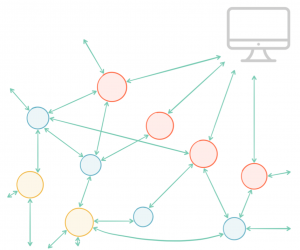

但是当我们进入许多独立服务的世界时，事情就会开始变化。随着服务的数量随着时间的推移逐渐增长，同步交互的网络也随之增长。以前良性的可用性问题开始引发更广泛的中断。

在分布式系统中，排查问题对于我们不幸的运维工程师来说，将是艰巨的任务。疯狂的从一个服务到另一个服务，拼凑各个服务的信息片段。

这是一个众所周知的问题，并且有一些解决方案。一个是确保您的个人服务具有比您的系统更高的 SLAs。Google 提供了这样做的[协议](http://queue.acm.org/detail.cfm?id=3096459)。另一种方法是简单地分解将服务绑定在一起的同步关系。

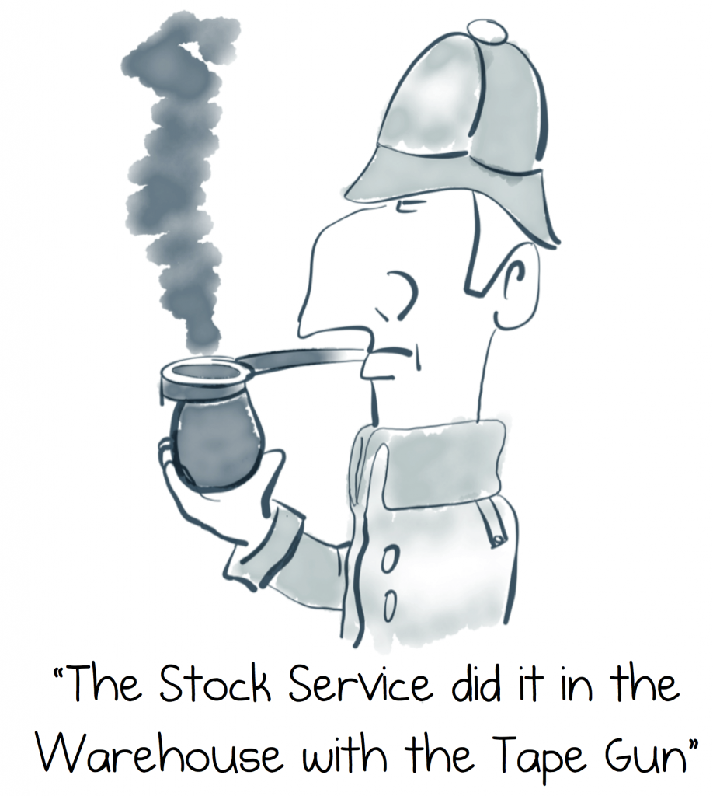

我们可以使用异步作为这样做的机制。如果你在在线零售工作，你会发现同步接口，如 getImage() 或 processOrder() 感觉自然，期望调用得到立即响应。但是当用户点击“购买”时，它会触发一个复杂而异步的过程。一个采购的过程，并将其线下交付到用户门口，这种方式已经超出原本按钮的上下文。因此，将软件分解成异步流可以使我们能够区分我们需要解决的不同问题，并允许我们拥抱一个本身就是异步的世界。

在实践中，我们发现会有轮询数据库表来进行更改，或者通过一些定时任务来进行更新。这些是打破同步关系的简单方式，但这些方式给人不透明的感觉，像有黑客篡改了你的数据一样。可能他们有一个很好的理由。

所以我们可以将所有这些问题集中到一个观察中。我们命令服务去做我们要求的事情，这样的命令式编程模式不适合独立运行的服务。

在这篇文章中，我们将看看架构硬币的另一面：不是通过命令链，而不是通过事件流的方式来组合服务。这是一个有效的方法。它也为我们将在本系列后面讨论的更先进的模式形成基准，我们将事件驱动处理的想法与[流式平台](https://www.confluent.io/blog/stream-data-platform-1/)中的观点相结合。

## 命令（Commands）、事件（Events）和查询（Queries）

在我们深入研究一个例子之前，我们需要解决三个简单的概念。服务可以通过三种方式相互交互：命令、事件和查询。 如果你以前没有考虑过这三者之间的区别，那么这很值得。

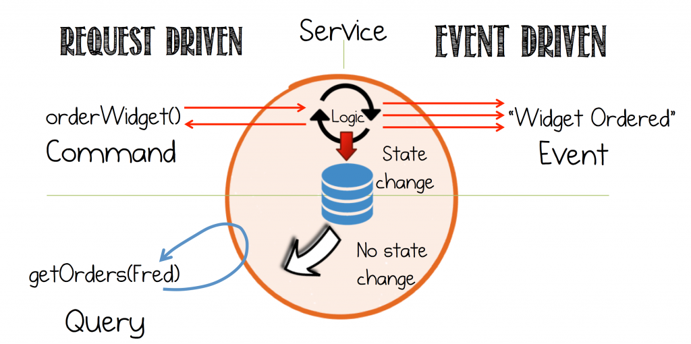

事件的优点是事实和触发。外部数据可以被系统中的任何服务来重用。但从服务的角度来看，事件造成的耦合又要比命令和查询来得低。这个事实很重要。

服务间交互的三种方式：

* 命令：是一个动作，在另一个服务中执行某些操作的请求。有些会改变系统状态。命令会期待一个响应结果。
* 事件：既是事实也是触发器。对已经发生事情的一种通知。
* 查询：是查找某物的一个请求。重要的是，查询是无副作用的，不会造成系统状态的改变。

## 一个简单的事件驱动流程

我们从一个简单的例子开始：客户订购小部件，这个行为会触发接下来的两个事情：

1. 处理相关的付款。
2. 系统检查以查看是否需要更多小部件。

在请求驱动的方法中，这可以表示为一连串的命令。目前没有查询。互动将如下所示：

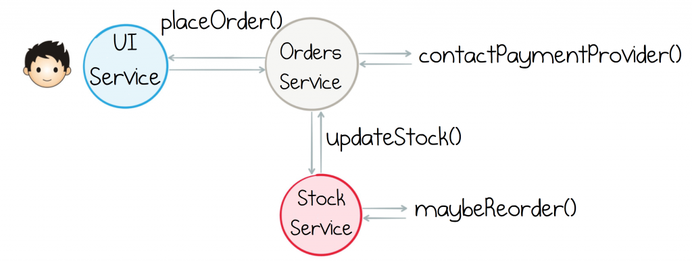

要注意的第一个事情是通过调用订单服务初始化“购买更多的库存”的业务流程。这混合了两个服务的责任，理想情况，我们应该更好的分离关注点。

现在，如果我们可以使用一个事件驱动方法来代表相同的流程，那么事情会变得更好。

1. UI 服务触发一个“订单请求”事件，并在返回给用户之前等待一个“订单确定”（或拒绝）的事件。
2. 订单服务与库存服务都通过触发的事情来进行响应。

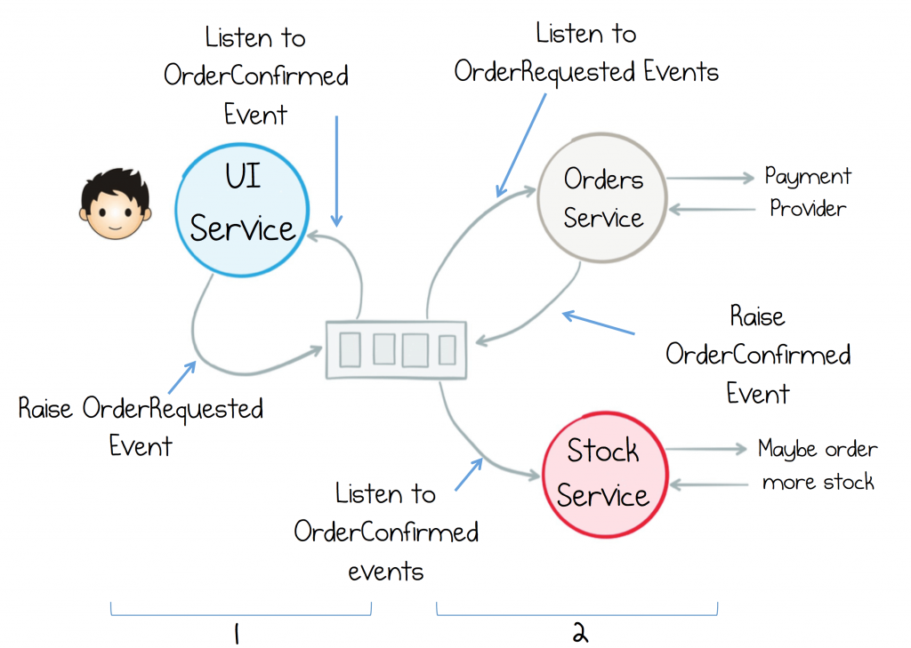

仔细看，UI 服务与订单服务的交互没有任何改变，除了他们是通过事件来交流的，而不是直接调用对方。

库存服务很有趣。订单服务不再告诉它要做什么，也不再控制是否参与互动。这是这种类型的架构非常重要的属性，称为 “Receiver Driven Flow Control”。逻辑被推送到事件的接收者，而不是发送者。责任的重任进行了翻转！

将控制转移到接收者可减少服务之间的耦合，从而为架构提供了重要的可插拔性。组件可以轻松地换入换出。

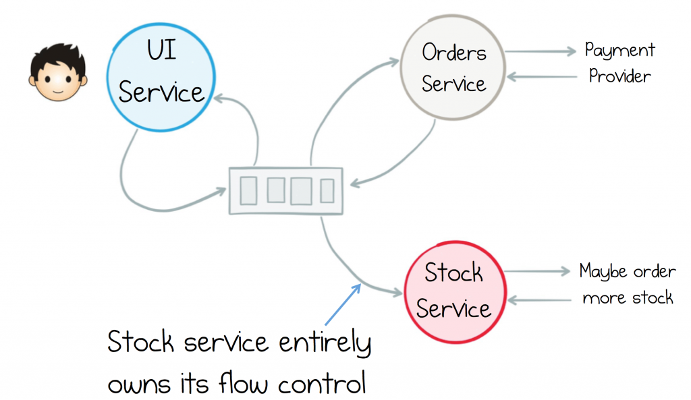

随着架构变得越来越复杂，可插拔性的这一要素变得越来越重要。说我们要添加一个实时管理定价的服务，根据供需调整产品的价格。在一个命令驱动的世界里，我们需要引入一个可以由库存服务和订单服务调用的 maybeUpdatePrice() 方法。但在事件驱动的世界重新定价只是一种订阅共享流的一个服务，当满足相关标准时发送价格更新。

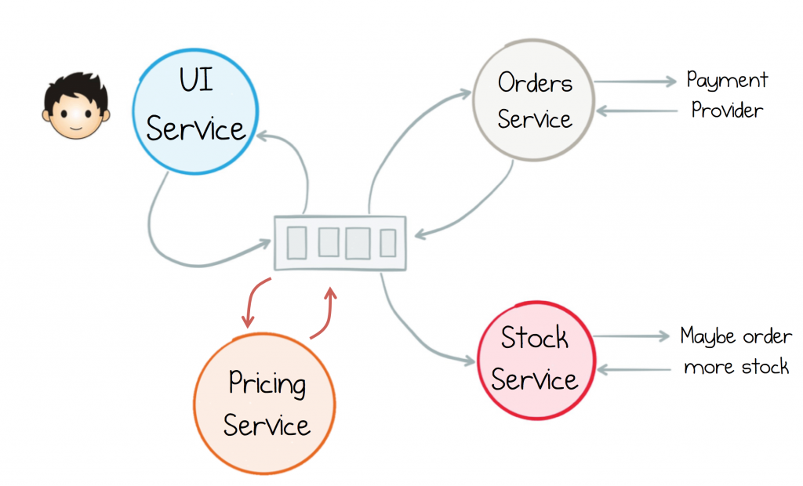

## 混合事件与查询

上面的例子只考虑了命令/事件。 没有查询操作（请记住我们将所有交互定义为命令、事件和查询的其中一种）。查询是除了最简单的架构之外的所有架构的必需品。所以我们来扩展这个例子，让订单服务检查在处理付款之前有足够的库存。

对此的请求驱动方法将涉及向库存服务发送查询以检索当前库存数量。这导致混合模型，其中事件流纯粹用于通知，允许任何服务进入流程，但查询直接转到源。

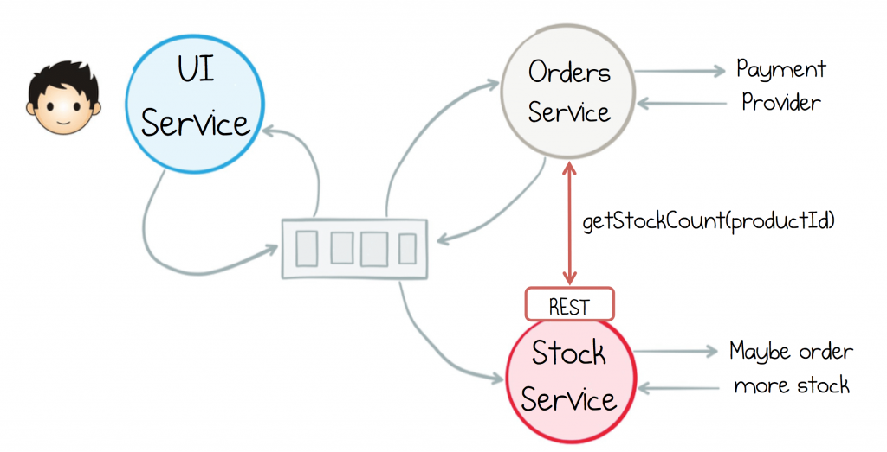

对于服务需要独立发展的更大的生态系统，远程查询增加了很多耦合，在运行时将服务捆绑在一起。 我们可以通过内部化来避免这种跨上下文的查询。事件流用于缓存每个服务中的数据集，使其可以在本地进行查询。

所以要添加这个库存检查，订单服务将订阅库存事件流，将它们进行本地存储。然后直接查询本地缓存来验证是否有足够的库存。

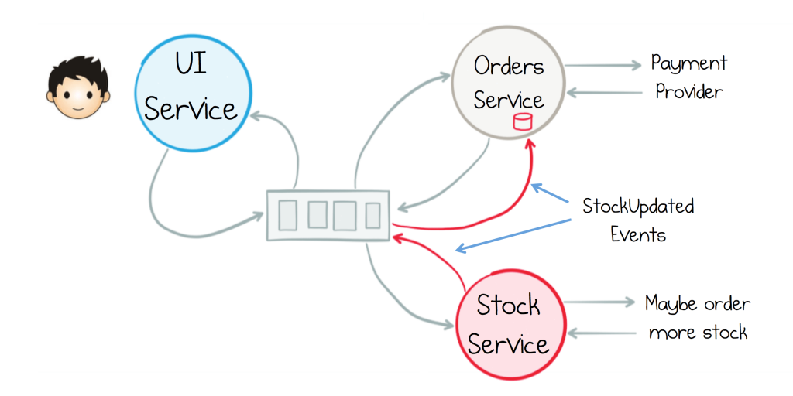
*纯事件驱动系统没有远程查询的概念 - 事件将状态传播到在本地进行查询的服务*

这种“按事件传播查询”方法有三个优点：

* 更好的解耦：查询是本地的。它们不涉及跨上下文调用。这种服务的耦合性远远低于他们请求驱动时的耦合性。
* 更好的自治：订单服务具有库存数据集的私有副本，因此它可以随意使用它，而不仅限于库存服务提供的查询功能。
* 高效连接：如果我们在每个订单上“查询库存”，我们将有效地通过两个服务之间的网络进行连接。随着负载的增加，或者更多的资源被使用时，这可能会变得非常糟糕。按事件传播查询通过将查询（和连接）本地化来解决此问题。

这种做法不是没有缺点。服务内部变成有状态的。他们需要跟踪和处理一段时间内传播的数据集。状态的重复也可能使一些问题更难理解（我们如何原子地减少库存数量？），我们也应该注意数据是最终一致性的问题。但是，所有这些问题都有可行的解决方案，他们只需要考虑一下。

## 单独写原则

适用于这种风格的系统的有用原则是将特定类型的传播事件的责任分配给单个服务：单独写原则。因此，库存服务部门将拥有“库存清单”如何随时间推进，订单服务部门将拥有订单等。

这有助于通过单个代码路径（尽管不一定是单个进程）来保证一致性，验证和其他“写入路径”问题。所以，在下面的示例中，请注意，订单服务控制对订单进行的每个状态更改，但整个事件流量跨越订单、付款和发货，每个由其各自的服务管理。

分配事件传播的责任很重要，因为这些不仅仅是短暂的事件，也不是短暂的聊天。他们代表共同的事实，数据在外面。因此，随着时间的推移，服务需要负责策划这些共享数据集：修复错误，处理模式变化等情况。

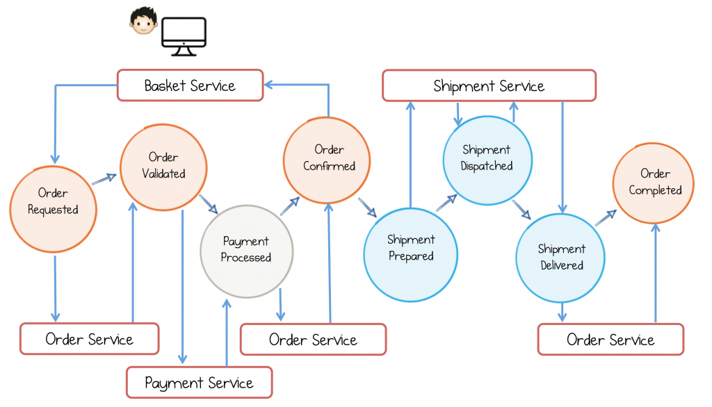

这里每个颜色代表 Kafka 在订单、发货和付款中的一个主题（topic）。当用户点击“购买”时，会触发“订单请求”，等待“订单确认”事件，然后再回复给用户。另外三个服务处理与其工作流程部分相关的状态转换。例如，付款处理完成后，订单服务将订单从验证推送到已确认。

## 混合模式和集群服务

对于上面描述的一些模式看起来像企业消息（Enterprise Messaging），但还是有些许的不同。企业消息在实践中侧重于状态的转移，通过网络有效地将数据库捆绑在一起。

事件协作是关于服务通过一系列事件来处理一些业务目标，这些事件将触发服务的行动。所以这是业务处理的一种模式，而不是简单的移动状态的机制。

但是，我们通常希望在我们构建的系统中利用这种模式的“faces”。事实上，这种模式的美妙之处在于它可以处理微观和宏观，或者在有意义的情况下被混合。

组合模式也很常见。 我们可能想要远程查询的灵活性，而不是本地维护数据集的开销，特别是在数据集增长时。这使部署简单的功能变得容易（如果我们要组合轻量级、无服务器架构和事件流，这一点就很重要），或者因为我们处于无状态的容器或浏览器。

诀窍是限制这些查询接口的范围，理想情况下是在界限上下文中。通常情况下，具有多个特定目标视图的架构会比单一的共享数据存储的架构要好。（界限上下文，这里是一组共享相同的部署周期或领域模型的服务。）

为了限制远程查询的范围，我们可以使用集群上下文模式。这里事件流是上下文之间的唯一沟通模式。但是，上下文中的服务会利用他们所需的事件驱动处理和请求驱动视图。

在下面的例子中，我们有三个部分，只通过事件相互沟通。 在每一个内部，我们使用更细粒度的事件驱动流。 其中一些包括视图层（查询层）。这平衡了耦合的便利性，允许我们将细粒度的服务与较大的实体相结合; 传统的应用程序或现成的产品中都存在许多真实的服务场景。

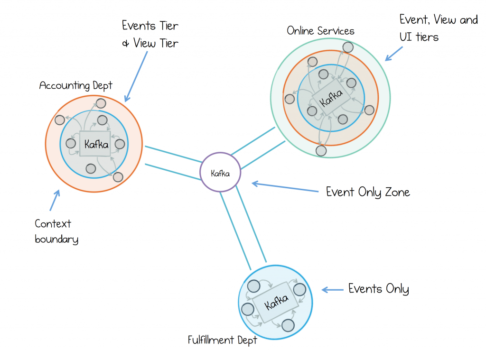
*集群上下文模式*

事件驱动服务的五大优势：

* 解耦：如果基于事件，服务可以更容易地插入到现有的事件流中，或者重做工作流的一些子集。
* 离线/异步流：服务卸下了保证交付给消息协商器（broker）的责任。这使得以事件驱动的方式轻松管理离线任务。
* 状态转移：事件流提供了一种分发数据集的有效机制，因此可以在界限上下文中重构和查询。
* 连接：从不同的服务组合/加入/扩充数据集更容易。连接是快速和本地化的。
* 可追溯性：当有一个中心的、不可变的，保持叙事性的，每次互动随着时间的推移而日常化的记录时，调试分布式将变得更加容易。

## 总结

所以在事件驱动的方法我们使用事件代替命令，事件触发处理。它们也变成我们可以在本地查询的视图。我们在必要时回到远程同步查询，特别是在较小的生态系统中，但是在较大的系统中我们限制了它的范围（理想情况下，仅限于单个界限上下文）。

但所有这些方法只是模式。一起构建系统的指导原则。对于它们，我们不应该太教条化。例如，如果它是很少改变的东西（比如单点登录服务），一个全局查询服务仍然是一个好主意。

诀窍是从事件的基准开始。事件提供了更少的服务机会来将自己相互联系起来，并且将流程控制转移到接收者使得更好的分离关注和更好的可插拔性。

关于事件驱动方法的另一个有趣的事情是，它们对于大型、复杂的架构，和对于小型、高度协作的架构同样起到很好的作用。事件的支柱为服务提供自由发展所需的自治权。去除了复杂的命令和查询关系。对于运维工程师来说，系统排查仍然是痛苦的，但是希望不是那么频繁，至少现在这个故事还有一个脚本！

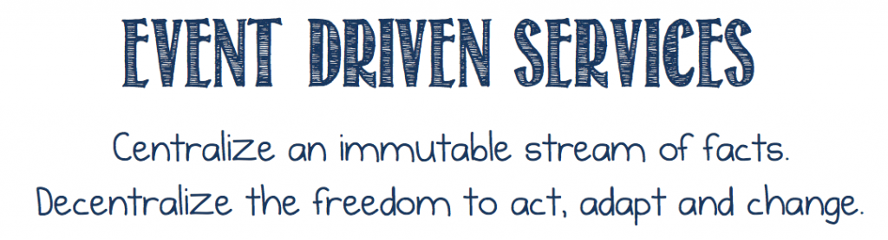

但是，随着所有这些事件的讨论，我们谈到了很少的分布式日志或流处理。当我们将这种模式与 Kafka 应用时，系统的规则就会改变。协商器的保留特性成为我们可以设计的工具，允许我们接触外部的数据。某些服务可以参考。

流式平台非常自然地与这种模型的处理事件和构建视图相配。直接嵌入到服务中的视图，远程服务查询的视图，或视图实现作为一个持续的流。

这导致了一系列优化：利用事件流和事件存储之间的对偶性，混合流式处理工具，筛选叙述，加入来自许多服务的流和实现我们可以查询的视图。这些模式正在赋予权力。它们允许我们使用专门用于处理事件流的工具集来重新构想业务处理。但是，所有这些优化都是基于这里讨论的概念，仅仅应用于更现代的工具集。

在下一篇文章中，我们将通过考虑将日志的保留属性作为我们的服务生态系统的组成部分来使数据更具确定性。我们将数据保存在外部作为可以依赖的中央共享叙事的地方。