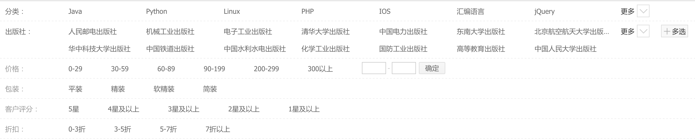
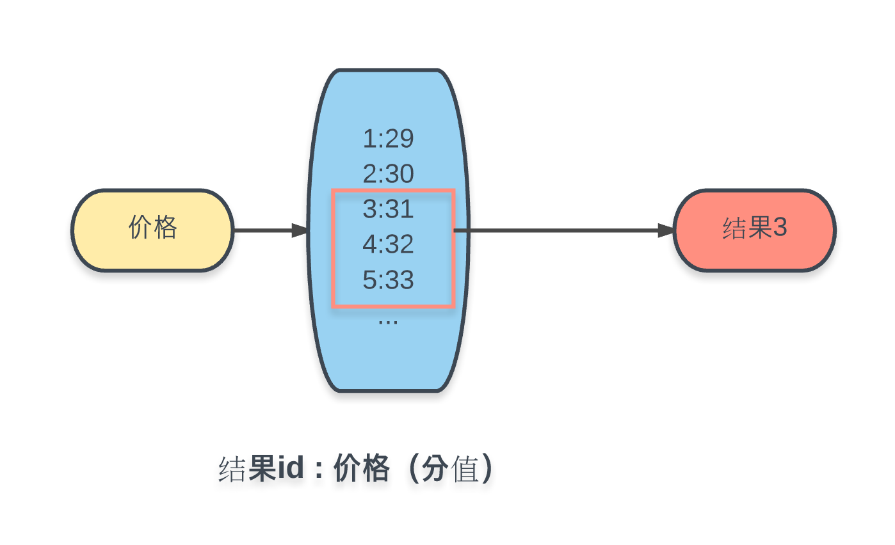
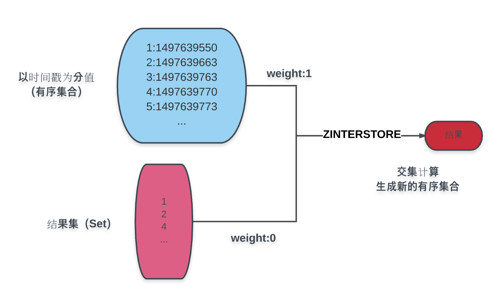

# 一步步实现 Redis 搜索引擎
> 摘要：本文属于原创，欢迎转载，转载请保留出处：[https://github.com/jasonGeng88/blog](https://github.com/jasonGeng88/blog)
 
## 场景

大家如果是做后端开发的，想必都实现过列表查询的接口，当然有的查询条件很简单，一条 SQL 就搞定了，但有的查询条件极其复杂，再加上库表中设计的各种不合理，导致查询接口特别难写，然后加班什么的就不用说了（*不知各位有没有这种感受呢~*）。

下面以一个例子开始，这是某购物网站的搜索条件，如果让你实现这样的一个搜索接口，你会如何实现？（*当然你说借助搜索引擎，像 Elasticsearch 之类的，你完全可以实现。但我这里想说的是，如果要你自己实现呢？*）




从上图中可以看出，搜索总共分为6大类，每大类中又分了各个子类。这中间，各大类条件之间是取的交集，各子类中有单选、多选、以及自定义的情况，最终输出符合条件的结果集。

好了，既然需求很明确了，我们就开始来实现。

## 实现1
率先登场是小A同学，他是写 SQL 方面的“专家”。小A信心满满的说：“不就是一个查询接口吗？看着条件很多，但凭着我丰富的 SQL 经验，这点还是难不倒我的。”

于是乎就写出了下面这段代码（这里以 MYSQL 为例）：

```sql
select ... from table_1
left join table_2
left join table_3
left join (select ... from table_x where ...) tmp_1
...
where ...
order by ...
limit m,n
```

代码在测试环境跑了一把，结果好像都匹配上了，于是准备上预发。这一上预发，问题就开始暴露出来。预发为了尽可能的逼真线上环境，所以数据量自然而然要比测试大的多。所以这么一个复杂的 SQL，它的执行效率可想而知。测试同学果断把小A的代码给打了回来。

## 实现2
总结了小A失败的教训，小B开始对SQL进行了优化，先是通过了```explain```关键字进行SQL性能分析，对该加索引的地方都加上了索引。同时将一条复杂SQL拆分成了多条SQL，计算结果在程序内存中进行计算。

伪代码如下：

```php
$result_1 = query('select ... from table_1 where ...');
$result_2 = query('select ... from table_2 where ...');
$result_3 = query('select ... from table_3 where ...');
...

$result = array_intersect($result_1, $result_2, $result_3, ...);
```

这种方案从性能上明显比第一种要好很多，可是在功能验收的时候，产品经理还是觉得查询速度不够快。小B自己也知道，每次查询都会向数据库查询多次，而且有些历史原因，部分条件是做不到单表查询的，所以查询等待的时间是避免不了的。

## 实现3
小C从上面的方案中看到了优化的空间。他发现小B在思路上是没问题的，将复杂条件拆分，计算各个子维度的结果集，最后将所有的子结果集进行一个汇总合并，得到最终想要的结果。

于是他突发奇想，能否事先将各个子维度的结果集给缓存起来，这要查询的时候直接去取想要的子集，而不用每次去查库计算。

这里小C采用 [Redis](https://redis.io/) 来存储缓存数据，用它的主要原因是，它提供了多种数据结构，并且在 Redis 中进行集合的交并集操作是一件很容易的事情。

具体方案，如图所示：


这里每个条件都事先将计算好的结果集ID存入对应的key中，选用的数据结构是集合（Set）。查询操作包括：

* 子类单选：直接根据条件 key，获取对应结果集；
* 子类多选：根据多个条件 Key，进行并集操作，获取对应结果集；
* 最终结果：将获取的所有子类结果集进行交集操作，得到最终结果；

***这其实就是所谓的[反向索引](https://zh.wikipedia.org/wiki/%E5%80%92%E6%8E%92%E7%B4%A2%E5%BC%95)。***

这里会发现，漏了一个价格的条件。从需求中可知，价格条件是个区间，并且是无穷举的。所以上述的这种穷举条件的 Key-Value 方式是做不到的。这里我们采用 Redis 的另一种数据结构进行实现，有序集合（Sorted Set）：



将所有商品加入 Key 为价格的有序集合中，值为商品ID，每个值对应的分数为商品价格的数值。这样在 Redis 的有序集合中就可以通过```ZRANGEBYSCORE```命令，根据分数（价格）区间，获取相应结果集。

至此，方案三的优化已全部结束，将数据的查询与计算通过缓存的手段，进行了分离。在每次查找时，只需要简单的查找 Redis 几次就能得出结果。查询速度上符合了验收的要求。

## 扩展

### 分页

这里你或许发现了一个严重的功能缺陷，列表查询怎么能没有分页。是的，我们马上来看 Redis 是如何实现分页的。

分页主要涉及排序，这里简单起见，就以创建时间为例。

如图所示：




图中蓝色部分是以创建时间为分值的商品有序集合，蓝色下方的结果集即为条件计算而得的结果，通过```ZINTERSTORE```命令，赋结果集权重为0，商品时间结果为1，取交集而得的结果集赋予创建时间分值的新有序集合。对新结果集的操作即能得到分页所需的各个数据：

* 页面总数为：```ZCOUNT```命令
* 当前页内容：```ZRANGE```命令
* 若以倒序排列：```ZREVRANGE```命令

### 数据更新

关于索引数据更新的问题，有两种方式来进行。一种是通过商品数据的修改，来即时触发更新操作，一种是通过定时脚本来进行批量更新。这里要注意的是，关于索引内容的更新，如果暴力的删除 Key，再重新设置 Key。因为 Redis 中两个操作不会是原子性进行的，所以中间可能存在空白间隙，建议采用仅移除集合中失效元素，添加新元素的方式进行。

### 性能优化

Redis 是内存级操作，所以单次的查询会很快。但是如果我们的实现中会进行多次的 Redis 操作，Redis 的多次连接时间可能是不必要时间消耗。通过使用```MULTI```命令，开启一个事务，将 Redis 的多次操作放在一个事务中，最后通过```EXEC```来进行原子性执行（***注意：这里所谓的事务，只是将多个操作在一次连接中执行，如果执行过程中遇到失败，是不会回滚的***）。

## 总结

这里只是一个采用 Redis 优化查询搜索的一个简单 Demo，和现有的开源搜索引擎相比，它更轻量，学习成本页相应低些。其次，它的一些思想与开源搜索引擎是类似的，如果再加上词语解析，也可以实现类似全文检索的功能。

最后，未完，待续。。。


