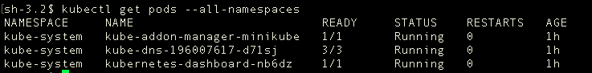
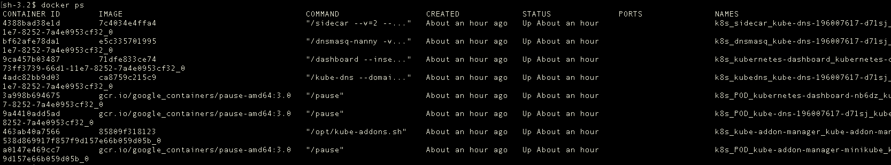
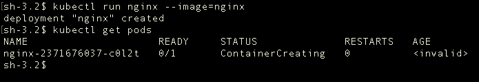
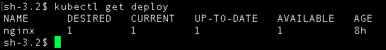

# 带着问题学 Kubernetes 基本单元 Pod
> 摘要：本文属于原创，欢迎转载，转载请保留出处：[https://github.com/jasonGeng88/blog](https://github.com/jasonGeng88/blog)

## 当前环境
1. Mac OS 10.11.x
2. kubectl == v1.6.4
3. minikube == v0.19.1
4. docker == 1.11.1
 

## 准备工作

* 启动 minikube（***minikube 是一个能让 K8S 本地运行的工具***）

```
minikube start \
--vm-driver=xhyve \
--docker-env HTTP_PROXY=http://your-http-proxy-host:your-http-proxy-port  \
--docker-env HTTPS_PROXY=http(s)://your-https-proxy-host:your-https-proxy-port
```

稍微解释下 ```--vm-driver=xhyve```，如果早期有在 Mac 上安装 docker 的同学，应该知道 docker 会在你的电脑上安装一个 VirtualBox 的虚拟驱动。因为 docker 支持的只有 Linux 系统，为了让它能在 Mac 上运行，实际上是运行由 VirtualBox 运行的虚拟环境下的。```--vm-driver``` 默认的参数也是 VirtualBox。再来看 xhyve，它实际和 VirtualBox 类似，简单理解，它是一个更轻量的虚拟技术。

***如果 docker 下载 gcr.io 镜像有困难的话，建议配置 docker 代理（这里推荐一个 [多态代理](https://duotai.love/)）。另一种取巧的方式是，先将所需的镜像通过 docker hub 下载下来，再通过 docker tag 的方式来进行重命名。***

* 配置本机的 docker 环境

上面也说了，K8S 是运行在 xhyve 建立的虚拟环境下。所以本地的 docker 命令是无法连接到 K8S 所依赖的 docker-daemon 的。当然，你可以通过 ```minikube ssh``` 进入虚拟环境，再使用 docker 命令进行观察。

更直观的是，通过 ```eval $(minikube docker-env)``` 将本地 docker 与 K8S 依赖的 docker 进行绑定。这样在本地就可以通过 docker 命令观察 K8S 中的容器变化了。

***```eval $(minikube docker-env -u)``` 取消与 minikube 中的 docker 进行绑定。***

## minikube 初始状态

好了，K8S 已经成功运行起来了。我们下面来初步观察一下当前 Pod 的运行情况，同时也验证一下上一篇所说的“一个 Pod 一个 Pause”的真伪了。

* 查看 K8S 上所有的 Pod（***刚启动的话，可能需要一定时间来拉取相应的镜像。***）

```
kubectl get pods --all-namespaces
```



* 验证每个 Pod 内都会运行一个 Pause 容器

```
docker ps
```



## Pod

* 如何运行和查看 Pod 信息？

先以命令式的方式进行启动（*最简单的启动方式，但不建议用于生产环境。后面会讲到用配置文件进行部署。*）

```
kubectl run nginx --image=nginx
```

是不是和```docker run```的命令很像，轻松上手。我们看一下 K8S 目前的 Pod 情况。

```
# 查看 default 命名空间下的 Pods 列表
kubectl get pods
```

```
# 查看 default 命名空间下指定 Pod 的详细信息
kubectl describe pod $POD_NAME
```





* Pod 的生命周期中所经历的状态有哪些？

	* Pending：Pod 定义正确，提交到 Master，但其包含的容器镜像还未完全创建。通常处在 Master 对 Pod 的调度过程中。
	* ContainerCreating：Pod 的调度完成，被分配到指定 Node 上。处于容器创建的过程中。通常是在拉取镜像的过程中。
	* Running：Pod 包含的所有容器都已经成功创建，并且成功运行起来。
	* Successed：Pod 中所有容器都成功结束，且不会被重启。这是 Pod 的一种最终状态。
	* Failed：Pod 中所有容器都结束，但至少一个容器以失败状态结束。这也是 Pod 的一种最终状态。

* 如何保证 Pod 正常运行？

从上面的各种状态可知，由于种种原因，Pod 可能处于上述状态的任何一种。对于异常的状态，K8S 是通过一种期望值与当前值的比对机制，来保证 Pod 的正常运行。通过 replicaset 做到的。

```
kubectl get rs
``` 

发现确实运行了一个 replicasets 资源。可是我们并没有直接的创建过它。它一般通过上层的 controller 来进行调用，主要是 ReplicationController 或 DeploymentController（下一代 ReplicationController）。上面我们运行 Pod 的时候，正好创建了一个 Deployment 资源。

```
kubectl get deploy
```

验证：当手动删除 Pod 时，DeploymentController 会自动创建一个新的 Pod，来确保与期望值的匹配。
	
* 如何正确删除 Pod？

既然 Pod 是由 deployment 来管理的，我们只要删除 deployment，那么由它产生的 replicaset 和 Pod 也会自动删除。

```
kubectl delete deploy $DEPLOY_NAME
```

* 什么场景下 Pod 会运行多个容器？

这其实是因人而异的，仁者见仁，智者见智。为了后面演示的方便，举一个服务自动构建的例子。

假设有两个容器，一个是 nginx 容器，做静态服务器，一个是 git-sync 容器，用于定时监测 git 仓库上代码的变化，拉取最新代码到本地。这是两个独立的容器，如果把它们放在一个 Pod 里面，Pod 的特点是内部网络共享、数据空间共享。这样就大大减少了原先跨容器访问复杂度。

***这里的例子举得不是特别好，如果涉及跨容器的网络通信，那么 Pod 的重要性会得到更好的体现。***

这里通过配置文件来启动包含 nginx、git-sync 容器的 Pod，配置文件具体如下：

```
```

配置文件中，主要讲一下数据共享的问题。这里主要分为数据临时存储与持久性存储。

* 临时存储：
* 磁盘存储：（当然也提供了云空间的存储方式）

***注意：即使是临时存储，因为数据是 Pod 下所有容器共享的，任何一个容器重启，数据都不会丢失。当 Pod 结束时，临时性数据才会丢失。***

* Pod 内部是如何实现网络共享的？

* 网络资源问题？
	* 容器之间访问
	* Pod 之间访问
* 数据共享问题？
	* 数据临时存储：
	* 数据持久存储：


 * 如何启动一个 Pod？
 * 如何查看 Pod 的状态？
 * Pod 的内部组成是怎样的？
 * 如何来访问 Pod？
 * Pod 启动之后，谁来负责它的后半生？

 
## 要点
* pause
* ReplicationSet
* service
	* type: default -> ClusterIP