# 带着问题学 Kubernetes 基本单元 Pod
> 摘要：本文属于原创，欢迎转载，转载请保留出处：[https://github.com/jasonGeng88/blog](https://github.com/jasonGeng88/blog)

* 文章一：[带着问题学 Kubernetes 架构](https://github.com/jasonGeng88/blog/blob/master/201707/k8s-architecture.md)

## 当前环境
1. Mac OS 10.11.x
2. kubectl == v1.6.4
3. minikube == v0.19.1
4. docker == 1.11.1

## 要点

* 使用 minikube 本地搭建 K8S
* 证明每个 Pod 都有一个 Pause
* Pod 的基本使用
* Pod 生命周期的各种状态
* Pod 的管理问题
* Pod 的多容器场景
* Pod 的数据共享问题
* Pod 的网络共享的实现原理
 

## 准备工作

***关于 minikue 的安装，[官方文档](https://kubernetes.io/docs/tutorials/stateless-application/hello-minikube/)已经和详尽了，这里就不讲了。***

* 启动 minikube（*minikube 是一个能让 K8S 本地运行的工具*）

```
minikube start \
--vm-driver=xhyve \
--docker-env HTTP_PROXY=http://your-http-proxy-host:your-http-proxy-port  \
--docker-env HTTPS_PROXY=http(s)://your-https-proxy-host:your-https-proxy-port
```

稍微解释下 ```--vm-driver=xhyve```，如果早期有在 Mac 上安装 docker 的同学，应该知道 docker 会在你的电脑上安装一个 VirtualBox 的虚拟驱动。因为 docker 支持的只有 Linux 系统，为了让它能在 Mac 上运行，实际上是运行由 VirtualBox 运行的虚拟环境下的。```--vm-driver``` 默认的参数也是 VirtualBox。再来看 xhyve，它实际和 VirtualBox 类似，简单理解，它是一个更轻量的虚拟技术。

***如果 docker 下载 gcr.io 镜像有困难的话，建议配置 docker 代理（这里推荐一个 [多态代理](https://duotai.love/)）。另一种取巧的方式是，先将所需的镜像通过 docker hub 下载下来，再通过 docker tag 的方式来进行重命名。***

* 配置本机的 docker 环境

上面也说了，K8S 是运行在 xhyve 建立的虚拟环境下。所以本地的 docker 命令是无法连接到 K8S 所依赖的 docker-daemon 的。当然，你可以通过 ```minikube ssh``` 进入虚拟环境，再使用 docker 命令进行观察。

更直观的是，通过 ```eval $(minikube docker-env)``` 将本地 docker 与 K8S 依赖的 docker 进行绑定。这样在本地就可以通过 docker 命令观察 K8S 中的容器变化了。

***```eval $(minikube docker-env -u)``` 取消与 minikube 中的 docker 进行绑定。***

## minikube 初始状态

好了，K8S 已经成功运行起来了。我们下面来初步观察一下当前 Pod 的运行情况，同时也验证一下上一篇所说的“一个 Pod 一个 Pause”的真伪了。

* 查看 K8S 上所有命名空间下的 Pod（***刚启动的话，可能需要一定时间来拉取相应的镜像。***）

```
kubectl get pods --all-namespaces
```


<center>图1</center>

可以看到 K8S 一共启动了3个 Pod，并且都是在 kube-system 命名空间下的。具体这3 个 Pod 的作用，大家唉看名字应该能猜到一点，不在本文介绍范围内。

* 验证每个 Pod 内都会运行一个 Pause 容器

```
docker ps
```


<center>图2</center>

从图中可以看出，确实运行着3个 pause 容器。同时运行着5个容器，数字也与图1中 READY  的总数一致（1+3+1）。

## Pod 

### Q1：如何运行和查看 Pod 信息？

先以命令式的方式进行启动，这也是最简单的启动方式，但不建议用于生产环境。（*后面会涉及以配置文件进行部署。*）

```
kubectl run nginx --image=nginx
```

***注意：在不指定命名空间时，默认为 default，其他指令基本都是如此。***

是不是和```docker run```的命令很像，轻松上手。我们看一下运行情况。


<center>图3</center>

图中显示，deployment 已经被创建。可以把它看作是 Pod 的管理者，是 controller-manager 中的一员（*后面还会讲到*）。

```
kubectl get deploy
```

<center>图4</center>

查看 Pod 列表

```
kubectl get pods
```
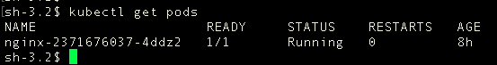
<center>图5</center>

查看指定 Pod 的详细描述

```
kubectl describe pod $POD_NAME
```
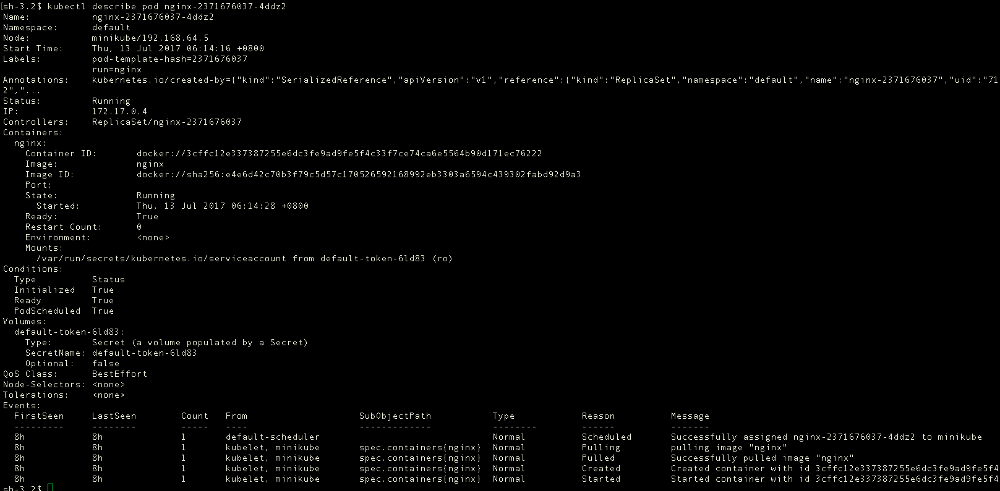
<center>图6</center>


### Q2：Pod 的生命周期中所经历的状态有哪些？

从图5中可以看出，Pod 当前的状态是 Running，如果自己尝试的话，可能会遇到其他状态。因为 Pod 所处的生命周期的阶段可能不一样。

下面常见的有这几种：

* Pending：Pod 定义正确，提交到 Master，但其包含的容器镜像还未完全创建。通常处在 Master 对 Pod 的调度过程中。
* ContainerCreating：Pod 的调度完成，被分配到指定 Node 上。处于容器创建的过程中。通常是在拉取镜像的过程中。
* Running：Pod 包含的所有容器都已经成功创建，并且成功运行起来。
* Successed：Pod 中所有容器都成功结束，且不会被重启。这是 Pod 的一种最终状态。
* Failed：Pod 中所有容器都结束，但至少一个容器以失败状态结束。这也是 Pod 的一种最终状态。

### Q3：如何保证 Pod 正常运行？

从上面的各种状态可知，由于种种原因，Pod 可能处于上述状态的任何一种。对于异常的状态，K8S 是通过一种期望值与当前值的比对机制，来保证 Pod 的正常运行。其内部是通过 replicaset（*下一代 ReplicationController*） 做到的。

```
kubectl get rs
``` 
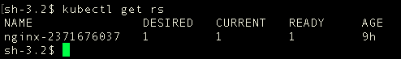
<center>图7</center>

观察 replicaset 发现，存在一个 nginx-xxx 的 replicaset，它的期望值与当前值都为1，表示需要一个 Pod，并且已经处于 READY 状态。

可是我们并没有直接的创建过它。而且一般也不会直接去使用它。我们通常会使用上层的 Deployment 来进行调用，因为它还提供了一些其他的特性，如更新与回滚。

验证：当手动删除 Pod 时，Deployment 会自动创建一个新的 Pod，来确保与期望值的匹配。

```
kubectl delete pod $POD_NAME
```
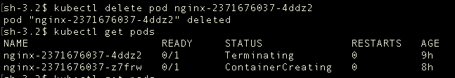
<center>图8</center>


***Deployment 相较 ReplicationController 而言，除了提供 ReplicationController 的基本功能，还支持声明式的更新和回滚。
不过目前还是 beta 版。***
	
### Q4：如何正确删除 Pod ？

通过上述验证，我们直接删除 Pod后，依然会创建新的 Pod，这是它的保障机制。我们只有删除它的上层管理者，即 deployment，那么由它产生的 replicaset 和 Pod 会自动删除。

```
kubectl delete deploy $DEPLOY_NAME
```
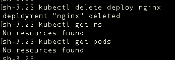
<center>图9</center>

### Q5：什么场景下 Pod 会运行多个容器？

为了后面演示的方便，举一个服务自动构建的例子。（*实用否，大家可以自行判断*）

假设有两个容器，一个是 nginx 容器，做静态服务器，一个是 git-sync 容器，用于定时监测 git 仓库上代码的变化，拉取最新代码到本地。这是两个独立的容器，如果把它们放在一个 Pod 里面，Pod 的特点是内部网络共享、数据空间共享。这样就大大减少了原先跨容器访问的复杂度。

***这里的例子举得可能不是特别好，如果涉及跨容器的网络通信，那么 Pod 的优势会得到更好的体现。***

这里通过配置文件来启动包含 nginx、git-sync 容器的 Pod，

配置文件 nginx-git.yml 具体内容如下：（*[官方参考文档](https://kubernetes.io/docs/resources-reference/v1.6/#replicationcontroller-v1-core)*）：

```
apiVersion: apps/v1beta1
kind: Deployment
metadata:
  name: nginx-git
spec:
  replicas: 1
  template:
    metadata:
      labels:
        app: nginx
    spec:
      containers:
      - name: nginx # 启动 nginx 容器
        image: nginx
        volumeMounts: # 挂载数据卷
        - mountPath: /usr/share/nginx/html
          name: git-volume
      - name: git-sync # 启动 git-sync 容器
        image: openweb/git-sync
        env:
        - name: GIT_SYNC_REPO
          value: "https://github.com/jasonGeng88/test.git"
        - name: GIT_SYNC_DEST
          value: "/git"
        - name: GIT_SYNC_BRANCH
          value: "master"
        - name: GIT_SYNC_REV
          value: "FETCH_HEAD"
        - name: GIT_SYNC_WAIT
          value: "10"
        volumeMounts: # 挂载数据卷
        - mountPath: /git
          name: git-volume
      volumes: # 共享数据卷
      - name: git-volume
        emptyDir: {}
```

配置文件有必要的注释，应该比较容易理解，这里简单讲下两点：

1. GIT 仓库地址下只有一个 index.html 文件，内容为：```hello world 1!```。
2. 关于共享数据 ```volumes``` 的配置问题。共享数据存储的问题主要分为：数据临时存储与持久性存储。
	* 临时存储：

	```
	volumes:
	- name: volume-name
	  emptyDir: {}
	```

	* 挂载宿主机存储：

	```
	volumes:
	- name: volume-name
	  hostPth: 
	  	path: "/data"
	```

	* 当然还有网络磁盘存储等（如谷歌公有云）

***注意：即使是临时存储，因为数据是 Pod 下所有容器共享的，任何一个容器重启，数据都不会丢失。当 Pod 结束时，临时性数据才会丢失。***

#### 演示：

* **以配置文件运行 deployment：**

```
kubectl create -f nginx-git.yml
```

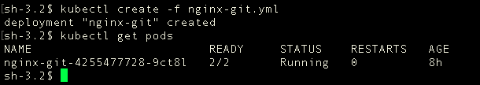
<center>图10</center>

* **访问 Pod 查看效果：**

更实用的场景是将 Pod 作为 Service 暴露，通过 Service 来进行访问，因为本文主要讲 Pod，不想引入 Service 的概念。所以我们直接来访问 Pod。


* 1. 查看 Pod 对应的 IP （*也可在 Pod 详细描述中获得*）

```
kubectl get -o template pod/$POD_NAME --template={{.status.podIP}}
```

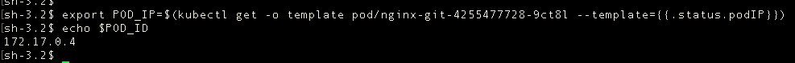
<center>图11</center>

* 2. 进入 K8S 集群，访问 Pod 中 nginx 服务 

因为获得 Pod IP 是 K8S 集群内部创建的，外面是无法与其通信的。所以我们需要通过命令 ```minikube ssh``` 进入集群，才可进行 Pod 访问。

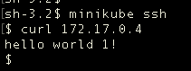
<center>图12</center>

再把 git 仓库上的 index.html 内容改为 ```hello world 2!```，再访问一下 Pod 观察结果（需等待几秒）。

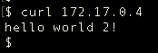
<center>图13</center>

### Q6：Pod 内部是如何实现网络共享的？

最后，我们来看下 Pod 的 IP 是如何生成的，以及内部容器是如何关联的。

通过 ```docker ps``` 我们发现，nginx-git 最终会生成三个容器，分别是 git-sync, nginx, pause。

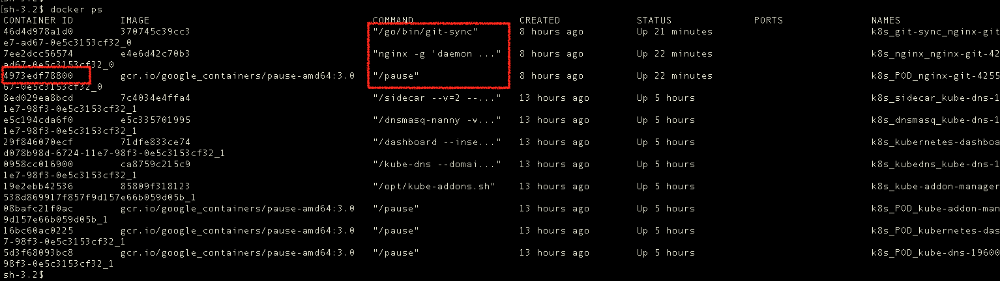
<center>图14</center>

通过 ```docker inspect $CONTAINER_ID``` 我们发现，git-sync 与 nginx 的网络模型都是使用了同一个容器ID的网络，而该容器ID 正好对应了 pause 这个容器。

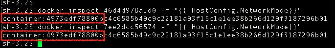
<center>图15</center>

我们再看 pause 容器的网络模型，发现它使用的是 bridge 模式，而分配的 IP 正是对应了 Pod 的 IP。由此可知，Pod 内所有容器都是通过 pause 的网络进行通信的。

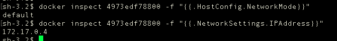
<center>图16</center>

docker 中默认的网络模式就是 Bridge 模式。

#### 证明：

上面演示已经证明了集群间通过 Pod IP 是可以访问到容器内的服务的。我们下面证明，Pod 内容器之间通过 localhost 进行互相访问。

我们进入 git-sync 容器，通过访问 localhost 的 80 端口，看是否能访问到 nginx 容器。

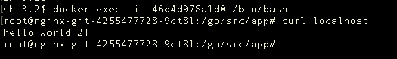
<center>图17</center>

答案很明显了！

## 总结

本文没有按部就班的去一一介绍 Pod 的相关功能点，而是通过 K8S 的本地搭建，从 Pod 的基本使用开始，通过几个问题穿插着介绍了 Pod 的一些主要的概念与使用。

本文知识点总结：

* minikube 的启动与连接
* kubectl 的使用
* Pod 的命令式与配置文件的启动
* Pod 的查看方式（概况与详情）
* Pod 生命周期中的各个状态
* deployment 对 Pod 的管理
* deployment, replicaset, pod 三者的关系
* Pod 内多容器的场景
* Pod 的共享数据的临时存储与文件挂载的持久存储
* Pod 中 pause 的作用及网络通信的原理

可能关于 Pod 的有些知识点没有讲到，或者有讲的不对的地方，也欢迎提出和指正！

后面，也会去讲关于 service，configMap，update，rollout 相关的一些内容，希望对您有帮助~

