# 带着问题学 Kubernetes 抽象对象 Service
> 摘要：本文属于原创，欢迎转载，转载请保留出处：[https://github.com/jasonGeng88/blog](https://github.com/jasonGeng88/blog)

* 文章一：[带着问题学 Kubernetes 架构](https://github.com/jasonGeng88/blog/blob/master/201707/k8s-architecture.md)
* 文章二：[带着问题学 Kubernetes 基本单元 Pod](https://github.com/jasonGeng88/blog/blob/master/201707/k8s-pod.md)

## 当前环境
1. Mac OS 10.11.x
2. kubectl == v1.6.4
3. minikube == v0.19.1
4. docker == 1.11.1

## 知识点
* Service 的 Selector 与 Label 匹配机制
* Service 与 Pods 的地址映射关系
* kube-proxy 的 iptables 代理机制
* Service 的服务发现机制
* Service 的服务暴露方式

## 前言

上一篇讲述了 Pod 的相关内容，了解了 Pod 的定义、生命周期以及通信机制等。正如上文说的，Pod 是存在生命周期的，它的崩溃、更新都是以创建新 Pod 替换原有的 Pod 的方式进行的，所以通过固定 Pod 地址的访问变得不太可行。我们需要通过一种上层调用的方式，来解决底层 Pod 的动态变化的场景。

庆幸，K8S 引入了 Service 这个抽象的概念。Service 会创建一个虚拟的服务，由它来整合集群内的 Pod。Service 会虚拟出一个 VIP，并在它销毁之前保持该 VIP 地址保持不变。通过对它的访问，以代理的方式负载到对应的 Pod 上，同时 Pod 生命周期的变换，也会及时反应在代理上。

下面我们几种常见的场景，来具体看看 Service 是如何工作的。

## 环境准备
### 演示镜像
* 镜像名：jasonn/php-echoserver
* 作用：打印当前容器的 IP

### K8S Pod 创建
* 文件名：deploy-echoserver.yml （*这里以 Deployment 的方式来创建与管理 Pod*）
* 文件内容：

```
apiVersion: apps/v1beta1
kind: Deployment
metadata:
  # Deployment 实例名称
  name: echoserver
spec:
  # 设置 Pod 个数
  replicas: 2
  template:
    metadata:
      # 设置 Pod 标签
      labels:
        app: echoserver
    spec:
      # 运行 docker 镜像
      containers:
      - name: echoserver 
        image: jasonn/php-echoserver
```

* 启动命令：

```
kubectl create -f deploy-echoserver.yml
```

至此，准备工作全部完成。短暂的等待后，Pod 创建成功，并且也由 deployment 管理着。

查看 deployment 启动情况：

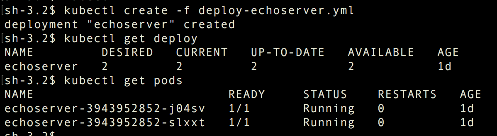

对 Pod 的访问情况如下（*通过```kubectl describe pods```获取 Pod 的 IP 地址*）：

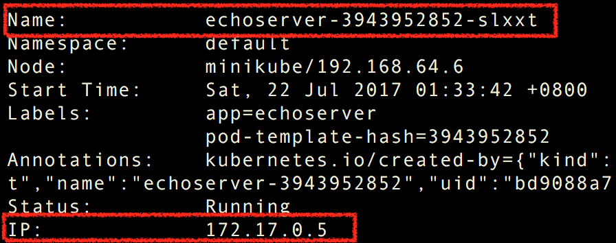

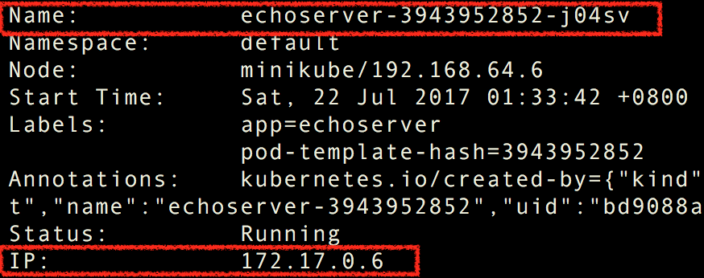

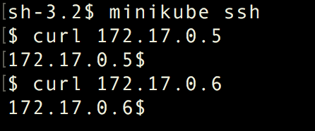


## 问题
### ***场景1：现在 K8S 上运行着2个 Pod。我们希望通过上述所说的 Service 来整合这两个 Pod 的访问，完成对它们的统一访问，而不用向具体的 Pod 发出请求。***

### Q1: Service 如何对 Pod 进行整合
这里所说的 Pod 默认都是带有标签（label）的，我们之前创建的两个 Pod 所赋予的标签是 ```app: echoserver```，所以我们在创建 Service 时，就要通过选择器（selector）来获取符合条件的 Pod 进行整合。

Service 创建脚本内容如下（*service-echoserver.yml*）：

```
apiVersion: v1
kind: Service
metadata:
  # Service 实例名称
  name: svc-echoserver
spec:
  ports:
    - protocol: TCP
      # Service 端口地址
      port: 8080
      # Pod 端口地址
      targetPort: 80
  selector:
    # 匹配符合标签条件的 Pod
    app: echoserver
```

创建 Service 命令：

```
kubectl create -f service-echoserver.yml
```

由此，我们创建好了一个 Service，同时也生成了一个对应的 VIP。

查看 Serivce 创建情况：

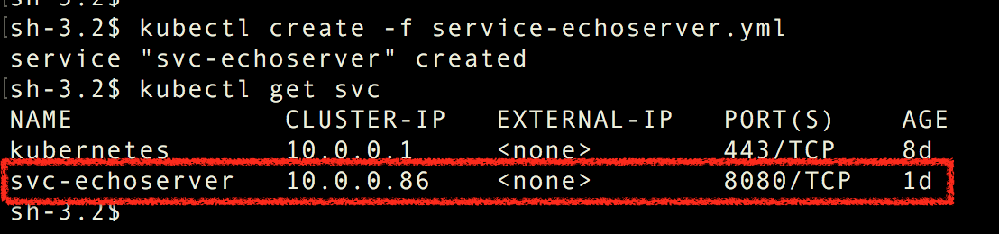

下面，我们来验证下是否如之前所说，对 VIP 的访问能访问到 Pod 的内容。

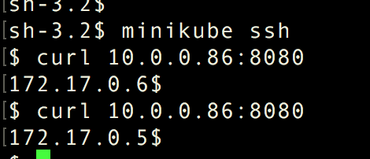

*我们发现不仅能成功访问，而且还提供了负载均衡的功能。后面会讲负载是怎么实现的*

*PS: 标签筛选查找范围仅在同个命名空间（namespace）内。*

***

### ***场景2：了解了 Service 是通过 label & selecor 来进行整合 Pod 的。那如果 Pod 不存在标签，又或者是在不同 Namespace 下，也可能是 K8S 集群外的一个服务。现实情况往往更加复杂，这样的情况下，Service 又该如何整合。***

### Q2: Service 与 Pod 的地址映射关系由谁管理？
这里引出了另一个概念 Endpoints。我们先来看看它的一个具体情况。

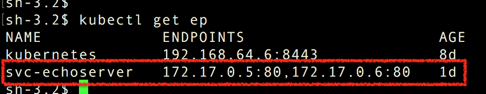

发现在 Service 创建的同时，还生成了一个 Endpoints。 该 Endpoints 与 Service 同名，它所暴露的地址信息正是对应 Pod 的地址。由此猜测是 Endpoints 维护了 Service 与 Pod 的映射关系。

为了验证我们的猜测，我们手动删除 Endpoints，发现之前能成功访问到 Pod 的 VIP，现在已经已经访问不到了。

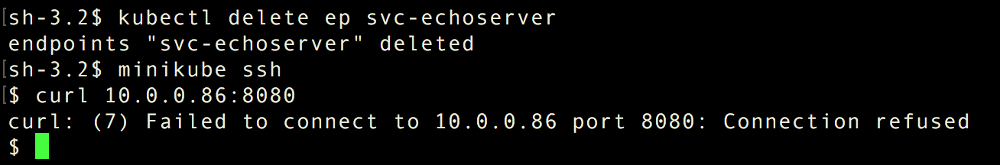

我们在手动把 Endpoints 创建回来，创建脚本如下（*endpoint-echoserver.yml*）：

```
apiVersion: v1
kind: Endpoints
metadata:
  # Endpoints 实例的名称
  name: svc-echoserver
subsets:
  - addresses:
    - ip: 172.17.0.5
    - ip: 172.17.0.6
    ports:
    - port: 80
```

创建命令：

```
kubectl create -f endpoint-echoserver.yml
```

***注意：Endpoints  与 Service 的绑定关系通过名称来关联的，所以这两者的名称（name）一定要一致。***

*如果创建失败，出现的错误信息是“...endpoints "svc-echoserver" already exists”，说明 Service 已经更新了 Endpoints。这里就说到了 Service 会定期去检查 Pod 的状态，并且将结果更新到 Endpoints 上。*

VIP 再次访问时又能成功访问到，如图：

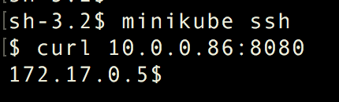

现在我们已经能轻松的解决场景2的问题了，在创建 Service 时，只要不设置 ```Selector``` 属性，那么将不会自动创建 Endpoints，这是我们可以根据需求手动的创建指定地址（address）的 Endpoints，来解决标签无法实现的整合。

***

### ***场景3：知道了 Service、Endpoints、Pod 的三者关系后，我们来具体看看所说的代理到底是如何实现的。从之前 K8S 的架构中，我们知道 Service 的代理是由 kube-proxy 实现的。而它的代理模式（Proxy mode）主要有两种：userspace 与 iptables。自 K8S v1.2 开始，默认的代理模式就是 iptables，并且它的性能也是要高于 userspace 的，所以在这儿只讨论 iptables 的实现。***

### Q3：kube-proxy 是如何使用 iptables 做到服务代理的（*对于 iptables 不了解的同学可以直接跳过*）？

我们现在要做的呢，是将 VIP 请求给转发到对应的 Pod 上。而实现此的正是 iptables。

了解 iptables 的同学都知道四表五链的概念，而做端口地址转发的呢，主要是在 nat 表中实现。我们下面看一下一个 VIP 请求在 nat 表中是如何一步步被转发到 Pod 上的。

* 1. 根据 iptables 的机制，请求是先到 nat 表的 PREROUTING 链（chain）上的，它的规则如下：

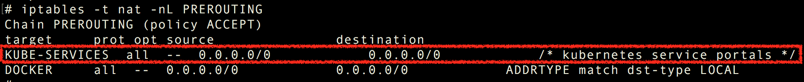

从图中发现，请求首先经过 KUBE-SERVICE 链，其次再到 DOCKER 链上的。

* 2. 我们看一下 KUBE-SERVICE 的情况：


我们发现 KUBE-SERVICE 中包含了一系列 Service 的规则。根据我们请求的 VIP 的目的地址，对应到了下一个名叫 KUBE-SVC-PRQ3AXYQLQGIVVIU 的 Service 链上。

* 3. KUBE-SVC-PRQ3AXYQLQGIVVIU 规则如下：

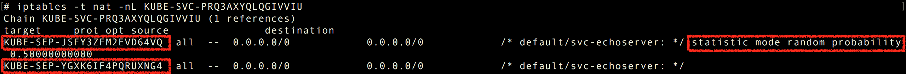

从规则的名字上可以看出，该条 Service 链上记录的是2个 Endpoints 链，具体的选择是通过 50% 的随机性的进行决定（***这也是它的一个负载规则***）。

* 4. 我们来看第一个名叫 KUBE-SEP-JSFY3ZFM2EVD64VQ 的 Endpoints 链的情况：

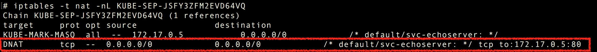

从图中，我们已经很清晰的看到了它转发到 Pod 的具体规则。

* 5. 下面以一张简单的流程图，看一下请求的转发情况：

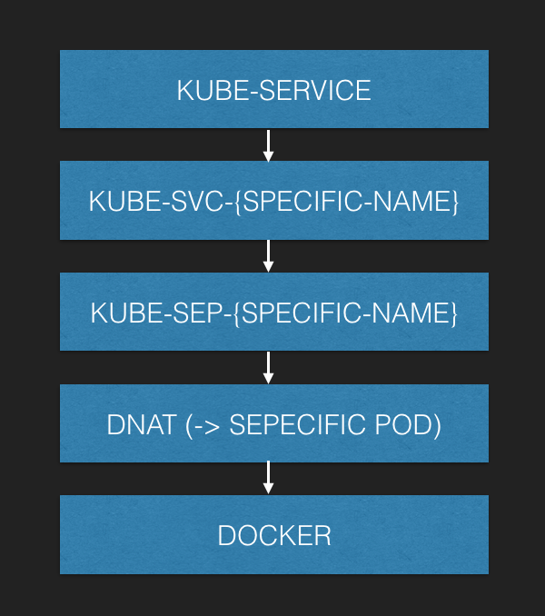

关于 DOCKER 链的跟踪，方法是差不多的，请求 从 nat 表结束后，在到 filter 表中，这里就不加以说明了。

而这些规则的实现正是由 Service、Endpoints 来完成的。我们在创建、更新、以及其自身的检测机制，都会对这些规则进行更新。

***

### ***场景4：Service 的创建、内部结构以及映射关系，我们都了解了。下面我们就要关心如何优雅的使用它，上面我们都是通过 Service 的 VIP 进行访问的。这存在的问题是，如果有服务与服务之间的调用，难道我还要知道所调用服务的 VIP 不成，对于 VIP 的访问能否更通用一些。***

### Q4：Service 的服务发现机制是怎样的？

对于服务与服务间的调用，实际上就是 Pod 对 Servie 的调用。而 Pod 是如何发现 Service 的，这里可选择的方式有2种。

我们通过启动一个名为 busybox 的 Pod 来观察这两种方式：

```
kubectl run -i --tty busybox --image=busybox --restart=Never -- sh
```

* 环境变量：

在 Pod 中，集群中的 Service 会以环境变量的方式赋值在容器中，我们可以通过 ```{SERVICE_NAME}_SERVICE_HOST``` 和 ```{SERVICE_NAME}_SERVICE_PORT``` 进行获取（*对于有多个 Port 的，可以通过带指定 PORT 名称的变量获得。*）。

busybox 中 环境变量如下：

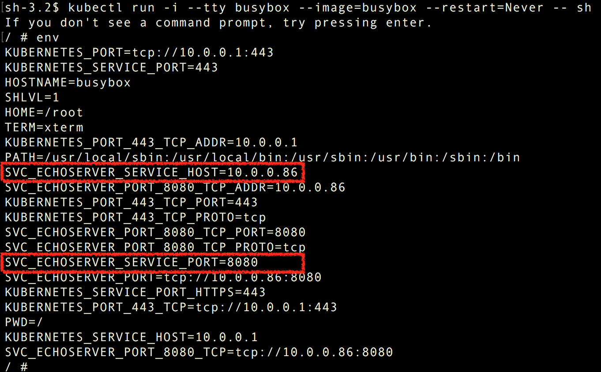


查看访问情况：

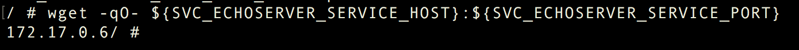

* dns 解析：

第二种方式是通过 kube-dns 对 Service 进行域名解析，同样能达到服务发现的目的。

查看 DNS 域名解析配置：
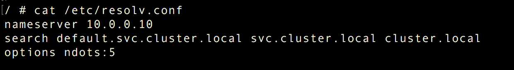

通过 nslookup 查询 dns 记录：
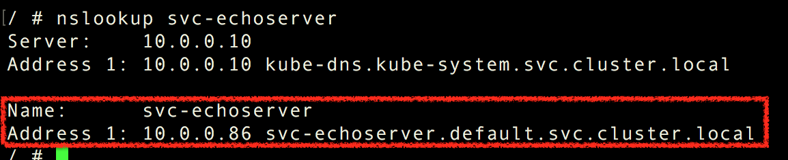

查看访问结果：
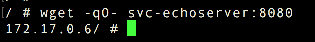

***

### ***场景5：集群间的服务调用解决了，可说到底还是通过的 VIP 进行的访问。VIP 对于集群外的终端用户，是无法访问的。所以我们得通过服务暴露的方式，让终端用户能与集群内的服务进行通信。***

### Q5：Service 是如何对外暴露服务的？

在 Service 的配置文件中，属性```spec.type```就是用来设置服务暴露的方式，它提供的三种方式如下：

* ClusterIP: 提供一个集群内部的虚拟IP以供Pod访问（*默认类型，我们上述使用的正是这种方式*）。
* NodePort: 在每个Node上打开一个端口以供外部访问。
* LoadBalancer: 通过外部的负载均衡器来访问（*一般需要云提供商提供 LB 支持*）。

我们这里简单起见，还是通过 NodePort 方式进行。

修改 Service 配置文件，并重新启动：

```
apiVersion: v1
kind: Service
metadata:
  # Service 实例名称
  name: svc-echoserver
spec:
  ports:
    - protocol: TCP
      # Service 端口地址
      port: 8080
      # Pod 端口地址
      targetPort: 80
  selector:
    # 匹配符合标签条件的 Pod
    app: echoserver
  type: NodePort
```

***注意：这里如果要以```kubecrl replace -f service-echoserver.yml```方式进行平滑更新，配置中需添加```spec.clusterIP```属性，值为当前 Service 的 VIP，否则更新会失败。这也符合了一开始说的 Service 在它终止之前，VIP 是不会改变的。***

查看 Service 更新情况：

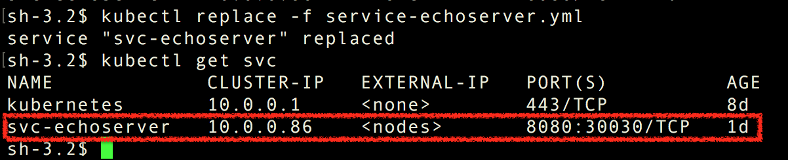

外部访问（*该 Node 地址是：192.168.64.6*）：

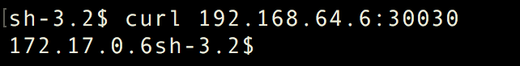

## 总结
文本从 Service 的标签与选择器开始，讲了 Service 整合 Pod 的过程，引出了 Service, Endpoints, Pods 三者的关系情况。随后又通过 iptables 详细展开了 kube-proxy 的代理机制。最后，以 Service 的集群内与集群外的访问设置，讲述了 Service 的服务发现与服务暴露机制。

关于 Service 的有遗漏重要的知识点，或者有讲的不对的地方，也欢迎提出和指正！最后，希望本篇对你学习 K8S 有所帮助~


