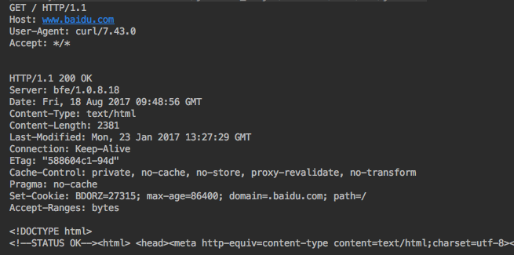

# JAVA 中原生的 socket 通信机制
> 摘要：本文属于原创，欢迎转载，转载请保留出处：[https://github.com/jasonGeng88/blog](https://github.com/jasonGeng88/blog)


## 当前环境
1. jdk == 1.8

## 知识点
* socket 的连接处理
* 输入、输出流的处理
* 请求模型优化

## 背景

先来看张图，有用过 RPC 的同学，应该对下面这张图都比较熟悉。

-- 图一

*这里仅以同构系统的 JAVA 通信为例。*

客户端通过调用本地的对象方法（即存根），来访问服务端对应的远程方法（即服务接口的具体实现）。这中间涉及了很多的知识点，以 JAVA 来说，有对 socket 的处理，通信的同步与异步的不同实现，数据传输的序列化与反序列化，服务调用与定位所用到的反射机制与动态代理等。

我后面打算针对上述的几块，一步步自建一个简易的 RPC 框架。

## 场景

今天，先和大家聊一下 JAVA 中的 socket 通信问题。这里采用最简单的一请求一响应模型为例，假设客户端需要与10个站点进行通信，我们该如何实现这个客户端。

首先，先来看看用 JAVA 中原生的 socket 是如何实现的。

* 首先，我们需要建立 socket 连接（*核心代码*）

```java
import java.net.InetSocketAddress;
import java.net.Socket;
import java.net.SocketAddress;
		
// 初始化 socket
Socket socket = new Socket();
// 初始化远程连接地址
SocketAddress remote = new InetSocketAddress(host, port);
// 建立连接
socket.connect(remote);

```

* 连接成功后，我们就能获得 socket 的输入输出流，下面我们就该对该连接发起数据请求了。

*socket 连接本质就是 io 处理，与文件流有点类似。所以也有对应的输入流与输出流。获取输入、输出流代码如下：*

```java
// 输入流
InputStream in = socket.getInputStream();
// 输出流
OutputStream out = socket.getOutputStream();
```

关于 io 流的处理，我们一般会用相应的包装类来处理 io 流，如果直接处理的话，我们需要对 byte[] 进行操作，而这是相对比较繁琐的。如果采用包装类，我们可以直接以 string、int 等类型进行处理，简化了 io 字节操作。

下面以 BufferedReader 与 PrintWriter 作为输入输出的包装类进行处理。

```java
// 获取 socket 输入流
private BufferedReader getReader(Socket socket) throws IOException {
    InputStream in = socket.getInputStream();
    return new BufferedReader(new InputStreamReader(in));
}

// 获取 socket 输出流
private PrintWriter getWriter(Socket socket) throws IOException {
    OutputStream out = socket.getOutputStream();
    return new PrintWriter(new OutputStreamWriter(out));
}

```

* 有了 socket 连接、输入与输出流，下面就该向发送请求数据，以及获取请求的响应结果。

有了 io 包装类的支持，我们可以直接以字符串的格式进行传输。我们以访问 baidu 站点为例，进行请求的响应与接收。

请求的数据内容处理如下：

```java
public class HttpUtil {

    public static String compositeRequest(String host){

        return "GET / HTTP/1.1\r\n" +
                "Host: " + host + "\r\n" +
                "User-Agent: curl/7.43.0\r\n" +
                "Accept: */*\r\n\r\n";
    }
    
}
```

发送请求数据代码如下：

```java
// 发起请求
PrintWriter writer = getWriter(socket);
writer.write(HttpUtil.compositeRequest(host));
writer.flush();
```

接收响应数据代码如下：

```java
// 读取响应
String msg;
BufferedReader reader = getReader(socket);
while ((msg = reader.readLine()) != null){
    System.out.println(msg);
}
```

* 至此，讲完了原生 socket 下的创建连接、发送请求与接收响应的所有核心代码。

完整代码如下：

```
import java.io.*;
import java.net.InetSocketAddress;
import java.net.Socket;
import java.net.SocketAddress;
import com.test.network.util.HttpUtil;

public class SocketHttpClient {

    public void start(String host, int port) {

        // 初始化 socket
        Socket socket = new Socket();

        try {
            // 设置 socket 连接
            SocketAddress remote = new InetSocketAddress(host, port);
            socket.setSoTimeout(5000);
            socket.connect(remote);

            // 发起请求
            PrintWriter writer = getWriter(socket);
            System.out.println(HttpUtil.compositeRequest(host));
            writer.write(HttpUtil.compositeRequest(host));
            writer.flush();

            // 读取响应
            String msg;
            BufferedReader reader = getReader(socket);
            while ((msg = reader.readLine()) != null){
                System.out.println(msg);
            }

        } catch (IOException e) {
            e.printStackTrace();
        } finally {
            try {
                socket.close();
            } catch (IOException e) {
                e.printStackTrace();
            }
        }

    }

	private BufferedReader getReader(Socket socket) throws IOException {
        InputStream in = socket.getInputStream();
        return new BufferedReader(new InputStreamReader(in));
    }

    private PrintWriter getWriter(Socket socket) throws IOException {
        OutputStream out = socket.getOutputStream();
        return new PrintWriter(new OutputStreamWriter(out));
    }

}
```

* 下面，我们通过实例化一个客户端，来进行 socket 通信。

```java
public class Application {

    public static void main(String[] args) {

        new SocketHttpClient().start("www.baidu.com", 80);

    }
}
```

结果输出：



## 请求模型优化
这种方式，虽然实现功能没什么问题。但是我们细看，发现在 io 写入与读取过程，是发生了 io 阻塞的情况。即：

```
// 会发生 io 阻塞
writer.write(HttpUtil.compositeRequest(host));
reader.readLine();
```

所以如果要同时请求10个站点，如下：

```java
public class SingleThreadApplication {

    public static void main(String[] args) {

        for (String host: HttpConstant.HOSTS) {

            new SocketHttpClient().start(host, HttpConstant.PORT);

        }

    }
}
```

它一定是第一个请求响应结束后，才会发起下一个站点处理。

*这在服务端更明显，虽然这里的代码是客户端连接，但是具体的操作和服务端是差不多的。请求只能一个个串行处理，这在响应时间上肯定不能达标。*


* 多线程处理

有人觉得这根本不是问题，JAVA 是多线程的编程语言。对于这种情况，采用多线程的模型再合适不过。

```
public class MultiThreadApplication {

    public static void main(String[] args) {

        for (final String host: HttpConstant.HOSTS) {

            Thread t = new Thread(new Runnable() {
                public void run() {
                    new SocketHttpClient().start(host, HttpConstant.PORT);
                }
            });

            t.start();

        }
    }
}
```

这种方式起初看起来挺有用的，但并发量一大，应用会起很多的线程。都知道，在服务器上，每一个线程实际都会占据一个文件句柄。而服务器上的句柄数是有限的，而且大量的线程，造成的线程间切换的消耗也会相当的大。所以这种方式在并发量大的场景下，一定是承载不住的。

* 多线程 + 线程池 处理

既然线程太多不行，那我们控制一下线程创建的数目不就行了。只启动固定的线程数来进行 socket 处理，既利用了多线程的处理，又控制了系统的资源消耗。

```java
public class ThreadPoolApplication {

    public static void main(String[] args) {

        ExecutorService executorService = Executors.newFixedThreadPool(8);

        for (final String host: HttpConstant.HOSTS) {

            Thread t = new Thread(new Runnable() {
                public void run() {
                    new SocketHttpClient().start(host, HttpConstant.PORT);
                }
            });

            executorService.submit(t);
            new SocketHttpClient().start(host, HttpConstant.PORT);

        }

    }
}
```

*关于启动的线程数，一般 CPU 密集型会设置在 N+1（**N为CPU核数**），IO 密集型设置在 2N + 1。*

这种方式，看起来是最优的了。那有没有更好的呢，如果一个线程能同时处理多个 socket 连接，并且在每个 socket 输入输出数据没有准备好的情况下，不进行阻塞，那是不是更优呢。这种技术叫做“IO多路复用”。在 JAVA 的 nio 包中，提供了相应的实现。

## 后续
* JAVA 中是如何实现 IO多路复用
* Netty 下的实现异步请求的


