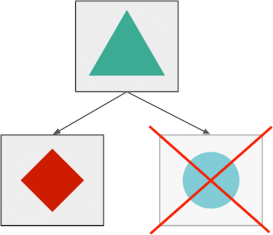
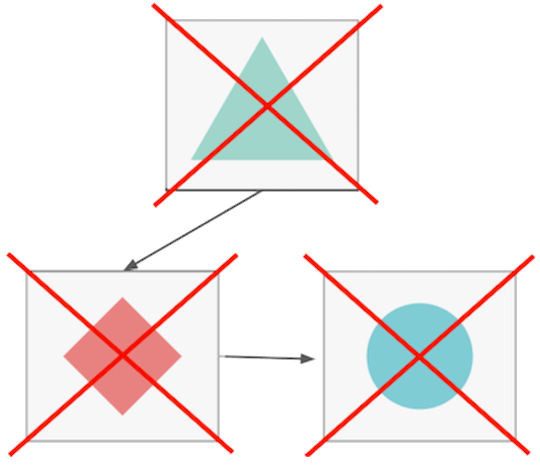
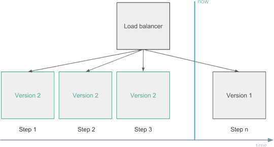
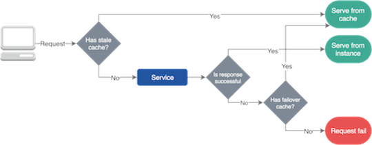
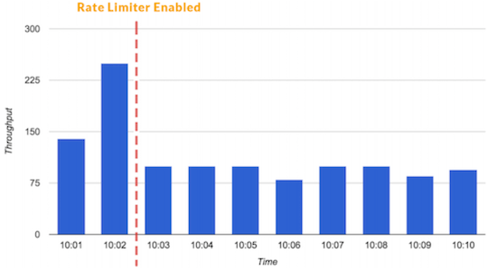
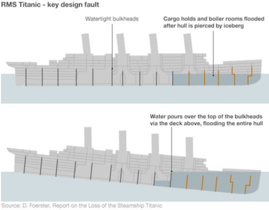
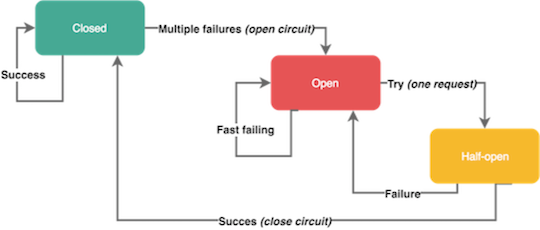

# [译] 设计一个容错的微服务架构
> 摘要：本文属于原创，欢迎转载，转载请保留出处：[https://github.com/jasonGeng88/blog](https://github.com/jasonGeng88/blog)

## 原文地址

[https://blog.risingstack.com/designing-microservices-architecture-for-failure/](https://blog.risingstack.com/designing-microservices-architecture-for-failure/)

***

微服务架构使得可以通过明确定义的服务边界来隔离故障。但是像在每个分布式系统中一样，发生网络、硬件、应用级别的错误都是很常见的。由于服务依赖关系，任何组件可能暂时无法提供服务。为了尽量减少部分中断的影响，我们需要构建容错服务，来优雅地处理这些中断的响应结果。

本文介绍了基于[RisingStack 的 Node.js 咨询和开发经验](https://risingstack.com/)构建和操作高可用性微服务系统的最常见技术和架构模式。

如果你不熟悉本文中的模式，那并不一定意味着你做错了。建立可靠的系统总是会带来额外的成本。

## 微服务架构的风险

微服务架构将应用程序逻辑移动到服务，并使用网络层在它们之间进行通信。这种通过网络间通信代替单应用程序内调用的做法，会带来额外的延迟，以及需要协调多个物理和逻辑组件的系统复杂度。分布式系统的复杂性增加也将导致更高的网络故障率。

微服务体系结构的最大优势之一是，团队可以独立设计，开发和部署他们的服务。他们对服务的生命周期拥有完全的所有权。这也意味着团队无法控制他们依赖的服务，因为它更有可能由不同的团队管理。使用微服务架构，我们需要记住，提供者服务可能会临时不可用，由于其他人员发行的错误版本，配置以及其他更改等。

## 优雅的服务降级

微服务架构的最大优点之一是您可以隔离故障，并在当组件单独故障时，进行优雅的服务降级。 例如，在中断期间，照片共享应用程序中的客户可能无法上传新图片，但仍可以浏览，编辑和共享其现有照片。



*微服务容错隔离*

在大多数情况下，由于分布式系统中的应用程序相互依赖，因此很难实现这种优雅的服务降级，您需要应用几种故障转移的逻辑（其中一些将在本文后面介绍），以为暂时的故障和中断做准备。



*服务间彼此依赖，再没有故障转移逻辑下，服务全部失败。*

## 变更管理

Google的网站可靠性小组发现，大约70％的中断是由现有系统的变化引起的。当您更改服务中的某些内容时，您将部署新版本的代码或更改某些配置 - 这总有可能会造成故障，或者引入新的bug。

在微服务架构中，服务依赖于彼此。这就是为什么你应该尽量减少故障并限制它的负面影响。要处理变更中的问题，您可以实施变更管理策略和自动回滚机制。

例如，当您部署新代码或更改某些配置时，您应该先小范围的进行部分的替换，以渐进式的方式替换服务的全部实例。在这期间，需要监视它们，如果您发现它们对您的关键指标有负面影响，应立即进行服务回滚，这称为“金丝雀部署”。



*变更管理 - 回滚部署*

另一个解决方案可能是您运行两个生产环境。您始终只能部署其中一个，并且在验证新版本是否符合预期之后才，将负载均衡器指向新的。这称为蓝绿或红黑部署。

回滚代码不是坏事。你不应该在生产中遗留错误的代码，然后考虑出了什么问题。如果必要，越早回滚你的代码越好。

## 健康检查与负载均衡

实例由于出现故障、部署或自动缩放的情况，会进行持续启动、重新启动或停止操作。它可能导致它们暂时或永久不可用。为避免问题，您的负载均衡器应该从路由中跳过不健康的实例，因为它们当前无法为客户或子系统提供服务。

应用实例健康状况可以通过外部观察来确定。您可以通过重复调用```GET /health```端点或通过自我报告来实现。现在主流的服务发现解决方案，会持续从实例中收集健康信息，并配置负载均衡器，将流量仅路由到健康的组件上。

## 自我修复

自我修复可以帮助应用程序从错误中恢复过来。当应用程序可以采取必要步骤从故障状态恢复时，我们就可以说它是可以实现自我修复的。在大多数情况下，它由外部系统实现，该系统会监视实例运行状况，并在较长时间内处于故障状态时重新启动它们。自我修复在大多数情况下是非常有用的。但是在某些情况下，持续地重启应用程序可能会导致麻烦。 当您的应用程序由于超负荷或其数据库连接超时而无法给出健康的运行状况时，这种情况下的频繁的重启就可能就不太合适了。

对于这种特殊的场景（如丢失的数据库连接），要实现满足它的高级自我修复的解决方案可能很棘手。在这种情况下，您需要为应用程序添加额外的逻辑来处理边缘情况，并让外部系统知道实例不需要立即重新启动。

## 故障转移缓存

由于网络问题和我们系统的变化，服务经常会失败。然而，由于自我修复和负载均衡的保障，它们中的大多数中断是临时的，我们应该找到一个解决方案，使我们的服务在这些故障时服务仍就可以工作。这就是故障转移缓存的作用，它可以帮助并为我们的应用程序在服务故障时提供必要的数据。

故障转移缓存通常使用两个不同的到期日期; 较短的时间告诉您在正常情况下缓存可以使用的过期时间，而较长的时间可以在服务故障时缓存依旧可用的过期时间。



*故障转移缓存*

请务必提及，只有当服务使用过时的数据比没有数据更好时，才能使用故障转移缓存。

要设置缓存和故障转移缓存，可以在 HTTP 中使用标准响应头。

例如，使用 ```max-age``` 属性可以指定资源被视为有效的最大时间。使用 ```stale-if-error``` 属性，您可以明确在出现故障的情况下，依旧可以从缓存中获取资源的最大时间。

现代的 CDN 和负载均衡器都提供各种缓存和故障转移行为，但您也可以为拥有标准可靠性解决方案的公司创建一个共享库。

## 重试逻辑

在某些情况下，我们无法缓存数据，或者我们想对其进行更改，但是我们的操作最终都失败了。对于此，我们可以重试我们的操作，因为我们可以预期资源将在一段时间后恢复，或者我们的负载均衡器将请求发送到了健康的实例上。

您应该小心地为您的应用程序和客户端添加重试逻辑，因为大量的重试可能会使事情更糟，甚至阻止应用程序恢复，如当服务超载时，大量的重试只能使状况更糟。

在分布式系统中，微服务系统重试可以触发多个其他请求或重试，并启动级联效应。为了最小化重试的影响，您应该限制它们的数量，并使用指数退避算法来持续增加重试之间的延迟，直到达到最大限制。

当客户端（浏览器，其他微服务等）发起重试，并且客户端不知道在处理请求之前或之后操作失败时，您应该为你的应用程序做好幂等处理的准备。例如，当您重试购买操作时，您不应该再次向客户收取费用。为每个交易使用唯一的幂等值键可以帮助处理重试。

## 限流器和负载降级

流量限制是在一段时间内定义特定客户或应用程序可以接收或处理多少个请求的技术。例如，通过流量限制，您可以过滤掉造成流量峰值的客户和服务，或者您可以确保您的应用程序在自动缩放无法满足时，依然不会超载。

您还可以阻止较低优先级的流量，为关键事务提供足够的资源。



*限流器可以阻止流量峰值产生*

有一个不同类型的限流器，叫做并发请求限制器。当您有重要的端点，您不应该被调用超过指定的次数，而您仍然想要能提供服务时，这将是有用的。

负载降级的一系列使用，可以确保总是有足够的资源来提供关键交易。它为高优先级请求保留一些资源，不允许低优先级的事务使用它们。负载降级开关是根据系统的整体状态做出决定，而不是基于单个用户的请求量大小。负载降级有助于您的系统恢复，因为当你有一个偶发事件时（*可能是一个热点事件*），您仍能保持核心功能的正常工作。

要了解有关限流器和负载降级的更多信息，我建议查看这篇[Stripe的文章](https://stripe.com/blog/rate-limiters)。

## 快速失败原则与独立性

在微服务架构中，我们想要做到让我们的服务具备快速失败与相互独立的能力。为了在服务级别上进行故障隔离，我们可以使用舱壁模式。你可以在本文的后面阅读更多有关舱壁的内容。

我们也希望我们的组件能够快速失败，因为我们不希望对于有故障的服务，在请求超时后才断开。没有什么比挂起的请求和无响应的 UI 更令人失望。这不仅浪费资源，而且还会影响用户体验。我们的服务在调用链中是相互调用的，所以在这些延迟累加之前，我们应该特别注意防止挂起操作。

你想到的第一个想法是对每个服务调用都设置明确的超时等级。这种方法的问题是，您不能知道真正合理的超时值是多少，因为网络故障和其他问题发生的某些情况只会影响一两次操作。在这种情况下，如果只有其中一些超时，您可能不想拒绝这些请求。

我们可以说，在微服务种通过使用超时来达到快速失败的效果是一种反模式的，你应该避免使用它。取而代之，您可以应用断路器模式，依据操作的成功与失败统计数据决定。

## 舱壁模式

工业中使用舱壁将船舶划分为几个部分，以便在船体破坏的情况下，可以将船舶各个部件密封起来。

舱壁的概念在软件开发中可以被应用在隔离资源上。

通过应用舱壁模式，我们可以保护有限的资源不被耗尽。例如，对于一个有连接数限制的数据库实例来说，如果我们有两种连接它的操作，我们采用可以采用两个连接池的方式进行连接，来代替仅采用一个共享连接池的方式。由于这种客户端与资源进行了隔离，超时或过度使用池的操作页不会使其他操作失败。

泰坦尼克号沉没的主要原因之一是其舱壁设计失败，水可以通过上面的甲板倒在舱壁的顶部，导致整个船体淹没。



*泰坦尼克号舱壁设计（无效的设计）*

## 断路器

为了限制操作的持续时间，我们可以使用超时。超时可以防止挂起操作并保持系统响应。然而，在微服务中使用静态、精细的超时是一种反模式，因为我们处于高度动态的环境中，几乎不可能提出在每种情况下都能正常工作的正确的时间限制。

替代这种静态超时的手段是，我们可以使用断路器来处理错误。断路器以现实世界的电子元件命名，因为它们的作用是相同的。您可以保护资源，并帮助他们使用断路器进行恢复。它们在分布式系统中非常有用，因为在分布式系统中，重复故障可能导致雪球效应并使整个系统瘫痪。

当特定类型的错误在短时间内多次发生时，断路器会被断开。开路的断路器可以防止进一步的请求 - 就像我们平时所说的电路跳闸一样。断路器通常在一定时间后关闭，在这期间可以为底层服务提供足够的空间来恢复。

请记住，并不是所有的错误都应该触发断路器。例如，您可能希望跳过客户端问题，例如具有4xx响应代码的请求，但不包括5xx服务器端故障。一些断路器也具有半开状态。在这种状态下，服务发送第一个请求以检查系统可用性，同时让其他请求失败。如果这个第一个请求成功，它将使断路器恢复到关闭状态并使流量流动。否则，它保持打开。



*断路器*

## 测试故障

您应该不断测试您系统的常见问题，以确保您的服务可以抵抗各种故障。您应经常测试故障，让您的团队具备故障处理的能力。

对于测试，您可以使用外部服务来标识实例组，并随机终止此组中的一个实例。这样，您可以准备单个实例故障，但您甚至可以关闭整个区域来模拟云提供商的故障。

最流行的测试解决方案之一是 Netflix 的 [ChaosMonkey 弹性工具](https://github.com/Netflix/chaosmonkey)。


## 结尾

实施和运行可靠的服务并不容易。 您需要付出很多努力，同时公司也要有相应的财力投入。

可靠性有很多层次和方面，因此找到最适合您团队的解决方案很重要。您应该使可靠性成为您的业务决策流程中的一个因素，并为其分配足够的预算和时间。

## 主要收获

* 动态环境和分布式系统（如微服务）会导致更高的故障机率；
* 服务应该做到故障隔离，到达优雅降级，来提升用户体验；
* 70％的中断是由变化引起的，代码回滚不是一件坏事；
* 做到服务快速失败与独立性。团队是无法控制他们所依赖的服务情况；
* 缓存、舱壁、断路器和限流器等架构模式与技术有助于构建可靠的微服务架构。


