# 记一次 JAVA 的内存泄露分析
> 摘要：本文属于原创，欢迎转载，转载请保留出处：[https://github.com/jasonGeng88/blog](https://github.com/jasonGeng88/blog)

## 当前环境
1. jdk == 1.8
2. httpasyncclient == 4.1.3

## 代码地址
git 地址：[https://github.com/jasonGeng88/java-network-programming](https://github.com/jasonGeng88/java-network-programming)

## 背景

前不久，上线了一个新项目，这个项目是一个压测系统，可以简单的看做通过回放词表（http请求数据），不断地向服务发送请求，以达到压测服务的目的。在测试过程中，一切还算顺利，修复了几个小bug后，就上线了。在上线后给到第一个业务方使用时，就发现来一个严重的问题，应用大概跑了10多分钟，就收到了大量的 Full GC 的告警。

针对这一问题，我们首先和业务方确认了压测的场景内容，回放的词表数量大概是10万条，回放的速率单机在 100qps 左右，按照我们之前的预估，这远远低于单机能承受的极限。按道理是不会产生内存问题的。

## 线上排查

首先，我们需要在服务器上进行排查。通过 JDK 自带的 jmap 工具，查看一下 JAVA 应用中具体存在了哪些对象，以及其实例数和所占大小。具体命令如下：

```shell
jmap -histo:live `pid of java`

# 为了便于观察，还是将输出写入文件
jmap -histo:live `pid of java` > /tmp/jmap00
```

经过观察，确实发现有对象被实例化了20多万，根据业务逻辑，实例化最多的也就是词表，那也就10多万，怎么会有20多万呢，我们在代码中也没有找到对此有显示声明实例化的地方。至此，我们需要对 dump 内存，在离线进行进一步分析，dump 命令如下：

```shell
jmap -dump:format=b,file=heap.dump `pid of java`
```

## 离线分析

从服务器上下载了 dump 的 heap.dump 后，我们需要通过工具进行深入的分析。这里推荐的工具有 mat、visualVM。

我个人比较喜欢使用 visualVM 进行分析，它除了可以分析离线的 dump 文件，还可以与 IDEA 进行集成，通过 IDEA 启动应用，进行实时的分析应用的CPU、内存以及GC情况（*GC情况，需要在visualVM中安装visual GC 插件*）。工具具体展示如下（*这里仅仅为了展示效果，数据不是真的*）：

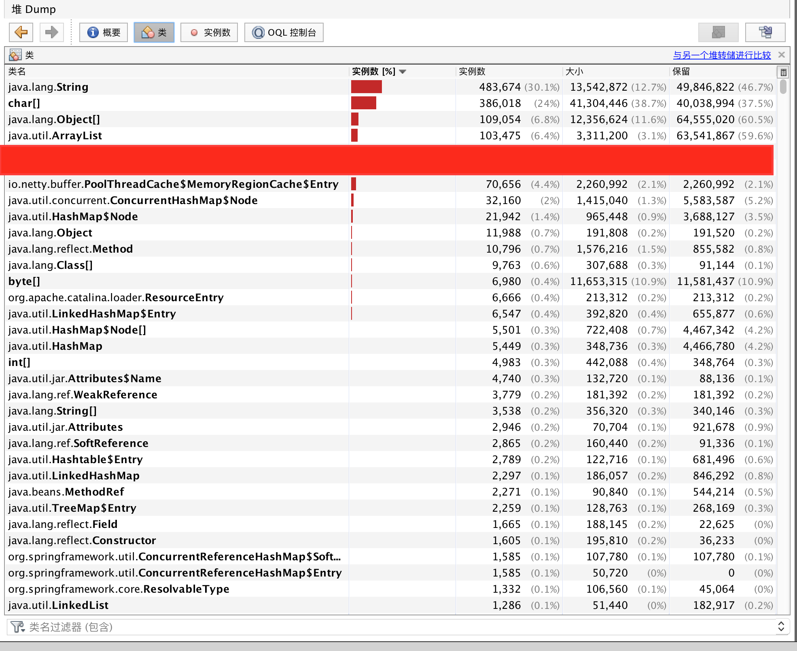

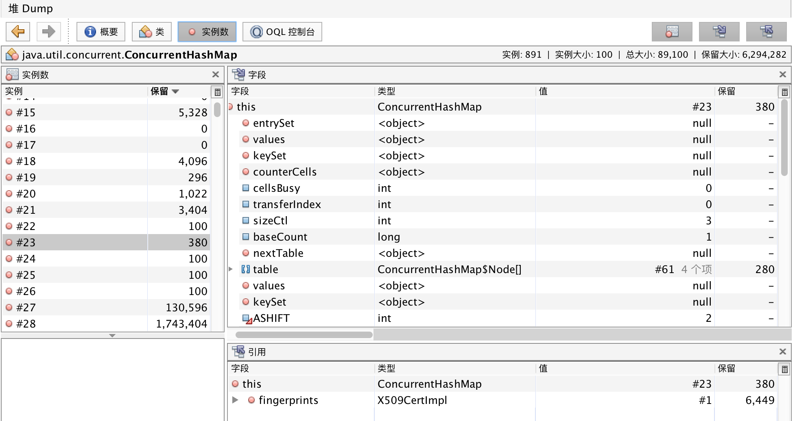


当然，mat 也是非常好用的工具，它能帮我们快速的定位到内存泄露的地方，便于我们排查。
展示如下：

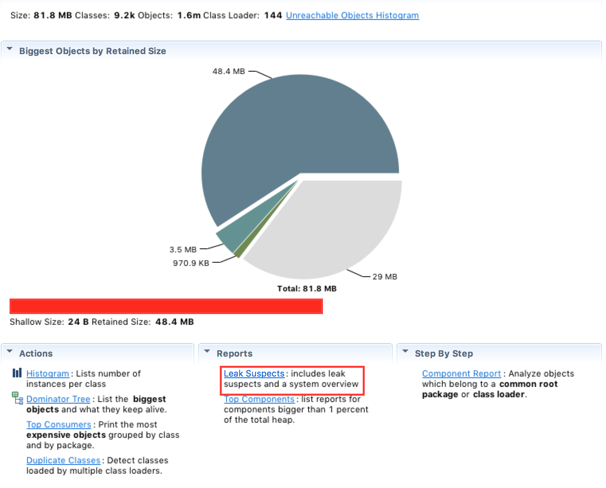


## 场景再现

经过分析，最后我们定位到是使用 httpasyncclient 产生的内存泄露问题。httpasyncclient 是 Apache 提供的一个 HTTP 的工具包，主要提供了 reactor 的 io 非阻塞模型，实现了异步发送 http 请求的功能。

下面通过一个 Demo，来简单讲下具体内存泄露的原因。

### httpasyncclient 使用介绍:

* maven 依赖

```xml
<dependency>
    <groupId>org.apache.httpcomponents</groupId>
    <artifactId>httpasyncclient</artifactId>
    <version>4.1.3</version>
</dependency>
```

* HttpAsyncClient 客户端

```java
public class HttpAsyncClient {

    private CloseableHttpAsyncClient httpclient;

    public HttpAsyncClient() {
        httpclient = HttpAsyncClients.createDefault();
        httpclient.start();
    }

    public void execute(HttpUriRequest request, FutureCallback<HttpResponse> callback){
        httpclient.execute(request, callback);
    }

    public void close() throws IOException {
        httpclient.close();
    }

}
```

### 主要逻辑：
Demo 的主要逻辑是这样的，首先创建一个缓存列表，用来保存需要发送的请求数据。然后，通过循环的方式从缓存列表中取出需要发送的请求，将其交由 httpasyncclient 客户端进行发送。

具体代码如下：

```java
public class ReplayApplication {

    public static void main(String[] args) throws InterruptedException {

		 //创建有内存泄露的回放客户端
        ReplayWithProblem replay1 = new ReplayWithProblem();
        
		 //加载一万条请求数据放入缓存
        List<HttpUriRequest> cache1 = replay1.loadMockRequest(10000);
        
        //开始循环回放
        replay1.start(cache1);

    }
}
```

### 回放客户端实现（内存泄露）：

这里以回放百度为例，创建10000条mock数据放入缓存列表。回放时，以 while 循环每100ms 发送一个请求出去。具体代码如下:

```java
public class ReplayWithProblem {

    public List<HttpUriRequest> loadMockRequest(int n){
    
        List<HttpUriRequest> cache = new ArrayList<HttpUriRequest>(n);
        for (int i = 0; i < n; i++) {
            HttpGet request = new HttpGet("http://www.baidu.com?a="+i);
            cache.add(request);
        }
        return cache;
        
    }

    public void start(List<HttpUriRequest> cache) throws InterruptedException {

        HttpAsyncClient httpClient = new HttpAsyncClient();
        int i = 0;

        while (true){

            final HttpUriRequest request = cache.get(i%cache.size());
            httpClient.execute(request, new FutureCallback<HttpResponse>() {
                public void completed(final HttpResponse response) {
                    System.out.println(request.getRequestLine() + "->" + response.getStatusLine());
                }

                public void failed(final Exception ex) {
                    System.out.println(request.getRequestLine() + "->" + ex);
                }

                public void cancelled() {
                    System.out.println(request.getRequestLine() + " cancelled");
                }

            });
            i++;
            Thread.sleep(100);
        }
    }

}
```

### 内存分析：

启动 ReplayApplication 应用（*IDEA 中安装 VisualVM Launcher后，可以直接启动visualvm*），通过 visualVM 进行观察。

* 启动情况：

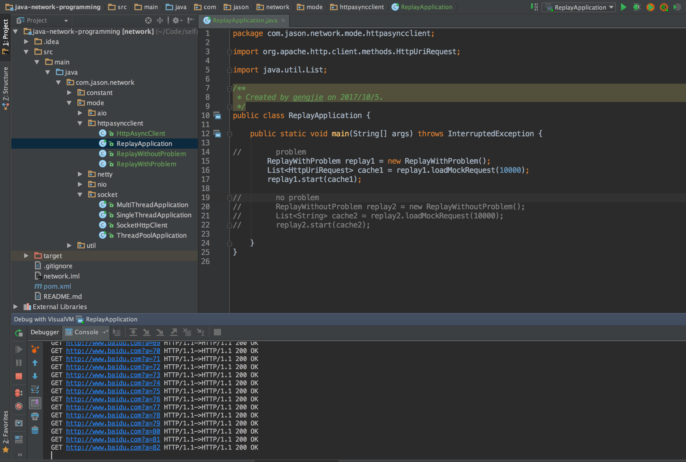

* visualVM 中前后3分钟的内存对象占比情况：

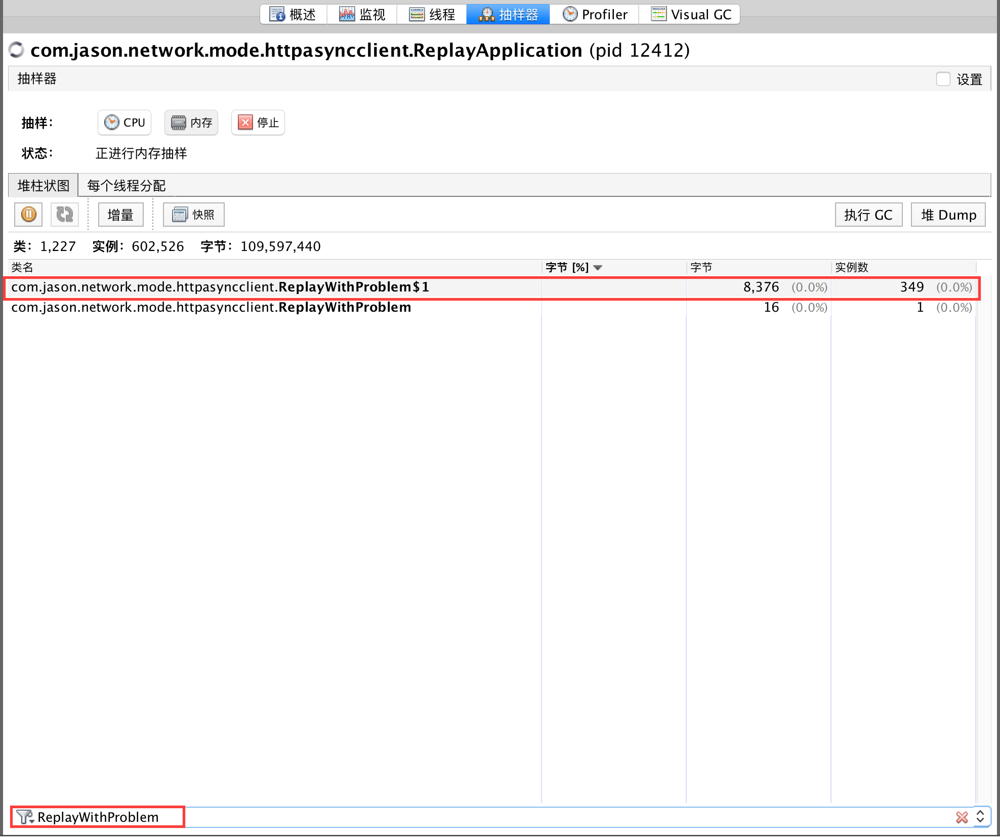
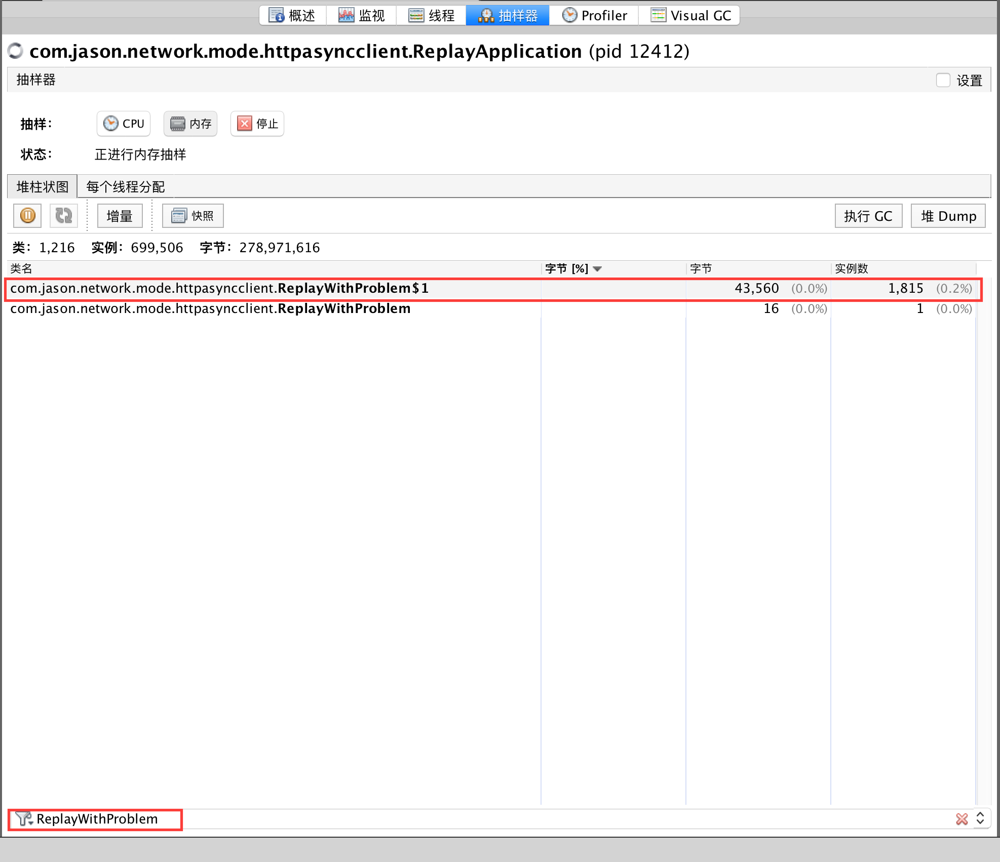

***说明：$0代表的是对象本身，$1代表的是该对象中的第一个内部类。所以ReplayWithProblem$1: 代表的是ReplayWithProblem类中FutureCallback的回调类。***

从中，我们可以发现 FutureCallback 类会被不断的创建。因为每次异步发送 http 请求，都是通过创建一个回调类来接收结果，逻辑上看上去也正常。不急，我们接着往下看。

* visualVM 中前后3分钟的GC情况：

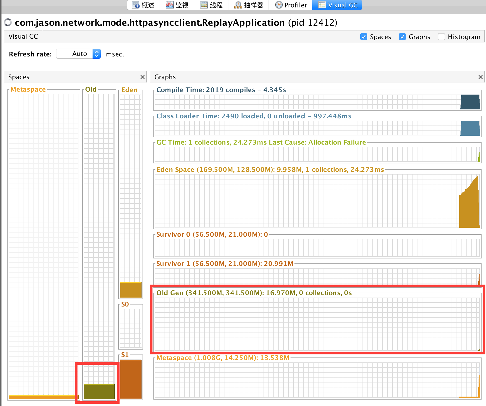
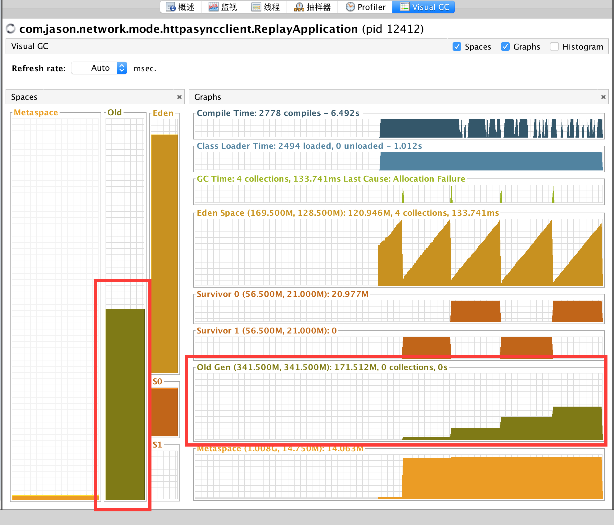

从图中看出，内存的 old 在不断的增长，这就不对了。内存中维持的应该只有缓存列表的http请求体，现在在不断的增长，就有说明了不断的有对象进入old区，结合上面内存对象的情况，说明了 FutureCallback 对象没有被及时的回收。

可是该回调匿名类在 http 回调结束后，引用关系就没了，在下一次 GC 理应被回收才对。我们通过对 httpasyncclient 发送请求的源码进行跟踪了一下后发现，其内部实现是将回调类塞入到了http的请求类中，而请求类是放在在缓存队列中，所以导致回调类的引用关系没有解除，大量的回调类晋升到了old区，最终导致 Full GC 产生。

* 核心代码分析：

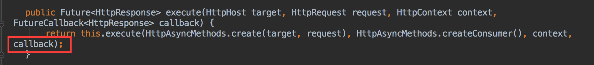

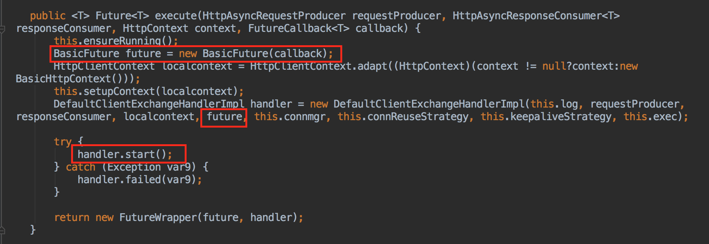

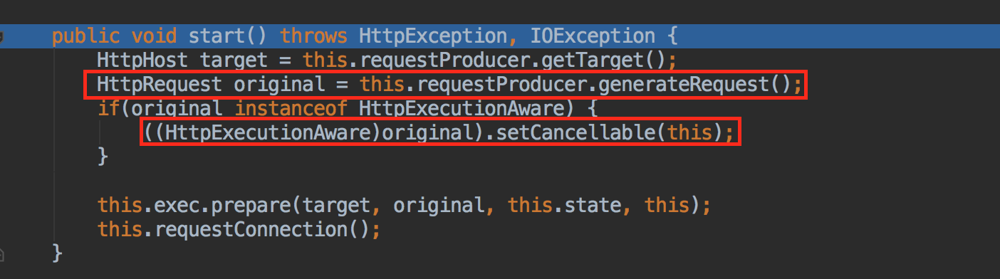


### 代码优化

找到问题的原因，我们现在来优化代码，验证我们的结论。因为```List<HttpUriRequest> cache1```中会保存回调对象，所以我们不能缓存请求类，只能缓存基本数据，在使用时进行动态的生成，来保证回调对象的及时回收。

代码如下：

```java
public class ReplayApplication {

    public static void main(String[] args) throws InterruptedException {

        ReplayWithoutProblem replay2 = new ReplayWithoutProblem();
        List<String> cache2 = replay2.loadMockRequest(10000);
        replay2.start(cache2);

    }
}

```

```
public class ReplayWithoutProblem {

    public List<String> loadMockRequest(int n){
        List<String> cache = new ArrayList<String>(n);
        for (int i = 0; i < n; i++) {
            cache.add("http://www.baidu.com?a="+i);
        }
        return cache;
    }

    public void start(List<String> cache) throws InterruptedException {

        HttpAsyncClient httpClient = new HttpAsyncClient();
        int i = 0;

        while (true){

            String url = cache.get(i%cache.size());
            final HttpGet request = new HttpGet(url);
            httpClient.execute(request, new FutureCallback<HttpResponse>() {
                public void completed(final HttpResponse response) {
                    System.out.println(request.getRequestLine() + "->" + response.getStatusLine());
                }

                public void failed(final Exception ex) {
                    System.out.println(request.getRequestLine() + "->" + ex);
                }

                public void cancelled() {
                    System.out.println(request.getRequestLine() + " cancelled");
                }

            });
            i++;
            Thread.sleep(100);
        }
    }

}
```

### 结果验证

* 启动情况：


* visualVM 中前后3分钟的内存对象占比情况：

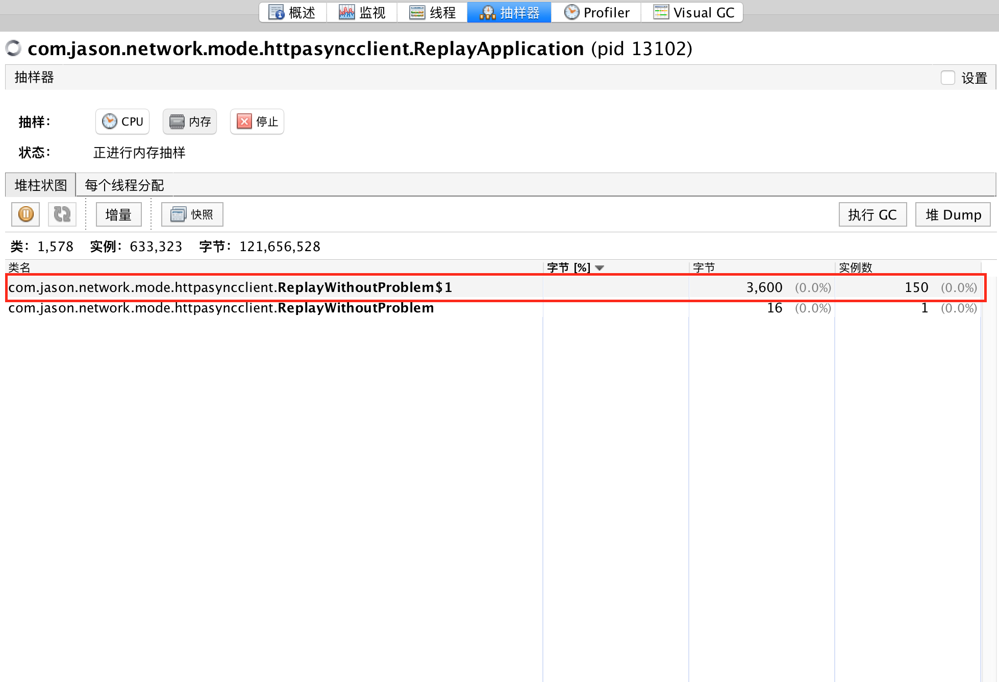
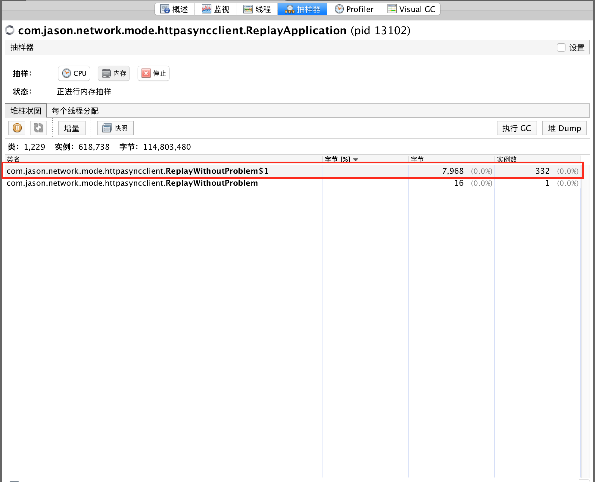

* visualVM 中前后3分钟的GC情况：

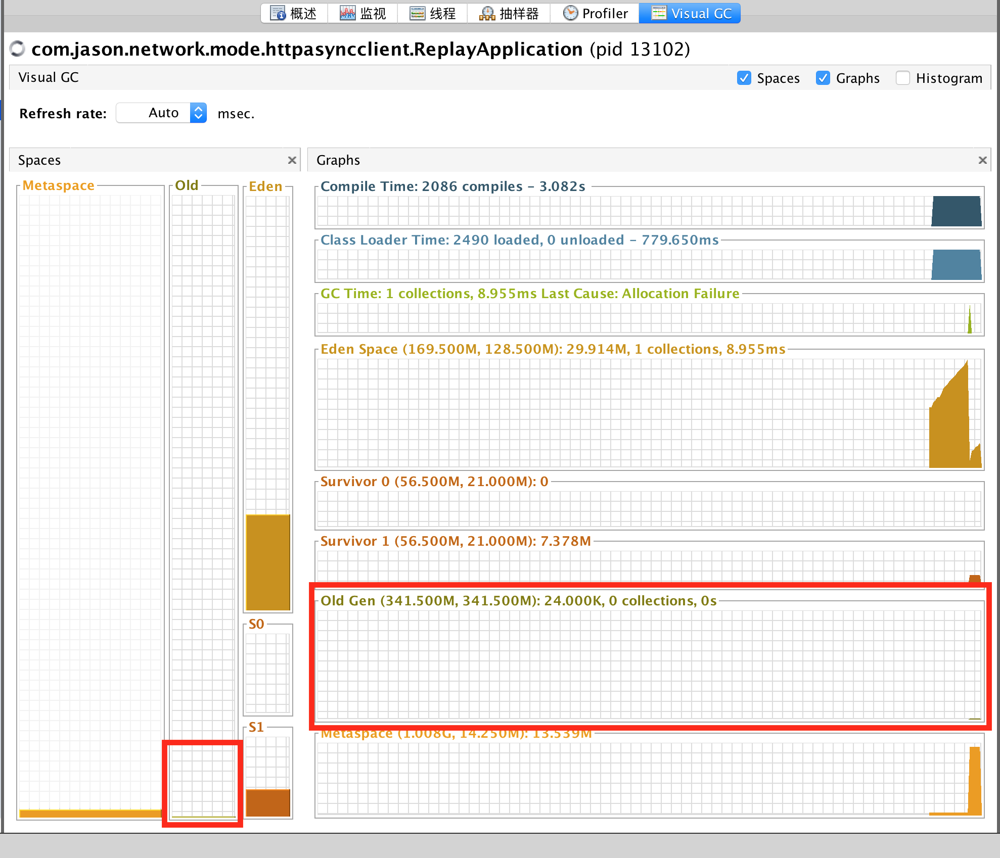
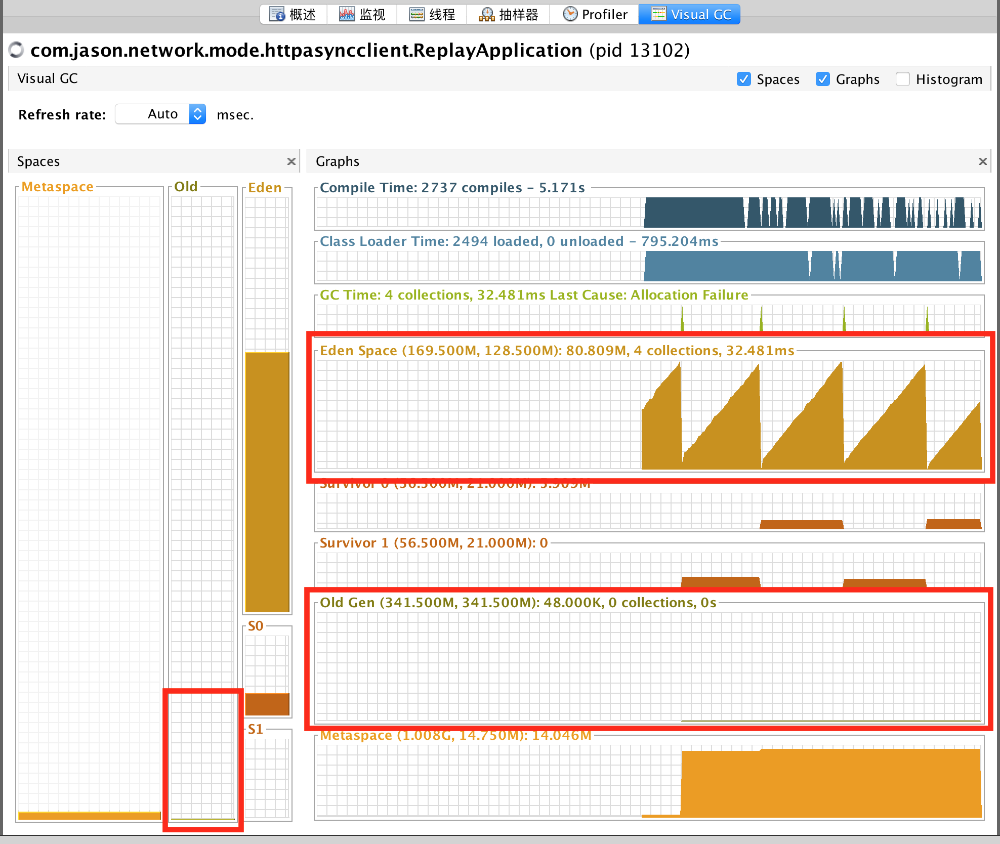

从图中，可以证明我们得出的结论是正确的。回调类在 Eden 区就会被及时的回收掉。old 区也没有持续的增长情况了。这一次的内存泄露问题算是解决了。

## 总结

关于内存泄露问题在第一次排查时，往往是有点不知所措的。我们需要有正确的方法和手段，配上好用的工具，这样在解决问题时，才能游刃有余。当然对JAVA内存的基础知识也是必不可少的，这时你定位问题的关键，不然就算工具告诉你这块有错，你也不能定位原因。

最后，关于 httpasyncclient 的使用，工具本身是没有问题的。只是我们得了解它的使用场景，往往产生问题多的，都是使用的不当造成的。所以，在使用工具时，对于它的了解程度，往往决定了出现 bug 的机率。


