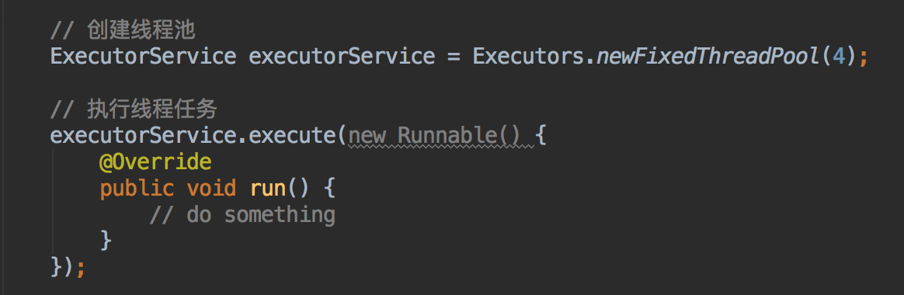
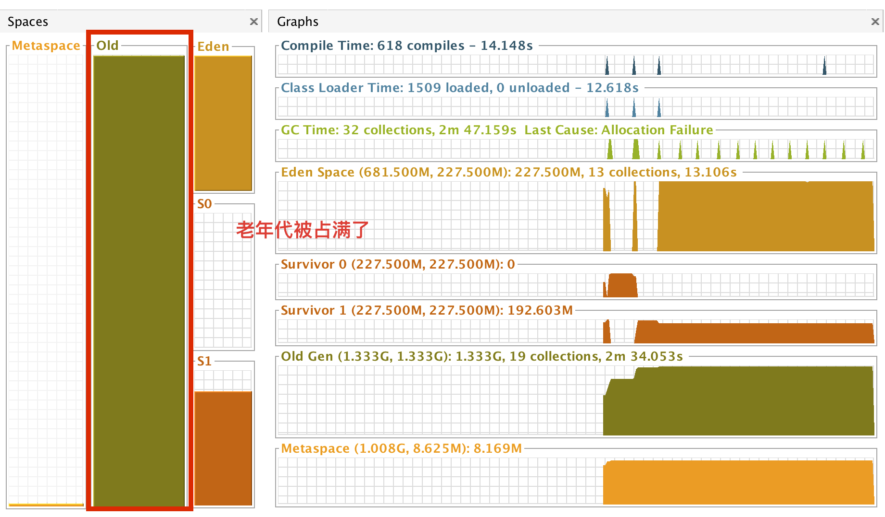
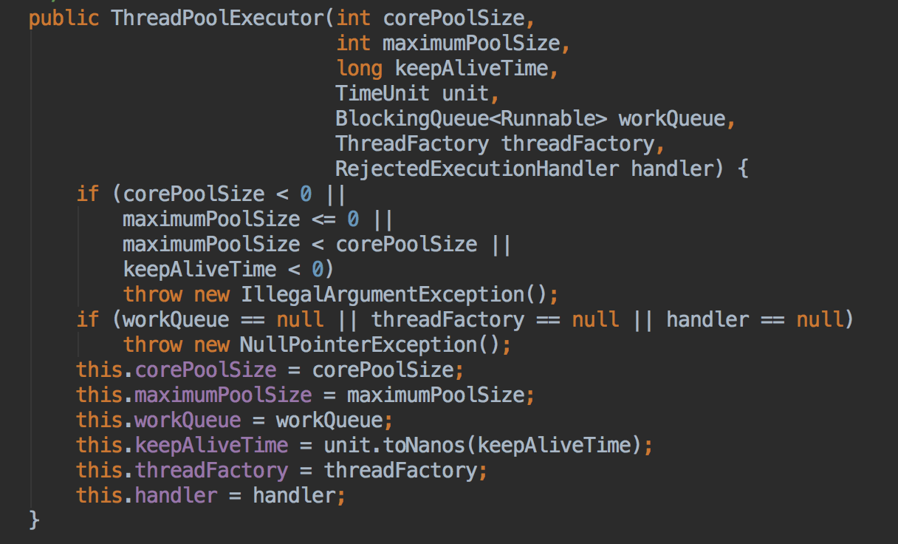
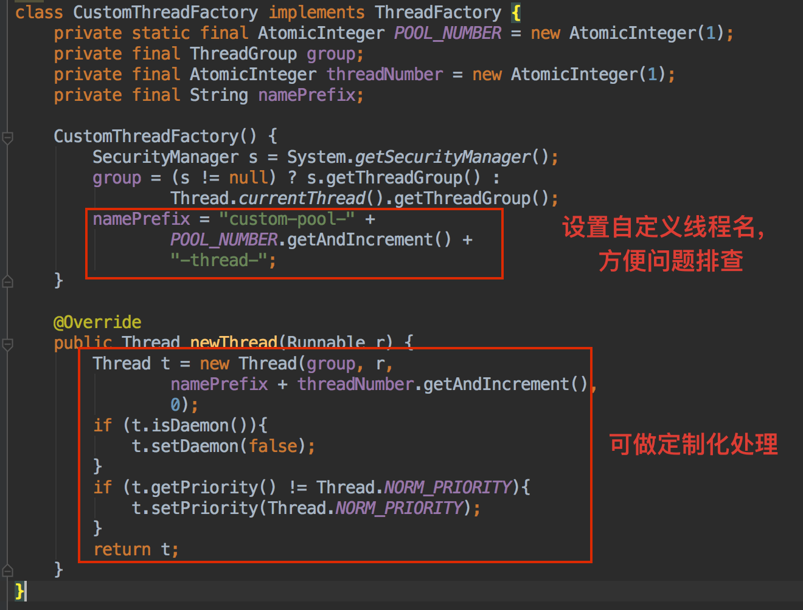
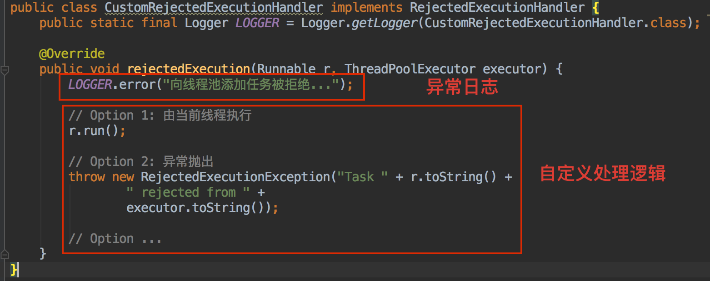
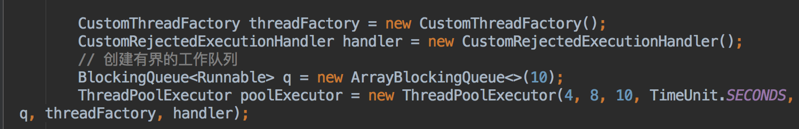

# JAVA 线程池的正确打开方式
> 摘要：本文属于原创，欢迎转载，转载请保留出处：[https://github.com/jasonGeng88/blog](https://github.com/jasonGeng88/blog)

## 当前环境
1. jdk == 1.8


## Executors 使用的隐患

先来看一段代码，我们要创建一个固定线程池，假设固定线程数是4。代码如下：



***```Executors```是JAVA并发包中提供的，用来快速创建不同类型的线程池。***

是不是很简单，创建线程池只需一行代码。对于一些个人项目或临时性的项目，这样写确实没什么问题，而且开发速度很快。但在一些大型项目中，这种做法一般是禁止的。

WHY？？？

因为用```Executors```创建的线程池存在性能隐患，我们看一下源码就知道，用```Executors```创建线程池时，使用的队列是```new LinkedBlockingQueue<Runnable>()```，这是一个无边界队列，如果不断的往里加任务时，最终会导致内存问题，也就是说在项目中由于使用了无边界队列，导致的内存占用的不可控性。下图是不断添加线程任务导致老年代被占满的情况：



当然，除了内存问题，它还存在一些其他的问题，在下面对线程池参数的介绍中会具体说明。

## 线程池的正确创建方式

其实，问题很好解决。提供的简便方式有局限性，那我们自己new一个```ThreadPoolExecutor```，无非多写几行代码而已。

关于```ThreadPoolExecutor```的具体代码如下：



### 参数说明：

* corePoolSize：核心线程数；
* maximumPoolSize：最大线程数，即线程池中允许存在的最大线程数；
* keepAliveTime：线程存活时间，对于超过核心线程数的线程，当线程处理空闲状态下，且维持时间达到keepAliveTime时，线程将被销毁；
* unit：keepAliveTime的时间单位
* workQueue：工作队列，用于存在待执行的线程任务；
* threadFactory：创建线程的工厂，用于标记区分不同线程池所创建出来的线程；
* handler：当到达线程数上限或工作队列已满时的拒绝处理逻辑；

### 具体代码

* 自定义threadFactory。除了可以自定义创建的线程名称，方便问题排查，在```newThread(Runnable r)```创建线程的方法中，还可以进行定制化设置，如为线程设置特定上下文等。



* 自定义RejectedExecutionHandler。记录异常信息，选择不同处理逻辑，有交由当前线程执行任务，有直接抛出异常，再或者等待后继续添加任务等。



* 创建自定义线程池



### 线程池内在处理逻辑

我们通过一些例子，来观察一下其内部的处理逻辑。基于上述具体代码，我们已经创建了一个核心线程数4，最大线程数8，线程存活时间10s，工作队列最大容量为10的一个线程池。

* 初始化线程池：未添加线程任务

	* 这时，线程池中没有任务线程被创建，存活线程为0，工作队列为0.

* 未达核心线程数：添加4个线程任务

	* 由于当前存活线程数 <= 核心线程数，所以会创建新的线程。即存活线程为4，工作队列为0.

* 核心线程数已满：添加第5个线程任务
	* 若当前线程池中存在空闲线程，则交由该线程处理。即存活线程为4，工作队列为0.
	* 若当前所有线程处理运行状态，加入工作队列。即存活线程为4，工作队列为1.（***<font color="red">注意：此时工作队列中的任务不会被执行，直到有线程空闲后，才能被处理</font>***）

* 工作队列未满：假设添加的任务都是耗时操作（短时间不会结束），再添加9个耗时任务

	* 即存活线程为4，工作队列为10.

* 工作队列已满 & 未达最大线程数：再添加4个任务

	* 当工作队列已满，且不存在空闲线程，此时会创建额外线程来处理当前任务。此时存活线程为8，工作队列为10.

* 工作队列已满 & 且最大线程数：再添加1个任务	
	* 触发RejectedExecutionHandler，将当前任务交由自己设置的执行句柄进行处理。此时存活线程为8，工作队列为10.

* 当任务执行完后，没有新增的任务，临时扩充的线程（大于核心线程数的）将在10s后被销毁。

## 总结

最后，我们在使用线程池的时候，需要根据使用场景来自行选择。通过corePoolSize和maximumPoolSize的搭配，存活时间的选择，以及改变队列的实现方式，如：选择延迟队列，来实现定时任务的功能。并发包```Executors```中提供的一些方法确实好用，但我们仍需有保留地去使用，这样在项目中就不会挖太多的坑。

### 扩展

对于一些耗时的IO任务，盲目选择线程池往往不是最佳方案。通过异步+单线程轮询，上层再配合上一个固定的线程池，效果可能更好。类似与Reactor模型中selector轮询处理。


	


